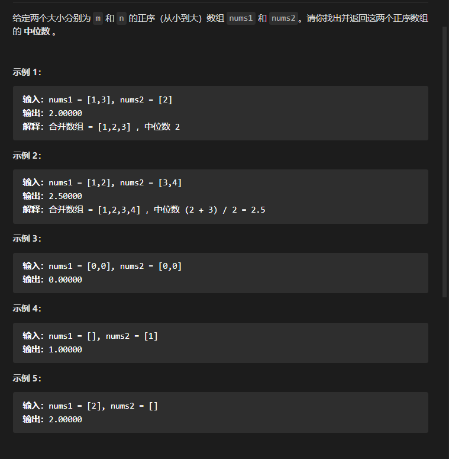
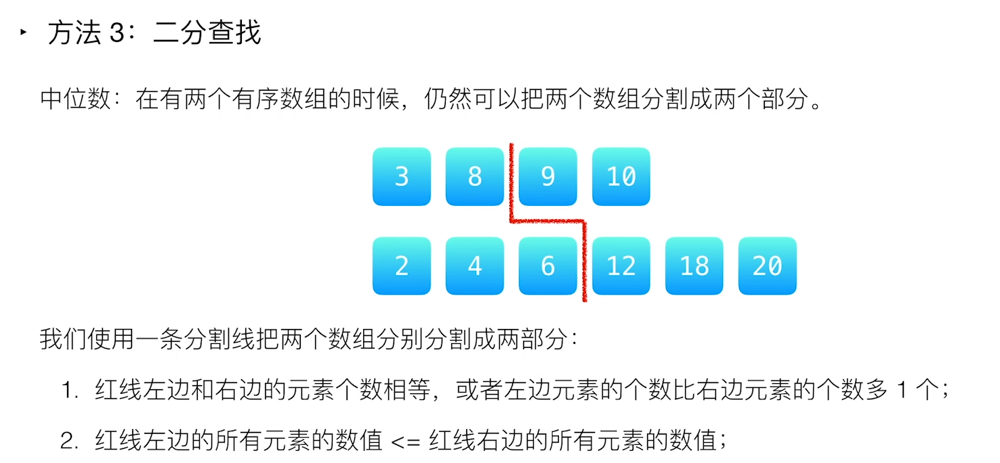
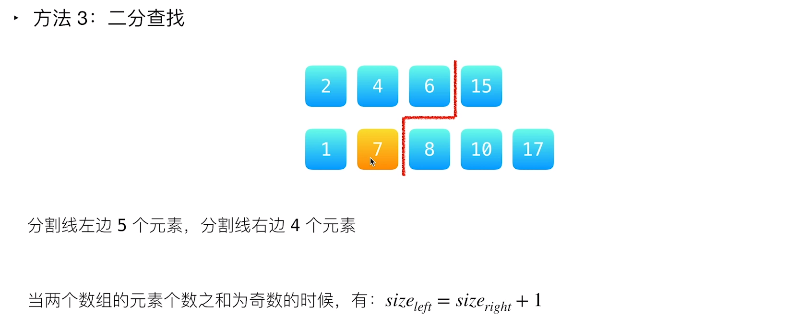
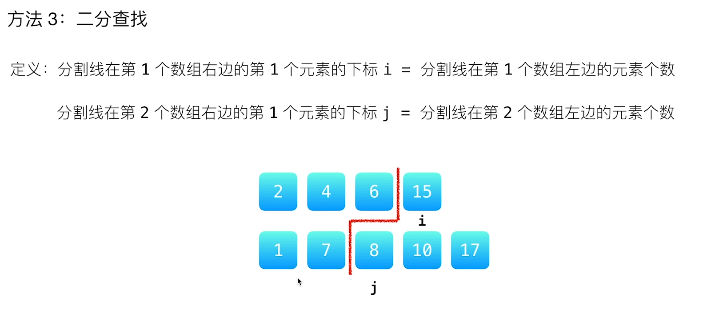
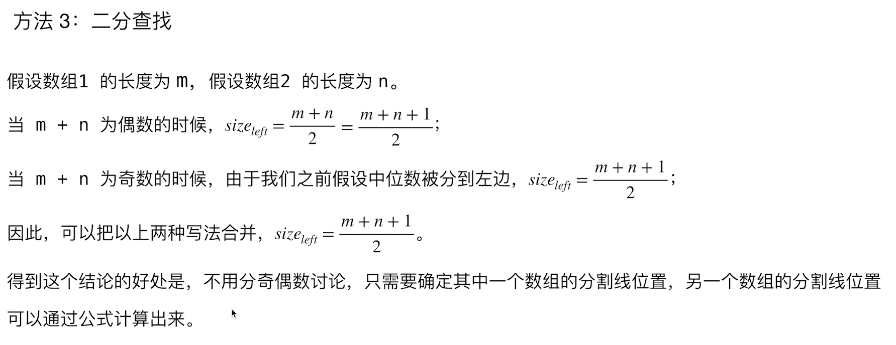
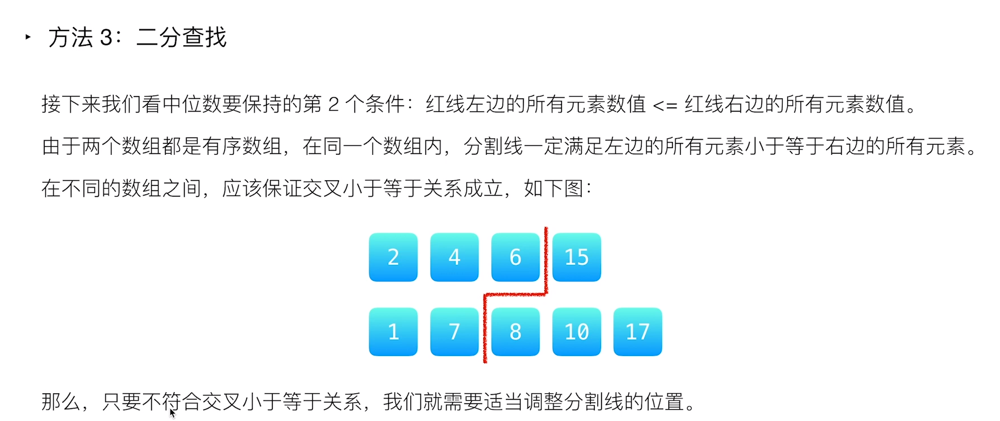
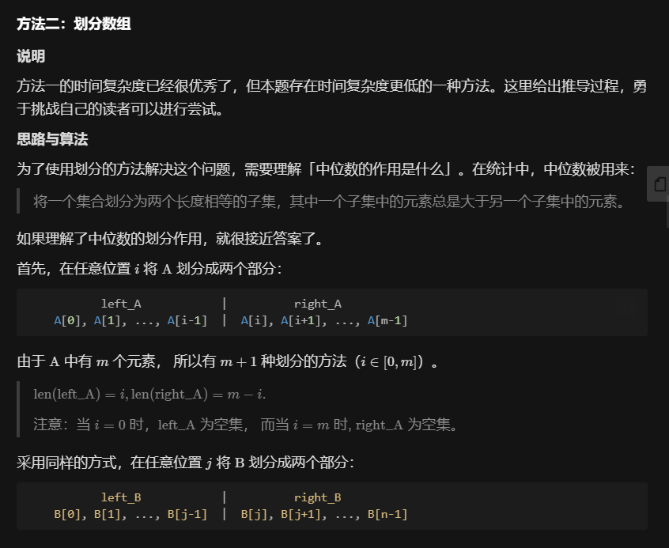
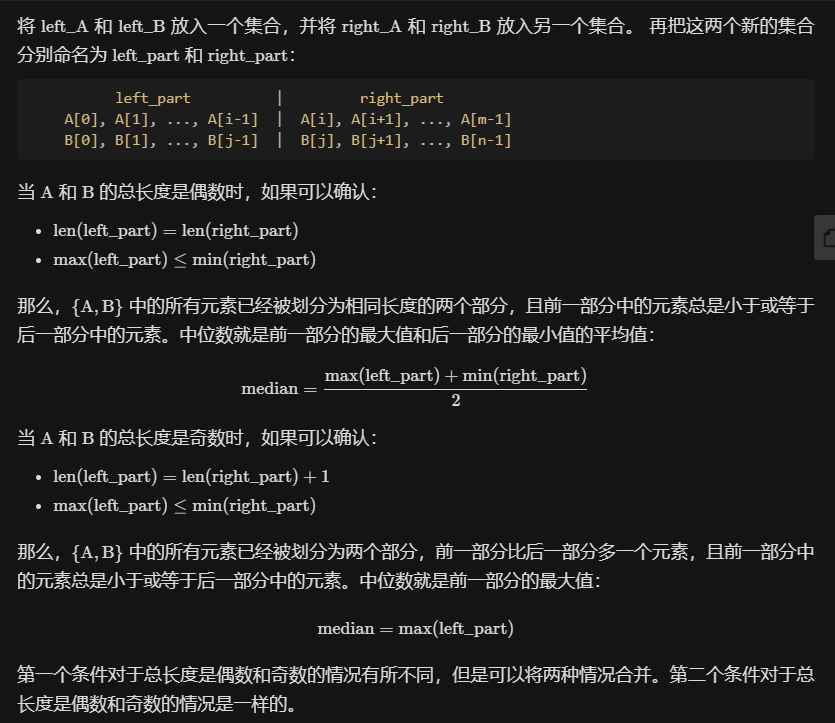
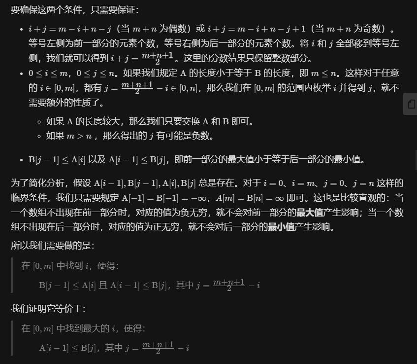
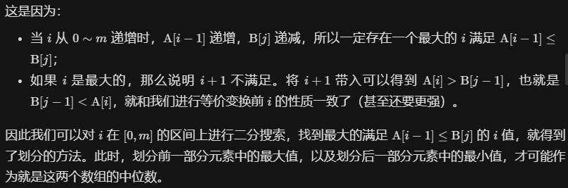

# 1.寻找两个有序数组的中位数

题目：

思路：

1.对两个数组统一的绘制出一条分割线。

2.红色分割线左边和右边的元素个数相差不超过1，如果是奇数的情况，则我们需要让分割线左侧的元素比右侧的元素多1

3.红线左侧的元素都要小于等于红线右边的元素。

4.如果分割线满足了上述两个条件，那么中位数就一定在分割线两侧的元素之中，在下图之中就在8 9 6 12这四个数之中产生

5.对于偶数总长度情况，我们从分割线左侧选取最大的元素，并从分割线右侧选取最小的元素，取两个元素的平均值就是中位数

6.对于奇数总长度情况，我们从分割线左侧选取最大的元素即可。

7.i,j的定义

8.实际举例

交叉小于等于的满足

完整思路：

