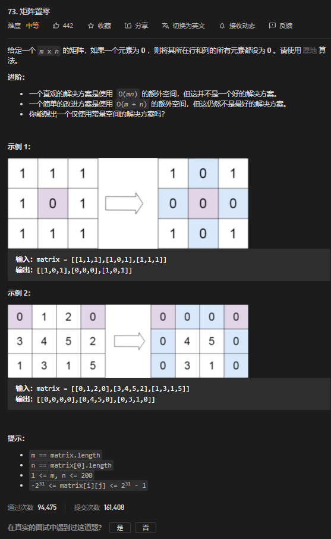

# 1.矩阵置0

### 1.1 题目



## 1.2 解决方案

### 1.2.1 使用标记数组

我们可以用两个标记数组分别记录每一行和每一列是否有零出现。

具体地，我们首先遍历该数组一次，如果某个元素为 0，那么就将该元素所在的行和列所对应标记数组的位置置为 true。最后我们再次遍历该数组，用标记数组更新原数组即可。

```java
class Solution {
    public void setZeroes(int[][] matrix) {
        int m = matrix.length, n = matrix[0].length;
        boolean[] row = new boolean[m];
        boolean[] col = new boolean[n];
        for (int i = 0; i < m; i++) {
            for (int j = 0; j < n; j++) {
                if (matrix[i][j] == 0) {
                    row[i] = col[j] = true;
                }
            }
        }
        for (int i = 0; i < m; i++) {
            for (int j = 0; j < n; j++) {
                if (row[i] || col[j]) {
                    matrix[i][j] = 0;
                }
            }
        }
    }
}
```

时间复杂度：O(mn)O(mn)，其中 mm 是矩阵的行数，nn 是矩阵的列数。我们至多只需要遍历该矩阵两次。

空间复杂度：O(m+n)O(m+n)，其中 mm 是矩阵的行数，nn 是矩阵的列数。我们需要分别记录每一行或每一列是否有零出现。

### 1.2.2 使用两个标记变量

我们可以用矩阵的第一行和第一列代替方法一中的两个标记数组，以达到 O(1)的额外空间。但这样会导致原数组的第一行和第一列被修改，无法记录它们是否原本包含 0。因此我们需要额外使用两个标记变量分别记录第一行和第一列是否原本包含 0

在实际代码中，我们首先预处理出两个标记变量，接着使用其他行与列去处理第一行与第一列，然后反过来使用第一行与第一列去更新其他行与列，最后使用两个标记变量更新第一行与第一列即可。

```java
class Solution {
    public void setZeroes(int[][] matrix) {
        int m = matrix.length, n = matrix[0].length;
        // 两个标记变量的声明
        boolean flagCol0 = false, flagRow0 = false;
        // 记录第一列有没有0
        for (int i = 0; i < m; i++) {
            if (matrix[i][0] == 0) {
                flagCol0 = true;
            }
        }
        // 记录第一行有没有0
        for (int j = 0; j < n; j++) {
            if (matrix[0][j] == 0) {
                flagRow0 = true;
            }
        }
        // 看剩下来的行和剩下来的列之中有没有0
        for (int i = 1; i < m; i++) {
            for (int j = 1; j < n; j++) {
                if (matrix[i][j] == 0) {
                    matrix[i][0] = matrix[0][j] = 0;
                }
            }
        }
        // 进行填充
        // -------------------------------------------------------
        for (int i = 1; i < m; i++) {
            for (int j = 1; j < n; j++) {
                if (matrix[i][0] == 0 || matrix[0][j] == 0) {
                    matrix[i][j] = 0;
                }
            }
        }
        if (flagCol0) {
            for (int i = 0; i < m; i++) {
                matrix[i][0] = 0;
            }
        }
        if (flagRow0) {
            for (int j = 0; j < n; j++) {
                matrix[0][j] = 0;
            }
        }
        // -------------------------------------------------------
    }
}
```

### 1.2.3 使用一个标记变量

我们可以对方法二进一步优化，只使用一个标记变量记录第一列是否原本存在 0。这样，第一列的第一个元素即可以标记第一行是否出现 0。但为了防止第一列的第一个元素被提前更新，我们需要从最后一行开始，倒序地处理矩阵元素。

```java
class Solution {
    public void setZeroes(int[][] matrix) {
        int m = matrix.length, n = matrix[0].length;
        boolean flagCol0 = false;
        for (int i = 0; i < m; i++) {
            if (matrix[i][0] == 0) {
                flagCol0 = true;
            }
            for (int j = 1; j < n; j++) {
                if (matrix[i][j] == 0) {
                    matrix[i][0] = matrix[0][j] = 0;
                }
            }
        }
        for (int i = m - 1; i >= 0; i--) {
            for (int j = 1; j < n; j++) {
                if (matrix[i][0] == 0 || matrix[0][j] == 0) {
                    matrix[i][j] = 0;
                }
            }
            if (flagCol0) {
                matrix[i][0] = 0;
            }
        }
    }
}
```

