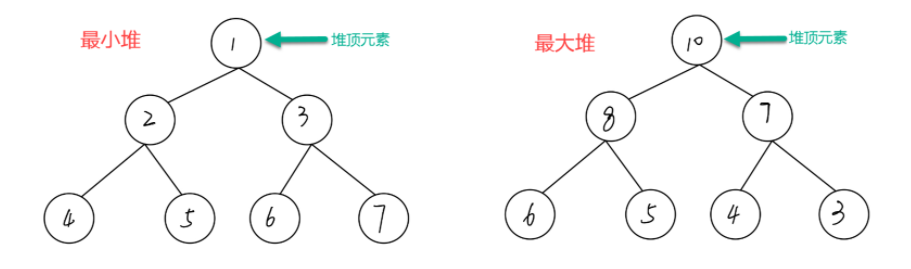

# 1.堆的定义

> **堆** 是一种特别的二叉树，满足以下条件的二叉树，可以称之为 **堆**：

> 1.是一棵完全二叉树
>
> 2.每一个结点的值都必须大于等于或者小于等于其孩子结点的值。

# 2.堆的特点

> a. 可以在O(logN)的时间复杂度内向堆中插入元素
>
> b. 可以在O(logN)的时间复杂度内从堆中删除元素
>
> c. 可以在O(1)的时间复杂度内获取堆的最大值或最小值


# 3.堆的分类

> 堆存在两种类型：最大堆，最小堆
>
> 
>
> 最大堆：堆中每一个结点的值都大于等于其孩子结点的值，
>
> 所以最大堆的特性是堆顶元素(根节点)是堆中的最大值
>
> 
>
> 最小堆：堆中每一个结点的值都小于等于其孩子结点的值，
>
> 所以最小堆的特性是堆顶元素(根节点)是堆中的最小值
>
> 


# 4.堆的插入过程

## 4.1 功能

>1.将一个结点插入堆之中，同时维持堆的特性
>
>2.从一组数之中进行堆的构建

## 4.2 插入JAVA代码 -- 插入也一定是插入在尾部，然后逐步向上调整。

### 4.2.1 最大堆的插入操作

> ```java
> public static void heapInsert(int[] arr, int index) {
>         //只有我比我的父位置要大我就和我的父位置进行交换的操作，并且index变换到父位置
>         while (arr[index] > arr[(index - 1) / 2]) {
>             swap(arr, index, (index - 1) / 2);
>             index = (index - 1) / 2;
>         }
>         //如果小于父位置的话则保持不变
>     }
> ```

### 4.2.2 最小堆的插入操作

> ```java
> public static void heapInsert(int[] arr, int index) {
>         //只有我比我的父位置要大我就和我的父位置进行交换的操作，并且index变换到父位置
>         while (arr[index] < arr[(index - 1) / 2]) {
>             swap(arr, index, (index - 1) / 2);
>             index = (index - 1) / 2;
>         }
>         //如果小于父位置的话则保持不变
>     }
> ```

### 4.2.3 通过插入操作构建最大堆

> ```java
> public static void buildHeap(int[] arr) {
> 	if (arr == null || arr.length < 2) {
>         return;
> 	}
> 	for (int i = 0; i < arr.length; i++) {
>     	heapInsert(arr, i);//0-(i-1)已经弄成大根堆了,然后我们需要将arr的第i个元素进行插入
> 	}
> }	
> ```

# 5. 删除操作

> step1:将本结点替换到数组的最后，将heapSize-1操作。
>
> step2:在本结点执行调整堆heapify操作。

# 6. 调整堆操作

> ```java
>  public static void heapify(int[] arr, int index, int size) {
>         int left = index * 2 + 1;
>         while (left < size) {
>             //找到左右孩子结之中的大者
>             int largest = left + 1 < size && arr[left + 1] > arr[left] ? left + 1 : left;
>             //找出左右结点的最大值和根结点值中的最大值
>             largest = arr[largest] > arr[index] ? largest : index;
>             //如果largest即根，左，右中最大的为自己，那么就不用进行继续的下沉。
>             if (largest == index) {
>                 break;
>             }
>             swap(arr, largest, index);//largest != index
>             index = largest;
>             left = index * 2 + 1;
>         }
>     }
> ```

# 7. java使用已经造好的轮子


## 7.1 进行堆的创建

```java
// Java中的堆可以用优先队列(PriorityQueue)来表示
import java.util.Collections;
import java.util.PriorityQueue;
import java.util.Arrays;
// 创建一个空的最小堆
PriorityQueue<Integer> minHeap = new PriorityQueue<>();
// 创建一个空的最大堆
PriorityQueue<Integer> maxHeap = new PriorityQueue<>(Collections.reverseOrder());

// 创建带初始值的「堆」， 或者称为「堆化」操作，此时的「堆」为「最小堆」
PriorityQueue<Integer> heapWithValues= new PriorityQueue<>(Arrays.asList(3,1,2));
```

## 7.2 向堆中插入元素

```java
// 最小堆插入元素
minHeap.add(1);
// 最大堆插入元素
maxHeap.add(1);
```

## 7.3 获取堆顶元素

```java
// 最小堆获取堆顶元素，即最小值
minHeap.peek();
// 最大堆获取堆顶元素，即最大值
maxHeap.peek();
```

## 7.4  删除堆顶元素

```java
// 最小堆删除堆顶元素
minHeap.poll();
// 最大堆删除堆顶元素
maxheap.poll();
```

## 7.5  获取堆的长度

```java
// 最小堆的长度
minHeap.size();
// 最大堆的长度
maxHeap.size();
// 注意：Java中判断堆是否还有元素，除了检查堆的长度是否为0外，还可以使用isEmpty()方法。
// 如果堆中没有元素，则isEmpty()方法返回true。
// 如果堆中还有元素，则isEmpty()方法返回false。
```

# 8. 系列操作的时间和空间复杂度


# 9.堆排序

## 9.1 理论

堆排序指的是利用**堆**的数据结构对一组无序元素进行排序。

## 9.2 最小堆排序算法步骤

1.将所有元素堆化成一个 最小堆 ；

2.取出并删除堆顶元素，并将该堆顶元素放置在存储有序元素的数据集 T 中；

3.此时，堆 会调整成新的 最小堆；

4.重复 3 和 4 步骤，直到 堆 中没有元素；

5.此时得到一个新的数据集 T，其中的元素按照 从小到大 的顺序排列。

## 9.3 最大堆排序算法步骤

1.将所有元素堆化成一个 最大堆；

2.取出并删除堆顶元素，并将该堆顶元素放置在存储有序元素的数据集 T 中；

3.此时，堆 会调整成新的 最大堆；

4.重复 3 和 4 步骤，直到 堆 中没有元素；

5.此时得到一个新的数据集 T，其中的元素按照从大到小的顺序排列。