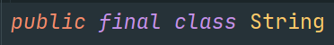

# 1.字符串概述

> a.String类是被final关键字修饰的，所以String类是不可继承的。
>
> 
>
> b.String的本质为char类型数组
>
> 
>
> c.String字符串使用Unicode编码保存。

# 2.字符串俩连接

> a.字符串之间可以使用+号进行拼接
>
> b.当一个字符串与一个非字符串进行拼接的操作的时候，非字符串对象将会被转换为字符串然后执行拼接
>
> 

# 3.字符串的创建方式

方式1：

> 通过构造函数传入字符串字面量：String xxx = new String(字符串字面量)

方式2：

> 直接将字符串字面量赋值给字符串变量：String xxx = 字符串字面量

方式3：

> 通过构造函数传入byte数组：String xxx = new String(bytes,offset,length)
>
> 其中offset和length可以被省略
>
> 

# 4.字符串常用方法

比较两个字符串的方法：

> 1.内容相等性比较：boolean equals(@Nullable Object anObject) 
>
> > 相等返回true
> >
> > 不等返回false
>
> 2.忽略大小写比较：boolean equalsIgnoreCase(@Nullable String anotherString)
>
> > 忽略大小写相等返回true
> >
> > 忽略大小写不等返回false
>
> 3.比较字符串大小：int compareTo(@NotNull String anotherString)
>
> > 将调用者和anotherString进行对齐，从首字符往后进行遍历，
> >
> > 用调用者此时的字符和anotherString此时的字符对应相减。
> >
> > 如下图所示，'a' - 'd' = -3 所以返回值为-3
> >
> > 

返回字符串中给定索引的字符的方法：

> 1.char charAt(int index)
>
> > 返回字符串中位于index索引处的字符

判断字符串中是否包含某个子字符串的方法：

> 1.boolean contains(@NotNull CharSequence s)
>
> > 当调用者包含字符序列s的时候返回true
> >
> > 当调用者不包含字符序列s的时候返回false
>
> 2.boolean startsWith(@NotNull String prefix)
>
> > 当调用者包含prefix前缀的时候返回true
> >
> > 当调用不包含prefix前缀的时候返回false
>
> 3.boolean endsWith(@NotNull String suffix)
>
> > 当调用者包含suffix后缀的时候返回true
> >
> > 当调用者不包含suffix后缀的时候返回false

查找字符串中子字符串位置的方法：

> 1.int indexOf(@NotNull String str)
>
> > 从前向后查找，返回调用者之中str开始位置的索引
> >
> > 如果没有找到则返回-1
>
> 2.int indexOf(@NotNull String str, int fromIndex)
>
> > 从调用者的fromIndex位置从前向后检查，返回调用者之中str开始位置的索引
> >
> > 如果没有找到则返回-1
>
> 3.int lastIndexOf(@NotNull String str)
>
> > 从后向前查找，返回调用者之中str开始位置的索引
> >
> > 如果没有找到则返回-1
>
> 4.int lastIndexOf(@NotNull String str, int fromIndex)
>
> > 从调用者的fromIndex位置从后向前检查，返回调用者之中str开始位置的索引
> >
> > 如果没有找到则返回-1

查找与替换方法

> 1.public String replace(char oldChar, char newChar)
>
> > 将所有的oldChar替换为newChar
>
> 2.String replace(@NotNull CharSequence target, @NotNull CharSequence replacement)
>
> > 将target子字符序列替换为replacement子字符序列
>
> 3.String replaceAll(@NotNull String regex, @NotNull String replacement)
>
> > 将字符串形式正则匹配到的子字符串通通替换为replacement
>
> 4.public String replaceFirst(@NotNull String regex,@NotNull String replacement)
>
> > 将字符串形式正则匹配到的第一个子字符串替换为replacement

字符串数组的连接

> 1.java.lang.String @NotNull public static String join(@NotNull CharSequence delimiter,@NotNull CharSequence... elements)
>
> > 其中第一个参数是连接符
> >
> > 剩余参数是一个一个的字符串
> >
> > 返回值是使用连接符将字符串连接起来并返回。
> >
> > 
>
> 2.java.lang.String @NotNull  public static String join(@NotNull CharSequence delimiter, @NotNull Iterable<? extends CharSequence> elements)
>
> > 其中第一个参数是连接符
> >
> > 第二个参数是一个字符串数组或者字符串作为元素的集合
> >
> > 返回值是使用连接符将字符串数组连接起来并返回。

字符串的拆分

> 1.java.lang.String @NotNull @Contract(pure = true)  public String[] split(@NotNull String regex)
>
> > 按照regex匹配到的分隔符将调用者进行拆分，并返回拆分完成的字符串数组
>
> 2.java.lang.String @NotNull @Contract(pure = true) public String[] split(@NotNull String regex, int limit)
>
> > 按照regex匹配到的分隔符将调用者进行拆分，并返回拆分完成的字符串数组,并仅仅拆分为limit个。
> >
> > 

大小写切换：

> 1.public String toLowerCase()
>
> > 将调用者变成小写并返回
>
> 2.public String toUpperCase()
>
> > 将调用者变成大写并返回

转换为字符数组或字节数组

> 1.public char[] toCharArray()
>
> > 将调用者转换为字符数组并返回
>
> 2.public byte[] getBytes()
>
> > 将调用者转换为字节数组并返回
>
> 3.public byte[] getBytes("字符串编码格式")
>
> > 将字符串按照字符串编码格式进行编码并返回

截取子串

> 1.public String substring(@Range(from = 0, to = Integer.MAX_VALUE) int beginIndex,@Range(from = 0, to = Integer.MAX_VALUE) int endIndex
>
> > 左闭右开的截取子字符串
>
> 2.public String substring(@Range(from = 0, to = Integer.MAX_VALUE) int beginIndex)
>
> > 从beginIndex开始截取直到末尾

去掉多余的空白字符

> 1.String trim()
>
> > 去掉字符串两侧的空白字符

将数值类型转换为字符串类型

> 1.String String.valueOf(数值)

# 5.StringBuilder

## 5.1 出现StringBuilder的原因

> 出现这个的原因是String对象是不可变的对象，每次要将String对象修改的结果会创建一个新的字符串对象，然后将指针指向这个新的String对象，为了直接进行修改而不进行内存的占用，这里引入了StringBuilder和StringBuffer这两个相似的类

## 5.2  StringBuilder概述

> 在java.lang包下，该类维护一个可变长度的字符串

## 5.3 StringBuilder方法

创建StringBuilder对象

> 1.new StringBuilder()
>
> 2.new StringBuilder(charSequence seq)
>
> 3.new StringBuilder(int capacity)
>
> 4.new StringBuilder(String str)

尾部追加

> 1.append(String str)
>
> > 在尾部添加str字符串
>
> 2.append(char c)
>
> > 在尾部添加c这个字符

设置某个字符

> 1.setCharAt(int i ,char c)
>
> > 将StringBuilder对象索引为i的地方的字符设置为c

插入字符串

> 1.insert(int offset,String str)
>
> > 向StringBuilder对象的offset索引处插入str

删除子串

> 1.delete(int startIndex, int endIndex)
>
> > 删除StringBuilder从startIndex到endIndex位置处左闭右开的字符

替换子串

> 1.replace(int startIndex,int endIndex, String str)
>
> > 替换StringBuilder从startIndex到endIndex位置左闭右开的字符替换为str

删除字符

> 1.deleteCharAt(int index)
>
> > 删除StringBuilder位于index位置处的字符

# 6.字符串常量池

>1.当我们创建字符串String s1="abc"的时候首先会去字符串常量池之中进行查看，查看有没有字符串常量"abc",
>
>当发现没有的时候就会在常量池之中创建"abc"并且在栈之中创建s1变量指向字符串常量池之中的常量，
>
>如果发现有的话，则不会在常量池之中创建"abc"

> 2.当我们创建String s2 = "abc"的时候，会发现常量池之中已经存在"abc",所以只需要在栈区之中创建s2变量并让
>
> s2这个变量指向我们常量池之中的"abc"

> 3.当我们使用String s = new String("abc") 他不使用字符串常量池，他每创建一个字符串都直接在堆中占用内存。

