# 1.DataType数据类型

分类：

> 1.引用数据类型 Reference Type
>
> > 1.1 字符串类型
> >
> > > definition:
> > >
> > > Java中字符字面值用单引号括起来，如‘@’‘1’。所有的UTF-16字符集都包含在字符字面值中。不能直接输入的字符，可以使用转义字符，如‘\n’为换行字符。也可以使用八进制或者十六进制表示字符，八进制使用反斜杠加3位数字表示，例如'\141'表示字母a。十六进制使用\u加上4为十六进制的数表示，如'\u0061'表示字符a。也就是说，通过使用转义字符，可以表示键盘上的有的或者没有的所有字符。
> >
> > > 转义字符：
> > >
> > > \ddd(八进制) 、 \uxxxx(十六进制Unicode字符)、\'（单引号）、\"（双引号）、\\ （反斜杠）\r（回车符） \n（换行符） \f（换页符） \t（制表符） \b（回格符）
> >
> > 1.2 其他对象类型
>
> 2.基本数据类型 Primitive Type
>
> ​	   Numeric Types 数值类型
>
> > 2.1 byte 1个字节
> >
> > > definition:
> > >
> > > byte由1个字节8位表示，是最小的整数类型。主要用于节省内存空间关键。当操作来自网络、文件或者其他IO的数据流时，byte类型特别有用。取值范围为:[-128, 127]
> > >
> > > default value: 0
> > >
> > > 编译错误：当我们试图将取值范围外的值赋值给byte时会报编译错误
> > >
> > > 类型提升：在参与运算的时候将被提升为int类型
> >
> > 2.2 short 2个字节
> >
> > > definition:
> > >
> > > 用16为表示，取值范围为：[- 2^15, 2^15 - 1]。short可能是最不常用的类型了。可以通过整型字面值或者字符字面值赋值，前提是不超出范围（16 bit）。short类型参与运算的时候，一样被提升为int或者更高的类型。
> >
> > 2.3 int 4个字节
> >
> > ​	   各种整形字面量
> >
> > > 2.3.1 0b或者0B开头可以写二进制字面量
> > >
> > > 2.3.2 0开头可以写八进制字面量
> > >
> > > 2.3.3 无前缀开头可以写十进制字面量
> > >
> > > 2.3.4 0x开头可以写十六进制字面量
> >
> > ​       溢出问题
> >
> > > 顺时针超过六点钟方向就是上溢---加着加着越界了。
> > >
> > > 逆时针超过六点钟方向就是下溢---减着减着越界了。
> >
> > > 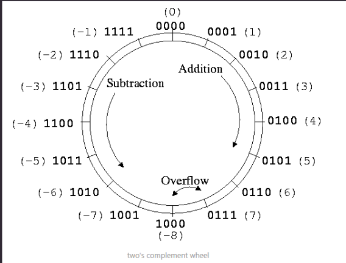
> >
> > 2.4 long 8个字节
> >
> > 2.5 浮点型
> >
> > > 2.5.1 float
> > >
> > > 2.5.2 double
> > >
> > > 注意：
> > >
> > > > 1.默认浮点类型字面量为double
> > > >
> > > > 2.如果要更改浮点类型字面量为float需要在浮点型字面量后加上f或者F
> > > >
> > > > 3.double和float是不精确的不要让他们进行==比较
> > > >
> > > > 4.特殊的三个浮点数值
> > > >
> > > > > 4.1 Infinity  正无穷大
> > > > >
> > > > > 1.0 / 0 时出现
> > > > >
> > > > > 4.2 -Infinity 负无穷大
> > > > >
> > > > > -1.0 / 0 时出现
> > > > >
> > > > > 4.3 NaN 不是一个数
> > > > >
> > > > > 对-9.0求平方根时出现
> > > >
> > > > 5.如果double和float都无法达到想要的精度，可以使用BigDecimal类。
>
> ​       boolean type 布尔类型
>
> > definition:
> >
> > boolean类型只有两个值true和false，默认为false。
>
> ​       char type 字符类型
>
> > definition：
> >
> > 16 bits, [0, 65535], [0, 2^16 -1],从'\u0000'到'\uffff'。无符号，默认值为'\u0000'。Java使用Unicode字符集表示字符，Unicode是完全国际化的字符集，可以表示全部人类语言中的字符。Unicode需要16位宽，所以Java中的char类型也使用16 bit表示。 赋值可能是这样的：
> >
> > char ch1 = 88;
> >
> > char ch2 = 'A';
> >
> > ASCII字符集占用了Unicode的前127个值。之所以把char归入整型，是因为Java为char提供算术运算支持，例如可以ch2++;之后ch2就变成Y。当char进行加减乘除运算的时候，也被转换成int类型，必须显式转化回来。

# 2.类型转换

## 2.1 自动类型转换

基本类型钟除了boolean类型都能进行相互的转换，当取值范围小的类型赋值给取值范围大的类型构成自动类型转换，对byte short char类型如果没有超出范围可以用整型字面量对这些类型的变量进行直接的赋值，对byte，short,char类型参与的运算会先将它们统一转换为int再进行运算，多种类型变量参与的运算将会先转换为大的数据类型再进行运算。

## 2.2 强制类型转换

格式：(要强转的类型)变量

# 3. 运算符

## 3.1 算数运算符

> 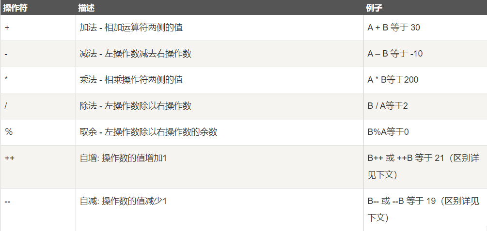

## 3.2 关系运算符

> 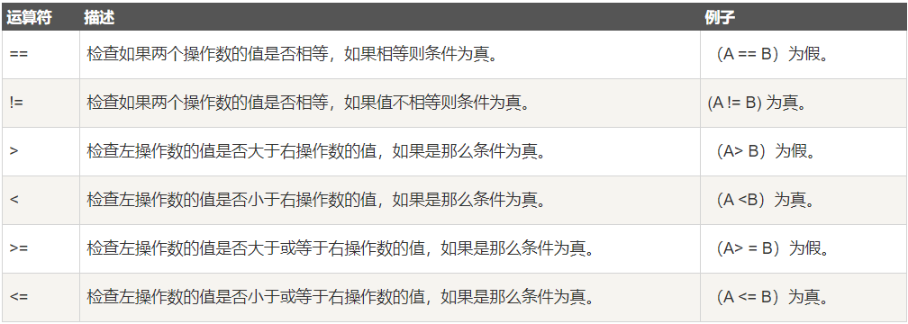

## 3.3 位运算符

> 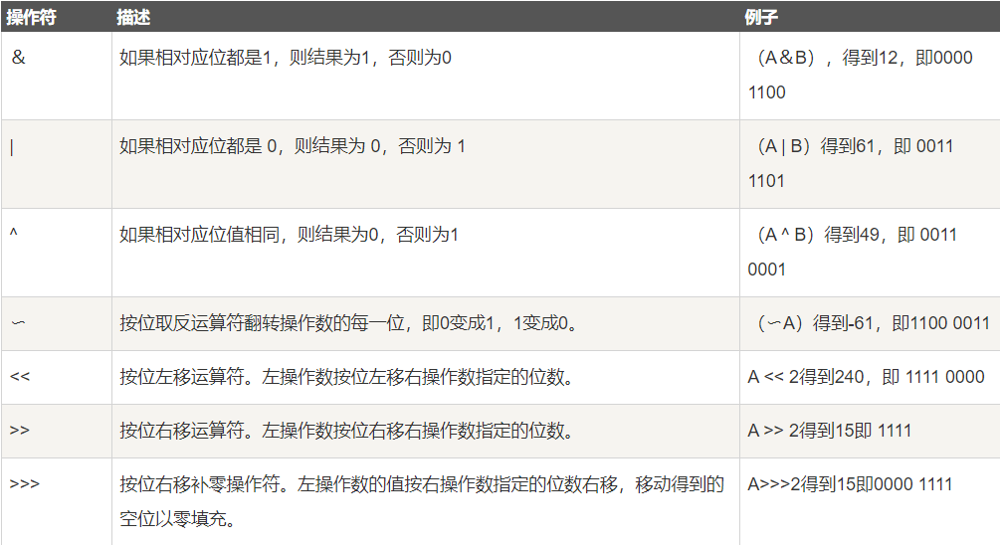

## 3.4 逻辑运算符

> 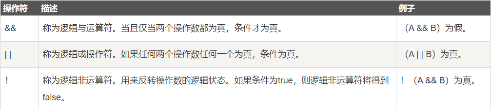

## 3.5 赋值运算符

> 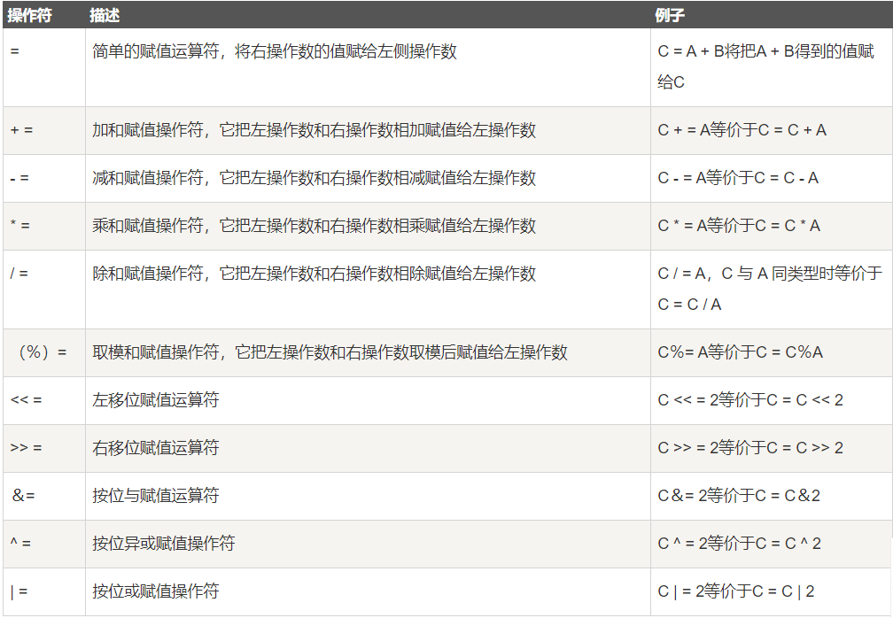

## 3.6 三元运算符

> 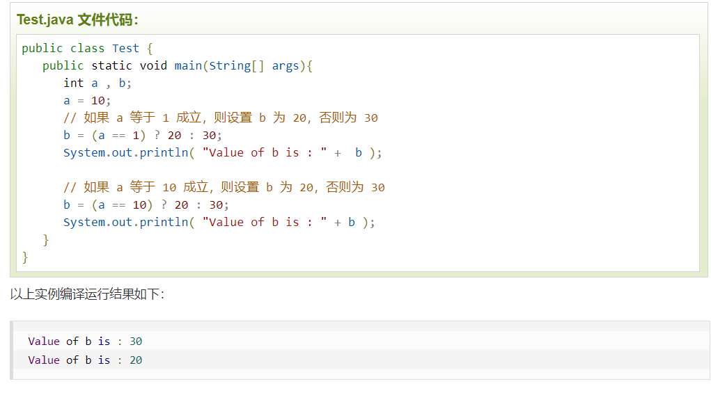

## 3.7 优先级和结合性

### 3.7.1 优先级

定义：

> 当两个运算符的优先级不同的时候，高优先级的运算符先结合操作数

总结：

> 优先级依次为括号-单元运算-双元运算-三元运算符-赋值运算符

### 3.7.2 结合性

定义：

>  当我们运算符的优先级相同的时候就需要使用结合性来进行运算顺序的判断了

分类：

> 从左到右(先让左侧运算符结合操作数)
>
> 从右到左(先让右侧的操作符结合操作数)

总结：

> 双元从左到右，一元和赋值和三元从右到左

### 3.7.3 图示

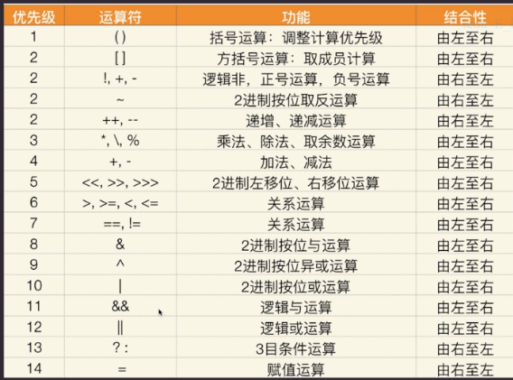

# 4. 变量与常量

## 4.1 变量分类

> ### 4.1.1 局部变量
>
> 声明位置：方法之中
>
> ### 4.1.2 成员变量
>
> 声明位置：类之中
>
> > #### 4.1.2.1 进一步分类之实例变量
> >
> > 定义：类的每一个对象都含有各自的实例变量
> >
> > 声明方式：类型 实例变量名;
> >
> > #### 4.1.2.2 进一步分类之静态变量
> >
> > 定义：静态变量属于类
> >
> > 声明方式：static 类型 静态变量名;
> >
> > #### 4.1.2.3  常量
> >
> > 定义：属于类，不可改变，需要再声明类的时候或者在构造函数之中进行初始化，
> >
> > 对于静态常量来说只能在声明类的时候进行初始化
> >
> > 静态常量声明方式：static final 类型 常量名;
> >
> > 实例常量声明方式：static 类型 常量名;

## 4.2 final关键字的作用

### 4.2.1 修饰局部变量

> 导致变量仅仅能够被初始化，不能被更改

> 注意：final修饰引用类型时，指的是引用不能指向别的对象，但不是指对象之中的内容不能修改，比如我们的数组虽然声明为final但是其值是可以更改的

### 4.2.2  修饰方法

> 导致方法不能被重写

### 4.2.3 修饰类

> 导致类不能被继承

### 4.2.4 修饰方法参数

> 如果我们想要一个参数进入到函数之中谁也不要进行改动，
>
> 就使用final这个关键字对参数进行修饰即可。

### 4.2.5 修饰实例变量

> final修饰实例变量将使得其在进行初始化之后不能再进行更改。
>
> 初始化的方式有两种，一种是在声明类的时候进行初始化，一种
>
> 是在构造函数之中进行初始化。

## 4.3 static关键字的作用

### 4.3.1 静态变量 

定义：

> static关键字所修饰的属于类的变量。

性质：

> 属于类，存在于方法区，只有一份，这个变量可以
>
> 通过类名访问，也可以通过对象来访问，两者访问
>
> 的都是属于类的那一个变量。

静态变量工作原理：

> 1.Java源文件经过编译得到字节码文件，每个类编译为一个class
>
> 文件
>
> 2.当执行java程序的时候，每用到一个类JAVA就会自动将对应的字节码加载到方法区，字节码文件仅仅加载一次。那么什么时候算用到了Java类呢？
>
> > 2.1 创建对象的时候
> >
> > 2.2 访问类的静态属性的时候
> >
> > 2.3 执行类之中的静态方法的时候
>
> 3.如果类中有静态变量，Java就会在加载类期间将其在方法区之中
>
> 进行初始化，初始化会发生有且仅有一次，所以只有一份在方法区
>
> 中的静态变量
>
> 4.创建对象的时候按照类中声明的实例变量分配对象的属性，每创建一个对象，就会分配一组对象属性
>
> 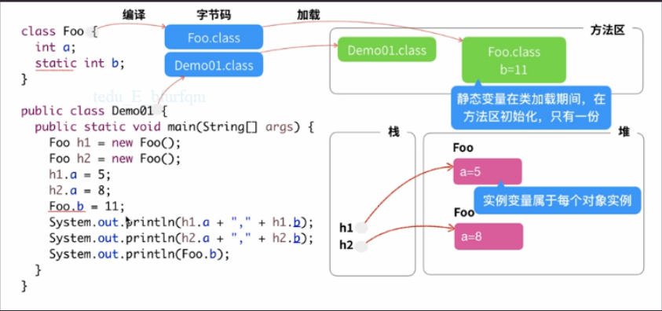

### 4.3.2 静态方法

定义：

> static关键字所修饰的类方法

性质：

> 1.静态方法之间可以进行相互的调用
>
> 2.实例方法可以在内部调用静态方法，可以理解为内部隐式
>
> 的使用了this对象进行调用。
>
> 3.静态方法在内部不可以调用实例方法
>
> 4.只能访问静态变量不能访问实例变量，因为没有隐式的this
>
> 对象。

适用情况：

> 1.当一个方法其方法体之中不会用到当前对象的任何属性的时候
>
> 就可以定义为静态方法，他作为一种工具存在。

### 4.3.3  静态代码块

代码块定义：

> 1.在类中可以适用{}定义代码块，代码块在创建对象时候按照顺序执行，具体情形可以参照对象创建时的执行顺序，其中可以进行变量的声明。

静态代码块定义：

> 1.属于类，在类被适用并加载期间自动执行，因为类只被加载一次，所以通常用来进行资源的加载比如图片资源。

### 4.3.4 静态导入

功能：

> 用于简化适用静态资源的编码

方式：

> import static 具体的类或者方法
>
> import static 类.*

举例：

> 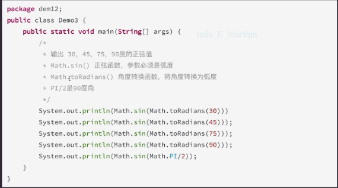
>
> 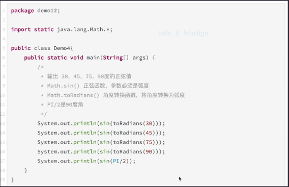

