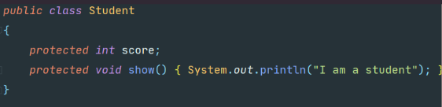

# 1.package关键字

作用：避免类的命名重名，减少了命名冲突，相当于文件夹的作用--[避免文件的重名]

注意：包可以存在层次结构，同包之中的类不能够重名

使用：

> 1.必须在Java源文件的第一行使用package声明包，package语句只能由一样。
>
> 2.package可以不用写，不写代表使用默认包
>
> 3.package相同的类在一个包下
>
> 4.建议包名采用小写字母
>
> 5.包编译后变成对应的多文件夹

区分：

> 文件管理之中的文件夹，不过要与directory进行区分，其中package是用来进
>
> 行类的存放的，而directory可以存放任何类型的文件

# 2.全限定名

作用：

> 由包名和类名组成的完整名称类似于文件夹之中绝对路径，JAVA程序编译
>
> 和运行的时候都采用全名，在同一个包内import导入之后可以省略包名直接
>
> 写类名，但是遇到相同类名时就不能省略包名而要填写全限定名

# 3.包的导入 import

使用：

> 1.同包中的类可以写类名直接访问。
>
> 2.不同包之中的类不能直接访问，若想要访问存在两种方式
>
> > 方式1：先import 包名.类名 再使用类名进行访问即可
> >
> > 方式2：直接使用类的全限定名(包名.类名进行访问)

# 4.四种访问权限 Access Right

图示：

> 

public：

> 公开的，所有类可以访问

private：

> 私有的，本类可以访问

protected：

> 保护的，本类，派生类，同包类可以访问

默认：

> 本类，同包类可以访问

## 4.1 各种访问权限的相互比较

> 默认访问权限和public访问权限的对比：
>
> 如下图所示，两个类分别处于不同的包之中，默认访问控制允许同包访问和本类访问而不允许不同包访问，
>
> 所以a是不被允许在Demo6之中被访问的
>
> 

> protected访问权限的演示：
>
> 
>
> 

> protected访问权限与默认访问权限的比较：
>
> 

## 4.2 权限使用最佳实践

> 1.需要隐藏的属性和方法定义为私有的private
>
> 2.需要留给子类使用的属性和方法定义为保护的protected
>
> 3.确实需要公开访问的属性和方法定义为public
>
> 4.不清楚使用哪种访问控制修饰符的时候，优先选择private
>
> 5.默认的访问控制不使用

## 4.3 让Idea的空包也显示

> 