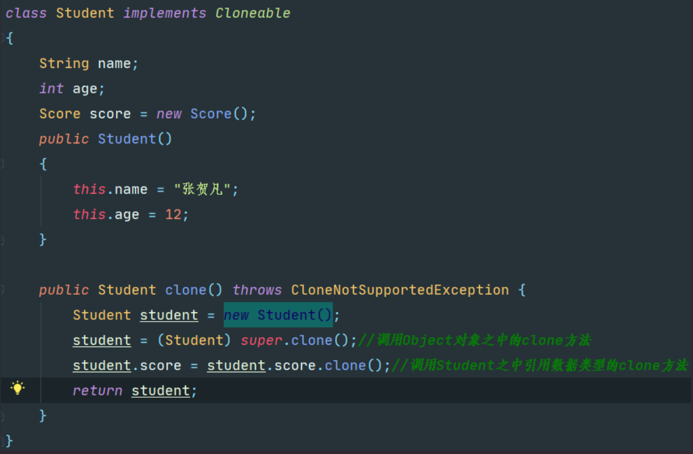
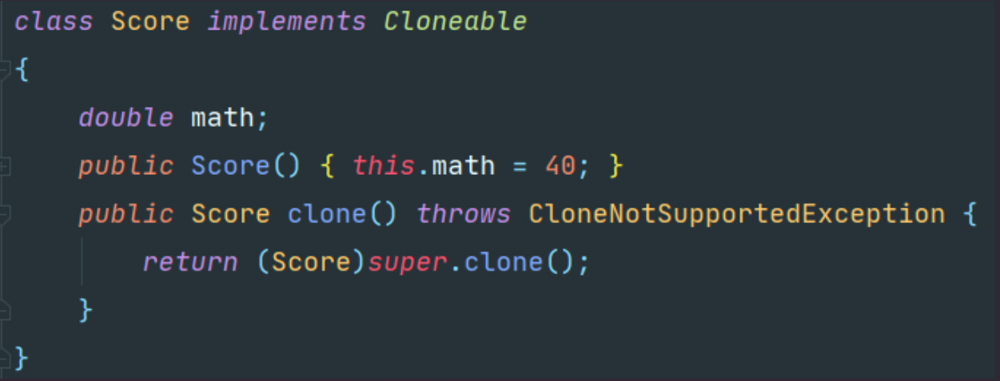
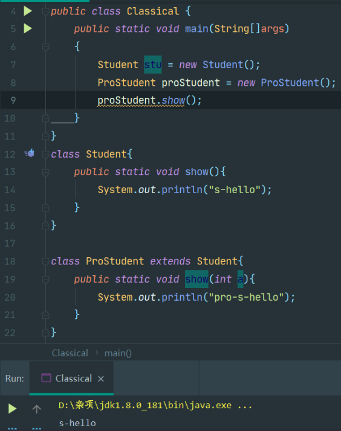
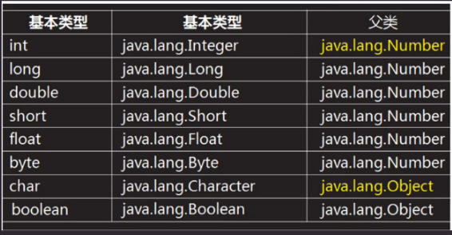
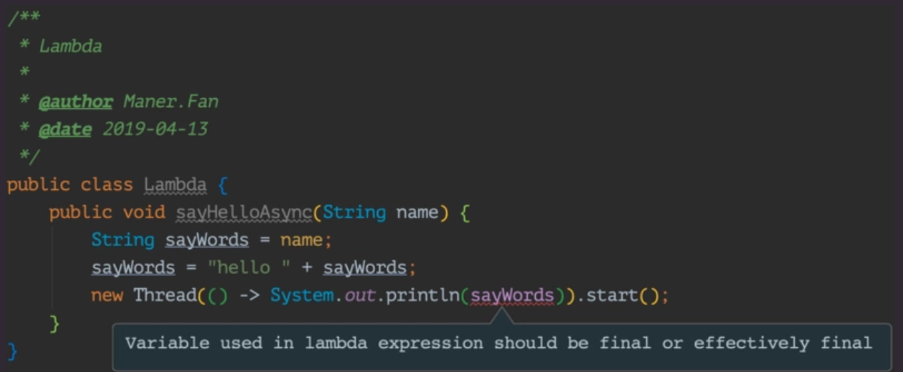
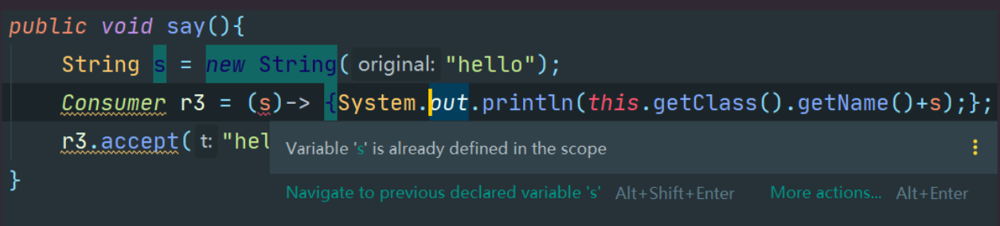
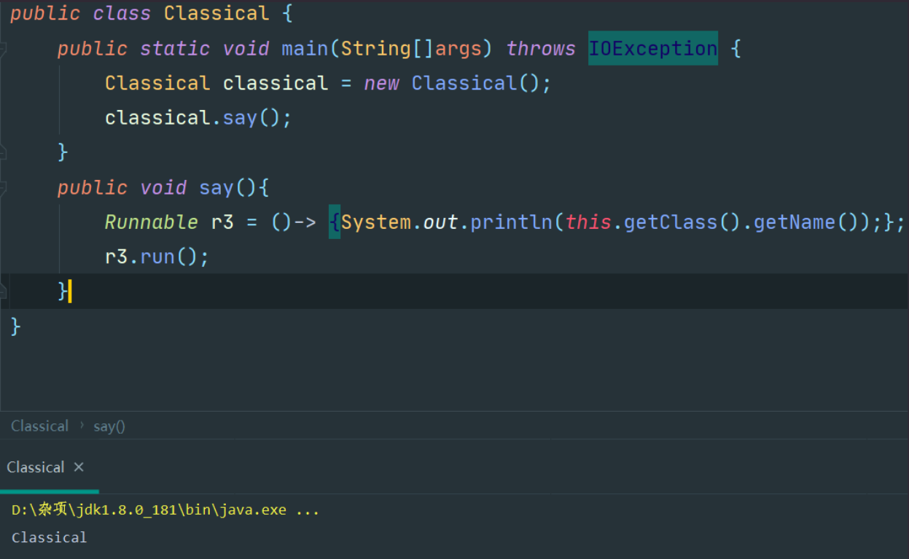
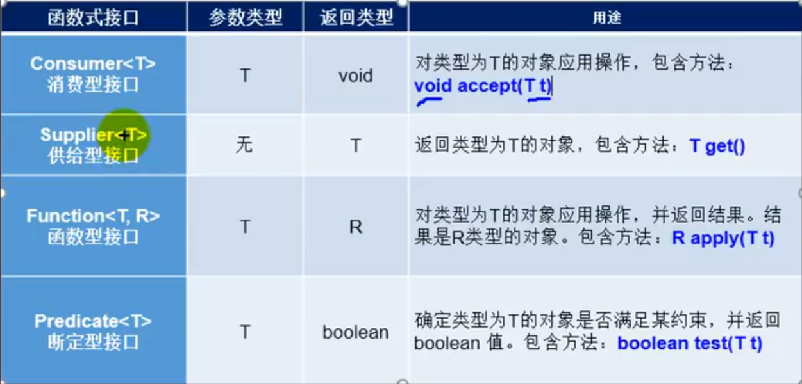
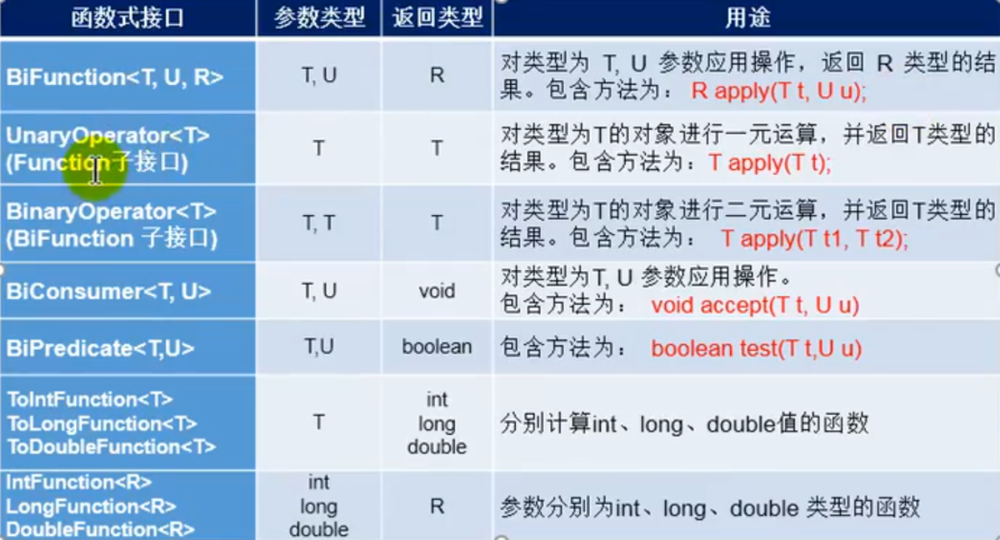

# 0.Object类

定义：

> Object类是JAVA中所有类的父类，我们编写的类如果不继承任何类，那么默认继承Object

功能：

> Object类承载了java所有类的共性内容，为java程序提供了最基本的结构支撑，是所有类的根类

Idea重写快捷键：

> alt + g

方法：

> toString
>
> 功能：Object对象中的toString方法返回完整包名＋类名+@+哈希码十六进制表示
>
> 重写：我们一般类中重写toString，一般是改为返回对象的内容，即返回对象的所有属性的展示

> equals
>
> 功能：比较两个变量的引用的对象是否是同一个对象
>
> 重写：一般是重写为比较各个对象中的属性是否相等

> clone
>
> 功能：在子类之中适用this.clone可以完成浅拷贝
>
> 重写：
>
> > 1.我们一般不想完成浅拷贝而是完成深拷贝，要对内部的引用数据类型调用clone方法
> >
> > 2.若想要在类的实例上调用clone方法(无论是重写了还是没有重写)我们需要这个类继承Cloneable接口，因为clone在Object之中为protected，所以在子类之中只能通过this(没重写)或者super(重写了)调用
>
> 实例：
>
> 1.要实现拷贝功能的类都需要实现Cloneable接口，不然会发生CloneNotSupportedException异常。
>
> 2.然后需要调用超类的clone方法将基本数据类型完成一次clone
>
> 3.接着需要调用引用数据类型的clone方法为引用数据类型进行clone
>
> 
>
> 


# 1.Java继承

格式：

> ```java
> // a是子类,b是父类
> public class a extends b{
>     // 类体
> }
> ```

继承的内容：

> 1.父类的属性和方法
>
> 2.可以理解没有继承父类的私有字段--实际上继承过来了，但是不能直接访问
>
> 需要通过父类的公有方法进行访问。
>
> 3.继承了父类的共有字段。

子类有没有继承父类的构造函数?

> 1.子类并没有继承父类的构造函数。
>
> 2.子类构造函数执行的时候首先会去调用父类的无参数的构造函数从而创建一个父类对象。
>
> 就是创建子类对象的时候会在子类对象内部创建一个父类对象。为了让子类可以使用父类
>
> 之中的成员。

继承的特性：

> 单继承：JAVA之中仅仅允许单一继承即仅仅允许拥有一个父类
>
> 传递性：父传子，子传孙

子类对象的创建：

> 说明：
>
> 派生类之中的构造函数中如果没有主动调用super(),则会先主动添加super()调用父类的无参(默认)构造函数来初始化父类中的属性，所以如果没有主动调用的时候父类一定要确保拥有无参构造。
>
> 注意：
>
> 如果我们需要主动的通过super()来进行调用父类的构造函数则必须保证这条代码位于构造函数的第一行之中

泛化这个名词的理解：

> 让父类定义从子类中抽取过来的属性和方法，从而生成一个更加通用泛化的类。

命名冲突：

> 当子类的属性或者方法与父类命名冲突--(即拥有相同的属性名或者方法名)的时候，采用的是就近原则，如果我们想要调用的是父类的属性和方法我们就需要使用super.属性或者方法进行访问

# 2.动态绑定和静态绑定

## 2.1 重载

发生地点：

> 发生在同一个类之中签名不同的方法，遵循编译器绑定，看参数/引用的类型来进行方法的绑定

## 2.2 重写/覆盖

适用情况：

> 子类方法的性质一样，但是具体实现因为子类而异，对于父类(非抽象类)有的子类觉得父类方法好可以直接继承，有的子类觉得不满足可以修改，对于抽象类，子类必须将抽象类定义的所有抽象方法进行重写方可以将自己变成一个正常的类而非抽象类

发生地点：

> 发生在父子类之中，方法名称相同，参数列表相同(签名相同)，方法体不同

重写规则：

> A.方法名称相同
>
> B.参数列表相同
>
> C.派生类方法返回值类型小于或者等于超类方法的返回值类型---小于等于的意思是为子类或者相同类
>
> D.派生类的访问权限大于或者等于超类方法的访问权限
>
> ---大于等于的意思是public > protected > 默认 > private
>
> E.派生类抛出异常少于小于或者等于超类方法抛出的异常
> ---小于等于的意思是异常的类型需要更加的精确
> 	秉持的原则
> 		抛出的异常越少越精确越好
>
> F.若返回值是基本数据类型那么需要和父类保持一致

## 2.3 动态绑定和静态绑定的区别

重写方法被调用时看引用所指向的对象的类型/区分于重载时的看引用类型因为在重写的时候是运行时绑定这个时候可以知晓对象的类型，而重载的时候是编译器绑定这个时候只能知晓引用的类型。


## 2.4 静态绑定的实现

private方法：

> 首先一点它不能被继承，既然不能被继承那么就没办法通过它子类的对象来调用，而只能通过这个类自身的对象来调用。因此就可以说private方法和定义这个方法的类绑定在了一起。

final方法：

> final方法虽然可以被继承，但不能被重写（覆盖），虽然子类对象可以调用，但是调用的都是父类中所定义的那个final方法，（由此我们可以知道将方法声明为final类型，一是为了防止方法被覆盖，二是为了有效地关闭java中的动态绑定)。

static方法：

> 可以被继承，如果满足重写的规则则是重载，根据引用类型来决定方法的调用。
>
> 

# 3. super和this关键字

## 3.1 super关键字

定义：

>  super关键字访问的是子类对象中属于父类的数据和方法。

用途：

> 1.super()放在子类构造函数的第一行用于调用父类的构造函数
>
> 2.super.方法/属性 用来调用父类的某个非私有的方法或者属性
>
> 3.在没有出现子类和父类的命名冲突的时候是不需要通过super来访问的，直接访问即可。

## 3.2 this关键字

定义：

>  this关键字访问的是当前对象。

用途：

> 1.this()调用子类中的某个构造函数
>
> 2.this.方法/属性调用子类的方法或属性

# 4.向上向下造型

## 4.1 向下造型

定义：

> 即将父类引用指向子类对象强制类型转换为子类引用指向子类对象

注意：

> 1.因为是父类引用，所以我们不能得知实际指向的对象是父类对象还是子类对象
>
> 2.如果指向的是子类对象则可以进行强转因为子类引用指向子类对象是安全的
>
> 3.如果是父类对象则不可以进行强转，会发生报错，ClassCastException 因为一些子类的属性方法父类对象是不存在的，那当进行强转的之后我们想要调用这些属性和方法的时候就不知道怎么办了。

如何判断一个对象真正是父类对象还是子类对象？

> 使用对象.instanceof 子类名
>
> > 如果对象不是类的实例返回false
>
> > 如果对象是类的实例返回true

## 4.2 向上造型

定义：

> 即将子类引用指向子类对象强制类型转换为父类引用指向子类对象，这一定是可以的，因为子类对象一定是父类的一元

## 4.3 调用方法注意

说明：

> 父类引用只能调用父类方法(但是可能会调用到子类重写的方法)，虽然这个引用可能指向的是子类的对象

# 5.一个Java类对象创建的全过程

## 5.1 进行默认的初始化

> 整型默认0
>
> 浮点型默认0.0
>
> 字符型默认空格
>
> 布尔类型默认flase
>
> String/引用类型默认为null
>
> 数组默认为null

## 5.2 进行显示域初始化

> 可以在类定义之中，直接将一个值赋值给任何域。在执行构造器之前，
>
> 先执行赋值的操作，在C++之中不能够直接的进行初始化，
>
> 但是JAVA之中是可以的。

## 5.3 按照在类中声明的次序，依次执行所有域初始化语句以及初始化块

> 在一个类的声明之中，可以包含多个代码块，只要构造类的对象，
>
> 这些代码块就会被执行。格式就是用大括号将一系列的初始化语句包括在内即可。

## 5.4 如果在构造函数之中调用了另一个构造函数则先执行那个构造函数

> this(...) 或  super(...)

## 5.5 执行本构造器的内容


# 6.接口和抽象类

## 6.1 接口

定义：

> 在JAVA程序设计语言之中，接口并不是类，而是对类的一组需求，类要完成的一系列特定的功能进行描述。一个类可以实现多个接口，如果类遵循某个接口的话它就要提供这个接口所要求其要提供的服务。

接口之中可以包含的方法：

> A.普通方法：接口之中的方法都是默认是public abstract进行修饰的。在进行实现的时候必须将方法声明为public否则将认为是类的默认访问属性，然后编译器就会给出你视图提供更加严格访问权限的警告信息。因为重写方法的话只能够访问权限更宽松
>
> 例如： void fly() 没有方法体
>
> B.静态方法：public static允许在接口之中进行静态方法的定义，通过接口名.进行调用
>
> 例如：static void show() 有方法体
>
> C.默认方法：public default可以为接口的方法提供一个默认的实现，当实现类没有进行
>
> 重写的时候使用这个默认的实现。
>
> 例如：default void show() 有方法体

接口之中可以包含的变量：

> 声明方式：类型 变量名;
>
> 变量类型：public static final

接口特性：

> 1.接口不是类，尤其不能够使用new运算符来创建一个接口对象。
>
> 2.尽管我们不能创造接口的对象，我们可以创建接口的变量
> 接口变量必须引用实现了这个接口的类的对象，如果声明了接口数组那意思就是具有这一个功能的第个对象的集合。
>
> 3.就像我们可以用instanceOf来判断对象是不是某特定类的实例，（当这个类为声明这个对象的类，或者说是这个类的基类，那么就会返回true，否则返回false），instanceOf也可以检查一个对象是否实现了某一个接口。
>
> 4.接口也可以进行扩展即继承另一个接口
>
> 5.接口之中不能包含实例域或者静态方法，但是可以包含有常量，这些都将被定义称为public static final。

默认方法命名冲突：

为什么会存在这种冲突：

> 为什么需要冲突解决，因为如果先在一个接口之中将一个方法定义为一个默认的方法，然后又在超类或者另一个接口之中定义相同的方法，不知道调用哪一个

Java的规则：

> 超类优先：如果超类提供了一个具体的方法，同名而且有相同参数类型的默认方法将会被忽略。
>
> 接口冲突：如果至少有一个接口提供了一个默认的方法，另一个接口提供了一个同名而且参数类型相同的方法，必须覆盖这个方法来解决冲突。


## 6.2 抽象类

声明格式：

```java
public abstract class 类名{

}
```

抽象类的特性：

> 1. 抽象类不能被实例化(初学者很容易犯的错)，如果被实例化，就会报错，编译无法通过。只有抽象类的非抽象子类可以创建对象。
>
>    
>
> 2. 抽象类中不一定包含抽象方法，但是有抽象方法的类必定是抽象类。
>
>    
>
> 3. 抽象类中的抽象方法只是声明，不包含方法体，就是不给出方法的具体实现也就是方法的具体功能。
>
>    
>
> 4. 构造方法，类方法（用 static 修饰的方法）不能声明为抽象方法。
>
>    
>
> 5. 抽象类的子类必须给出抽象类中的抽象方法的具体实现，除非该子类也是抽象类。


# 7.包装类

定义：

> 每一个基本数据类型对应一个包装类，包装类就是基本数据类型的对象形式

为什么需要包装类：

> 基本数据类型不能直接参与引用类型的使用或者计算，并且集合之中只能够使用引用的数据类型

特性：

> 1.包装类都是由final进行修饰的，不能定义子类
>
> 2.一旦构造了包装类，就不允许更改在其中的值

所有的包装类：

> 除了int类型和char类型对应的包装类之外，其余的包装类对应的包装类只要首字母大写即可。
>
> 

包装类字段：

> MIN_VALUE 最小值
>
> MAX_VALUE 最大值
>
> BYTES 字节数
>
> SIZE 位数
>
> TYPE 基本类型

包装类对象的创建：

> 三个重载方法：
>
> > Integer.valueOf(int i) 将整型包装起来
> >
> > Integer.valueOf(String s) 将字符串视作整型包装起来
> >
> > Integer.valueOf(String s, int radix) 将字符串视作radix进制的整数包装起来

将包装类对象转换成基本数据类型：

> 多个方法：
>
> > int intValue()
> >
> > double doubleValue()
> >
> > long longValue()

包装类的静态方法：

> 方法1：返回指定十进制数的字符串表示
>
> static String toString(int i)

> 方法2：将字符串转换为整数
>
> static int parseInt(String s)
>
> 方法3：将字符串转换为整数，并且我们给定的字符串s是radix进制的。
>
> static int parseInt(String s,int radix)

自动拆箱和装箱：

发生的地点：

> 1.如果将一个int值赋值给一个Integet对象会自动进行装箱的操作
>
> Integer i = a会在编译的时候自动转换为Integer i = Integer.valueOf(a)
>
> 2.如果将一个Integer赋值给一个int值时，将会自动地进行拆箱的操作。
>
> int b = i 会在编译的时候自动转换为int b = i.intValue()
>
> 3.甚至在算术表达式之中也能够进行自动的拆箱以及装箱。


# 8.内部类

## 8.1 定义：

> 在类的内部定义的类，被称之为内部类

## 8.2 成员内部类：

定义：

> 在类体之中定义的类，类似于实例变量的定义方式，作为一个类的成员。

优点：

> 1.可以隐藏类的定义(可以拿到外部使用但是非常罕见)
>
> 2.可以共享外部类的属性和方法。

何时使用内部类：

> 1.如果需要隐藏类的定义，不让外面使用这个类
>
> 2.内部类需要共享外部类的属性和方法的时候
>
> 3.如果不需要如上的特性则不需要适用成员内部类。

代码示例：

> ```java
> class Foo{
>     int a = 9;
>     
>     // 成员内部类
>     class Koo{
>         public void test()
>         {
>             // 共享外部类的属性
>             System.out.println(a);
>         }
>     }
>     
>     // 在类的内部使用内部类
>     public void demo()
>     {
>         Koo koo = new Koo();
>         koo.test();
>     }
> }
> ```

特性：

> 1.内部类仍然是一个独立的类，在编译之后还是会独立的生成.class字节码文件
>
> 2.内部类不能使用普通的方式从外部进行访问
>
> 3.想要在外部或者静态方法之中使用内部类，必须使用外部类的实例进行创建
>
> ```java
> public class DotNew{
>    public class Inner{
>        
>    }
>    public static void main(String[] args)
>    {
>        DotNew dn = new DotNew();
>        DotNew.Inner dni = dn.new Inner();
>    }
> }
> ```
>
> 4.成员内部类可以访问外部类之中的所有成员

## 8.3 静态内部类

格式：

> 在成员内部类的声明的基础上加上static关键字即可。

特性：

> 《1》在外围创建静态内部类的实例的时候不需要事先创建外部类的实例。Outer.Inner a = new Outer.Inner();
>
> 《2》静态内部类之中可以定义静态成员以及实例成员。
>
> 《3》静态内部类之中可以访问外部类的静态成员，但是如果想要访问外部类的实例成员，则需要创建外部类的对象。


## 8.4 局部内部类

定义：

> 在方法之中定义的类

使用情况：

> 不常用

特殊语法规则：

> 《1》局部内部类与局部变量相同不能够使用访问控制修饰符
>
> 《2》局部内部类只在当前方法之中生效
>
> 《3》局部内部类之中不能够定义static成员
>
> 《4》局部内部类之中可以访问外部类中所有成员
>
> 《5》在局部内部类之中可以访问当前方法之中final类型的参数与变量。


## 8.5 匿名内部类

定义：

> 用来创建临时使用的匿名对象的。

使用的场景：

> 假设我们仅仅创建一个对象，但是又不想要进行类的声明，那么我们就进行匿名内部类的创建即可

使用频率：

> 频繁

创建的方式：

> 因为构造器的名字必须与类名相同，而匿名内部类没有类名，所以匿名内部类没有构造器，所以
>
> 取而代之的有两种创建方式

​       方式1：

> 1.继承一个类重写它的方法
> 		格式：new SuperType(构造参数){
>     重写超类的方法
> }

​	   方式2：	

> 2.实现一个接口实现它的方法
> 		格式：New InterfaceType(){
>   实现接口的方法 
> }


# 9.LAMBDA表达式与函数式接口

## 9.1 LAMBDA表达式

定义：

> LAMBDA表达式是一个可以进行传递的代码块(可以像代码或者数据一样进行传递的操作)可以在以后执行一次或者是多次，都是将代码块传递给某个对象，然后这个对象会在未来的某个时间进行调用，但是传递一个代码块并不容易，所以需要构建一个对象(LAMBDA表达式在JAVA之中被视为一个函数式接口的实例)，然后这个对象的类必须要有一个方法能够包含所需执行的代码，比如我们的Arrays.sort方法的第二个参数要求接受一个实现了Comparator接口的一个对象。

格式与组成：

> component1  ： → lambda操作符号，也可以称之为箭头操作符
>
> component2  :   箭头左侧，lambda的形参列表，实际上就是接口中抽象方法的形参
>
> component3  :   箭头右侧，就是重写的方法的方法体

分情况解析：

> 情况1 == [无参数无返回值情况]
>
> 对于要进行重写的方法没有返回值也没有形参列表，就和我们下面的例子中的Runnable接口之中的抽象方法run
>
> 一样，既没有参数也没有返回值，我们像例子中一样进行操作即可。
>
> ```java
> Runnable r3 = ()->System.out.println("xxx")
> ```

> 情况2 == [单参数无返回值情况]
>
> 我们只需要在箭头前面的参数列表之中写上(参数类型 参数名)即可
> 	 提示1：其中的小括号之中的String是可加可不加的，因为编译器会自动推断得出
> 	 提示2：LAMBDA表达式如果只有一个参数的话小括号也可以进行省略
>
> ```java
> Consumer<String> con1 = (String s) -> {
> System.out.println("参数类型可以进行省略" + s)
> }
> ```

> 情况3 == [存在两个以上的参数并有返回值]
>
> //提示1：如果只有一条执行语句的话，大括号也可以进行省略的操作
> //提示2：并且这条仅有的语句还是返回语句的话return关键字也可以进行省略
>
> ```java
> Comparator<Integer> comparator1 = (o1,o2) -> {
>  System.out.println(o1);
>  System.out.println(o2);
>  return o1.compareTo(o2);
> }
> ```

## 9.2 LAMBDA表达式之中的捕获

捕获：

> Lambda表达式捕获到除了参数之外的其他变量并使用的过程。

注意：

> 1.LAMBDA表达式之中捕获的变量必须为最终变量即初始化之后就不会再为它进行重新赋值的操作,
>
> 如果我们捕获了非final的局部变量即为在代码中使用非final的变量则会爆出编译错误，对于静态变量
>
> 和成员变量没有这样的限制
>
> 

> 2.在LAMBDA表达式之中声明的参数不能够与外围声明的局部变量的名字相同这一点与普通方法是一致的。
>
> 

> 3.在LAMBDA表达式之中使用this关键字的话，this引用的对象是LAMBDA 表达式所在方法的this所引用的对象
>
> 

## 9.3 函数式接口

定义：

> 1.函数式接口在JAVA之中是指:有且仅有一个抽象方法的接口 需要提供这种类型接口的对象的时候。LAMBDA表达式可以派上用场，匿名内部类也可以派上用场，匿名内部类也可以派上用场。实现类对象最麻烦但是也可以派上用场。
>
> 2.为函数式接口赋值的两种方式：
>
> 方式1：	匿名内部类作为实例
> 方式2：	LAMBDA表达式作为实例

函数式接口的作用：

> 可以接收一个匿名内部类对象，或者一个lambda表达式作为输入，类似于可以存储一个逻辑。并放到代码之中去执行。

常用函数式接口

> A Table
>
> 

> B Table
>
> 

实例演示：

> ```java
> package JavaBasic.Basic04;
> 
> import java.util.ArrayList;
> import java.util.Arrays;
> import java.util.List;
> import java.util.function.Predicate;
> 
> public class ExtendSection {
>     public static void main(String[] args) {
>         testConsumer();
>     }
> 
>     // 含有函数式接口Predicate的静态方法
>     public static List<String> filterString(List<String> list, Predicate<String> pre)
>     {
>         List<String> res = new ArrayList<>();
>         for(String item:list)
>         {
>             if(pre.test(item))
>             {
>                 res.add(item);
>             }
>         }
>         return res;
>     }
> 
>     // 调用匿名内部类的方法。
>     public static void testConsumer()
>     {
>         List<String> list = Arrays.asList("北京","南京","天津","东京","西晋","普京");
>         List<String> listAfterFilter = filterString(list, new Predicate<String>() {
>             @Override
>             public boolean test(String s) {
>                 if(s.contains("京"))
>                 {
>                     return true;
>                 }
>                 else
>                 {
>                     return false;
>                 }
>             }
>         });
>         for(String item : listAfterFilter)
>         {
>             System.out.println(item);
>         }
>     }
> }
> 
> ```

## 9.4 方法引用

定义：

> 方法引用可以看成是Lambda表达式深层次的表达，他也是函数式接口的实例。

适用的场景：

> 当我们Lambda表达式要实现的功能已经存在现有的方法的情况下， 我们可以使用
>
> 方法引用来简化我们的编码操作。

具体写法：

> 情况1：针对类的静态方法
>
> 要求：要求接口中的抽象方法的形参列表和返回值类型与方法引用的形参列表和返回值类型相同。
>
> 举例：
>
> 比如说我
>
> ```
> 
> ```
>
> 们的Consumer这个函数式接口，它只接收一个参数但是没有返回值，与什么很类似呢，我们立马应该想到System.out.println(x)方法,它接收一个参数然后将参数输出
>
> ``` java
> Consumer<String> con = str -> System.out.println(str);
> Consumer<String> con = System.out::println()
> ```

> 情况2：针对类的非静态方法
>
> 要求：参数不要求完全匹配，返回值要匹配，总是抽取第一个参数作为对象进行调用。
>
> 举例1：
>
> ```java
> Comparator<String> com1 = String::compareTo;
> System.out.println(com1.compare("abc","abm"))
> ```
>
> 举例2：
>
> ```java
> Bipredicate<String,String> pre2 = String :: equals;
> System.out.println(pre2.test("abc","abd"));
> ```

> 情况3：无参构造器引用
>
> 对于无参构造函数一般使用supplier函数式接口进行存储
>
> ```java
> Supplier<Employee> sup1 = Employee::new;
> // 调用get方法将会返回Employee对象
> System.out.println(sup1.get());
> ```

> 情况4：单参构造器引用
>
> 对于单参数构造器一般使用Function函数式接口进行存储
>
> ```java
> Function<Integer,Employee> func1 = Employee::new;
> Employee employee1 = func1.apply(1002);
> System.out.println(employee1);
> ```

> 情况5：双参构造器引用
>
> 对于双参数构造器一般使用BiFunction函数式接口进行存储
>
> ```java
> BiFunction<Integer,String,Employee> func1 = Employee::new;
> System.out.println(func1.apply(1002,"tom"));
> ```


