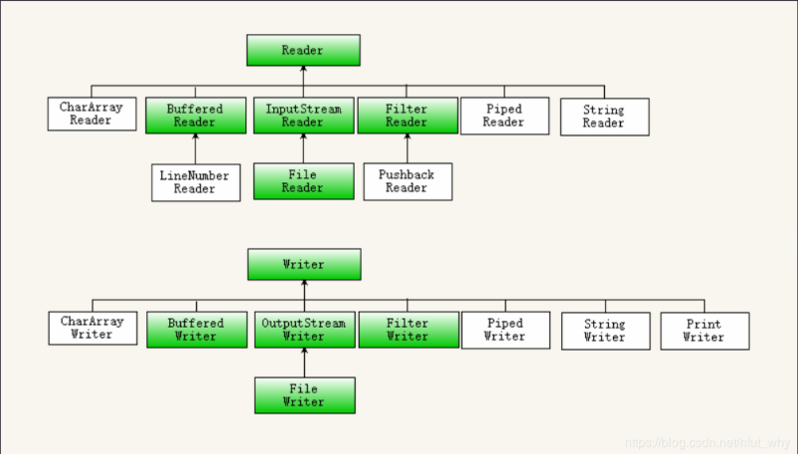

# 0.文件操作

## 0.1 File讲解

概述：

> 1.File类位于java.io包下
>
> 2.java中的File类对象用于表示硬盘上的一个文件或者文件夹,其实际上就是一个路径

File类的功能：

> 1.访问文件或者目录的基本属性
>
> 2.对文件整体进行操作(创建，删除，重命名)
>
> 3.可以访问文件夹之中的信息
>
> 4.不能修改文件之中的内容

File类的使用：

> 1.路径填写上的注意事项：填写路径的时候 / 相当于 \\
>
> 2.使用绝对路径创建File对象的缺点：绝对路径可移植性差，不同操作系统可能就无法使用了。
>
> 3.通过File类判断文件或者文件夹是否已经存在
>
> > file.exists() -- 如果存在返回true,如果不存在返回false
>
> 4.使用相对路径创建File对象
>
> > 可以使用./来代表当前工程，这样就解决了绝对路径造成的移植性问题。
>
> 5.判断是路径所指向的是文件还是文件夹
>
> > boolean isFile()
> >
> > boolean isDirectory()
>
> 6.获取文件名
>
> > String getName()
>
> 7.获取文件大小--返回值是long类型，以字节为单位
>
> > long length()
>
> 8.判断文件属性
>
> > 8.1 可读的 canRead()
> >
> > 8.2 可写的 canWrite()
> >
> > 8.3 隐藏的 isHidden()
>
> 9.文件的创建和删除
>
> > 9.1 文件的创建
> >
> > file对象.createNewFile()
>
> > 9.2 文件的删除
> >
> > file对象.delete() 返回值为true代表删除成功，返回值为false代表删除失败。
>
> 10.文件夹的创建和删除
>
> > 10.1 单个文件夹的创建
> >
> > file对象.mkdir()
>
> > 10.2 连续创建多级文件夹
> >
> > file对象.mkdirs()
>
> 11. 删除文件夹
>
> > 注意：使用delete()方式删除文件夹的时候文件夹必须为空。
>
> 12. 获取一个目录之中的所有子项
>
> > File[] listFiles()
>
> 13. 递归的删除一个目录
>
> > 如果是文件夹则遍历其中的文件递归调用该方法
> >
> > 如果是文件则直接删除即可。
> >
> > 
>
> 14.文件过滤器函数式接口的使用
>
> FileFilter的accept方法返回真代表经过listFiles后留下来
>
> FileFilter的accept方法返回假代表经过listFiles后不留下来，被过滤掉了。
>
> 下面的代码负责将文件名之中含有.的文件全部查出来，不含有的则不查出来。
>
> 

## 0.2 RAF讲解

概述

> RAF是在java.io包下能对文件内容进行读写操作的类--RandomAccessFile类。

为什么需要RAF类

> 为了弥补File类的不足，因为File类只能对文件整体进行操作而不能对文件内容
>
> 进行操作。

Raf的权限：

> r：只读模式
>
> w：写模式
>
> rw：读写模式
>
> 追加实现方式：
>
> ```java
> public static void appendMethodA(String fileName, String content) {
>     try {
>         // 打开一个随机访问文件流，按读写方式
>         RandomAccessFile randomFile = new RandomAccessFile(fileName, "rw");
>         // 文件长度，字节数
>         long fileLength = randomFile.length();
>         // 将写文件指针移到文件尾。
>         randomFile.seek(fileLength);
>         randomFile.writeBytes(content);
>         randomFile.close();
>     } catch (IOException e) {
>         e.printStackTrace();
>     }
> }
> 
> ```
>
> 

RAF类的操作

> 1.创建RAF类对象
>
> > 方式1： new RandomAccessFile("路径","权限");
> >
> > 方式2：new RandomAccessFile(File类对象,"权限")
>
> 2.写入字节方法
>
> > 格式：public void write(int b) throws java.io.IOException
> >
> > 功能：向指定的文件中写入给定int值的2进制的低8位--[int类型总共32位]
>
> 3.读入字节方法
>
> > 格式：public int read() throws java.io.IOException
> >
> > 功能：从文件中读取一个字节的数据，装载到int变量的低8位上，并且返回这个
> >
> > int值，如果读到文件尾返回-1
>
> 4.RAF实现二进制文件复制
>
> > 原理：从源文件中一个一个字节的读出，然后再向目标文件中一个一个字节的写入
> >
> > 代码实现：
> >
> > ```java
> > RandomAccessFile rafRead = new RandomAccessFile("源文件路径","r");
> > RandomAccessFile rafWrite = new RandomAccessFile("目标文件路径","w");
> > //声明中间字节存储位置
> > int d;
> > long start = System.currentTimeMillis();
> > while((d = rafRead.read()!=-1))
> > {
> >     rafWrite.write(d);
> > }
> > long end = System.currentTimeMillis();
> > System.out.println("用时:"+(end-start)+"ms");
> > rafRead.close();
> > rafWrite.close();
> > ```
> >
> > 缺点：一个一个字节的读取和写入速度非常的慢，内存的读写速度远远大于硬盘，读取硬盘和写入硬盘的次数太多，而这个速度又太慢，造成总时间过于的慢。
>
> > 优化：
> >
> > 原理：使用缓存让一次运送的字节多一点，再进行写入，这样就能节省多次访问磁盘的时间，这也被称为块读块写方式。
> >
> > 使用的方式：
> >
> > 方法1：
> >
> > public int read(@NotNull byte[] b) throws java.io.IOException
> >
> > 功能：一次性读取给定字节数组长度的字节量，并存到这个数组之中，返回实际读取到的字节量，如果返回-1表示本次读取已经到末尾
> >
> > 方法2：
> >
> > public void write(@NotNull byte[] b) throws java.io.IOException
> >
> > 功能：将给定的字节数组之中的数据写入到文件中
> >
> > 方法3：
> >
> > public int read(byte[] b,int off,int len) throws java.io.IOException
> >
> > 功能:将从文件中读入len长的字节数，并将这些字节写入字节数组下标为offset的位置
> >
> > 方法4：
> >
> > public void write(byte[] b,int off,int len) throws java.io.IOException
> >
> > 功能：Writes len bytes from the specified byte array starting at offset off to this file.
>
> > 优化代码实现：
> >
> > ```java
> > byte[] data = new byte[1024*1024];
> > // 每次读取到的字节数
> > int len;
> > long start = System.currentTimeMillis();
> > while((len=rafRead.read(data))!=-1)
> > {
> >     rafWrite.write(data,0,len);
> > }
> > long end = System.currentTimeMillis();
> > System.out.println("耗时:"+(end-start)+"ms");
> > rafRead.close();
> > rafWrite.close();
> > ```
>
> 5.Raf操作文本文件--需要查看编码问题
>
> > 写入步骤：
> >
> > 1.首先需要按照某一种编码格式将字符串转换成为字节数组。
> >
> > 方法：byte[] getBytes(字符串, 编码格式)
> >
> > 2.然后使用write方法进行写入
>
> > 读取步骤
> >
> > 1.首先需要使用read方法进行读入
> >
> > 2.然后使用String的构造函数 new String(字节数组,编码格式)将字节数组解码为字符串
>
> > 举例：
> >
> > 
> >
> > 

Raf指针：

引入：

int max = Integer.MAX_VALUE这个变量对应的完整的二进制为01111111 11111111 11111111 11111111

如果使用write(max)进行写入的话仅仅会写入低8位，如果我们要依次从低8位写到高8位应该怎么办？

解决：

复杂的方法：

复杂的方法我们可以使用位运算符>>>从高位输出到低位。>>>是无符号右移，高位补零。


简单的方法：

其实就是Raf类对象之中有一个对上述过程的封装而已，存在如下的很多方法，都是完成上述的类似操作，按照逐个字节

写入然后移位的原理，写入数据类型。


问题：

当我们写完了之后，到了读取的时候，发现已经到了末尾，这是为什么？

解决：

因为我们写的时候有一个指针跟着我们，随着我们写到了末尾，指针也跟着到了末尾。

指针的操作：

> 获取指针位置：
>
> long getFilePointer()
>
> 移动指针位置：
>
> void seek(long pos)

# 1.IO概述

> 1.JAVA标准的输入输出，JAVAIO是以标准的操作对外界设备进行数据交换输入和输出都是相对于内存和硬盘来说的，内存向硬盘之中的写入为输出，硬盘向内存之中写入为输入,从网络向内存之中的写入为输入，从内存向网络之中的写入为输出
>
> 2.IO是顺序读写方式，只能顺序向后进行读或者写操作，并且不能同时进行读和写操作

# 2.为什么需要IO操作

> 对于读写的灵活度来说不如RAF，但是基于流连接可以完成复杂数据的读写,并且读写的速度可以得到进一步的
>
> 提高

# 3.IO的分类

## 3.1 按照方向进行区分

> 输入流：java.io.InputStream 所有字节输入流的超类
>
> 输出流：java.io.OutputStream 所有字节输出流的超类

## 3.2 按照使用方式进行分类

> 节点流(低级流)：真实连接数据源和程序之间的"管道"负责实际搬运数据的流，读写一定是建立在结点流的基础上进行的
>
> 处理流(高级流)：不能够独立存在，必须连接在其它结点流上，使得在读写数据的过程中，当数据流经当前处理流时对其做某些加工处理，简化我们对数据的相关操作
>
> 实际应用：我们会串联一组高级流并最终连接到低级流上，使得对数据的读写以流水线式的加工读写达到对数据读写的处理，这个过程称为流的连接也是IO的精髓所在

## 3.3 按照操作数据的不同单位划分

字节流：


字符流：




# 4.文件字节流的使用

## 4.1 FileOutputStream

创建：

> 方式1：FileOutputStream(File file) 通过文件对象进行创建
>
> 方式2：FileOutputStream(String name) 通过绝对路径或者相对路径直接创建
>
> 方式3：FileOutputStream(File file,boolean append) boolean变量是追加与否
>
> 方式4：FileOutputStream(String name,boolean append) boolean变量是追加与否

操作：

> 方法1：close
>
> 功能：关闭此输出流并释放与此流相关联的任何系统资源
>
> 方法2：write(byte[] b)
>
> 功能：将字节数组写入
>
> 方法3：write(byte[]b,int offset,int len)
>
> 功能：将字节数组从offset位置开始写入len个

## 4.2 FileInputStream

创建方式等同于FileOutputStream

操作：

> 方法1：read
>
> 功能：从输入流读取数据的下一个字节。 
>
> 方法2：int read(byte[] b)
>
> 功能：从输入流读取b.length个字节并将其存储到b中，返回读取的字节数 ，如果读到了一些但是没有读取满，会返回读取到的字节数，但是在下一次读取的时候将会返回-1(因为读取到的为空)
>
> 方法3：read(byte[]b,int offset,int len)
>
> 功能：从输入流读取最多 len字节的数据到一个字节数组的offset位置。 


## 4.3 缓冲字节流

> 缓冲字节输入流：BufferedInputStream
>
> 缓冲字节输出流：BufferedOutputStream


## 4.4 使用文件流完成文件的复制

简单复制：


使用缓冲流的高级复制：

原理图：


代码实现：


Attention:

> 高级流创建的时候不能直接指向文件，它创建的时候需要低级流对象

> 关闭的时候仅仅需要关闭高级流，低级流会自动关闭，内部是联动的

> 如果在缓存没满的时候就输出就可以使用flush方法，调用close的时候会自动flush(将缓冲区之中的内容全部输出)

## 4.5 对象的序列化和反序列化操作

问题的提出：

> 对象有属性，我们想要将对象持久化到硬盘上，或者将对象从硬盘上取出

SerialVersionUID的作用(静态常量)：

> 定义：
>
> > 只要我们对类进行了修改(改了成员变量的名字)我们就需要将这个 VersionUID进行修改，从而标志我是这个版本的类的对象，这个时候当我们反序列化的时候，如果两者的UID不一样的话，就会直接发生报错的现象了，如果相同的话才能够发生转换
>
> 声明方式：
>
> > ```java
> > private static final long serialVersionUID = 1L
> > ```

transient关键字的作用

> 定义：
>
> > 他用来进行成员变量的标记，它是不需要进行序列化的。

序列化操作：

> 序列化操作的类：
>
> java.io.ObjectOutputStream
>
> 调用的方法：
>
> void writeObject(Object obj)
>
> 举例：
>
> 


> 反序列化操作的类：
>
> java.io.ObjectInputStream
>
> 调用的方法：
>
> Object readObject()
>
> 举例：
>
> 

注意：

> 如果一个类想要被序列化，需要实现一个接口JAVA.IO.Serializable(代表可序列化的)

如何判断反序列化操作最终读到了文件末尾：

> 如果使用一个while循环来判断对象不为空的方式读取，最后会因为读取到文件末尾继续读取抛出一个EOFExcetion，而我们仅仅需要捕获这个EOFException然后在catch块中执行我们想要的操作即可

## 4.6 字符流

FileReader

> | 序号 | 文件描述                                                     |
> | :--- | :----------------------------------------------------------- |
> | 1    | **public int read() throws IOException** 读取单个字符，返回一个int型变量代表读取到的字符 |
> | 2    | **public int read(char [] c, int offset, int len)** 读取字符到c数组，返回读取到字符的个数 |

FileWriter

> - | 序号 | 方法描述                                                     |
>   | :--- | :----------------------------------------------------------- |
>   | 1    | **public void write(int c) throws IOException** 写入单个字符c。 |
>   | 2    | **public void write(char [] c, int offset, int len)** 写入字符数组中开始为offset长度为len的某一部分。 |
>   | 3    | **public void write(String s, int offset, int len)** 写入字符串中开始为offset长度为len的某一部分。 |

## 4.7 缓冲字符流

BufferedReader

> 功能：使用缓存对文件内容进行块读

BufferedWriter

> 功能：使用缓存对文件的内容进行块写

## 4.8 转换流


OutputStreamWriter：

> 功能：将输出的字符流按照指定的编码编码成为字节流
>
> 

InputStreamReader：

> 功能：将输入的字节流按照指定的编码解码成为字符流

> 

## 4.9 PrintWriter

功能：是在BufferedWriter基础上的又一次,具有了自动换行的功能，如果加上第二个参数则拥有自动flush的功能

构造函数：

| PrintWriter(File file)      使用指定文件创建不具有自动行刷新的新 PrintWriter。 |
| ------------------------------------------------------------ |
| PrintWriter(File file, String csn)      创建具有指定文件和字符集且不带自动刷行新的新 PrintWriter。 |
| PrintWriter(OutputStream out)    根据现有的 OutputStream 创建不带自动行刷新的新 PrintWriter。 |
| PrintWriter(OutputStream out, boolean autoFlush)      通过现有的 OutputStream 创建新的 PrintWriter。 |
| PrintWriter(String fileName)      创建具有指定文件名称且不带自动行刷新的新 PrintWriter。 |
| PrintWriter(String fileName, String csn)      创建具有指定文件名称和字符集且不带自动行刷新的新 PrintWriter。 |
| PrintWriter(Writer out)     创建不带自动行刷新的新 PrintWriter。 |
| PrintWriter(Writer out, boolean autoFlush)      创建新 PrintWriter。 |

方法：

| `PrintWriter`     | `**append**(char c)`      将指定字符添加到此 writer。        |
| ----------------- | ------------------------------------------------------------ |
| ` PrintWriter`    | `**append**(CharSequence csq)`      将指定的字符序列添加到此 writer。 |
| ` PrintWriter`    | `**append**(CharSequence csq, int start, int end)`      将指定字符序列的子序列添加到此 writer。 |
| ` boolean`        | `**checkError**()`      如果流没有关闭，则刷新流且检查其错误状态。 |
| `protected  void` | `**clearError**()`      清除此流的错误状态。                 |
| ` void`           | `**close**()`      关闭该流并释放与之关联的所有系统资源。    |
| ` void`           | `**flush**()`      刷新该流的缓冲。                          |
| ` PrintWriter`    | `**format**(Locale l, String format, Object... args)`      使用指定格式字符串和参数将一个格式化字符串写入此 writer 中。 |
| ` PrintWriter`    | `**format**(String format, Object... args)`      使用指定格式字符串和参数将一个格式化字符串写入此 writer 中。 |
| ` void`           | `**print**(boolean b)`      打印 boolean 值。                |
| ` void`           | `**print**(char c)`      打印字符。                          |
| ` void`           | `**print**(char[] s)`      打印字符数组。                    |
| ` void`           | `**print**(double d)`      打印 double 精度浮点数。          |
| ` void`           | `**print**(float f)`      打印一个浮点数。                   |
| ` void`           | `**print**(int i)`      打印整数。                           |
| ` void`           | `**print**(long l)`      打印 long 整数。                    |
| ` void`           | `**print**(Object obj)`      打印对象。                      |
| ` void`           | `**print**(String s)`      打印字符串。                      |
| ` PrintWriter`    | `**printf**(Locale l, String format, Object... args)`      使用指定格式字符串和参数将格式化的字符串写入此 writer 的便捷方法。 |
| ` PrintWriter`    | `**printf**(String format, Object... args)`      使用指定格式字符串和参数将格式化的字符串写入此 writer 的便捷方法。 |
| ` void`           | `**println**()`      通过写入行分隔符字符串终止当前行。      |
| ` void`           | `**println**(boolean x)`      打印 boolean 值，然后终止该行。 |
| ` void`           | `**println**(char x)`      打印字符，然后终止该行。          |
| ` void`           | `**println**(char[] x)`      打印字符数组，然后终止该行。    |
| ` void`           | `**println**(double x)`      打印双精度浮点数，然后终止该行。 |
| ` void`           | `**println**(float x)`      打印浮点数，然后终止该行。       |
| ` void`           | `**println**(int x)`      打印整数，然后终止该行。           |
| ` void`           | `**println**(long x)`      打印 long 整数，然后终止该行。    |
| ` void`           | `**println**(Object x)`      打印 Object，然后终止该行。     |
| ` void`           | `**println**(String x)`      打印 String，然后终止该行。     |
| `protected  void` | `**setError**()`      指示已发生错误。                       |
| ` void`           | `**write**(char[] buf)`      写入字符数组。                  |
| ` void`           | `**write**(char[] buf, int off, int len)`      写入字符数组的某一部分。 |
| ` void`           | `**write**(int c)`      写入单个字符。                       |
| ` void`           | `**write**(String s)`      写入字符串。                      |
| ` void`           | `**write**(String s, int off, int len)`      写入字符串的某一部分。 |