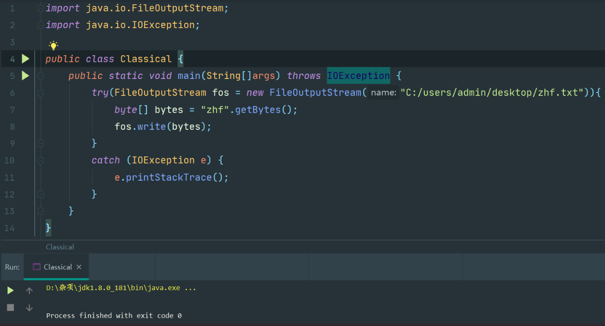
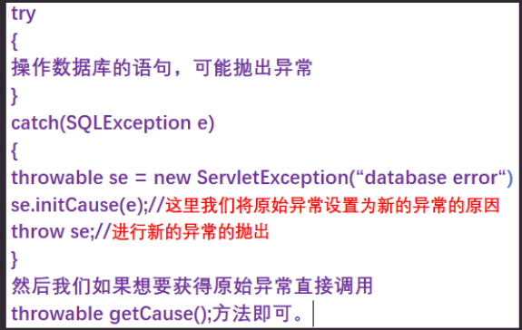
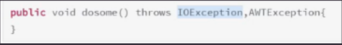
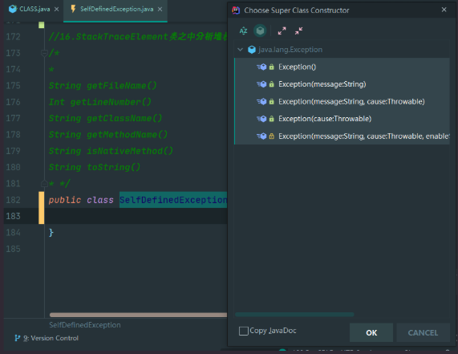

# 1.异常概述

异常就是在程序运行过程之中发生了无法继续执行代码的情况，异常就是程序运行不同于正常情况

# 2.异常处理

就是在程序发生异常之后的补救措施，就是发生异常之后要执行的代码

# 3.为什么要进行异常处理

如果一旦发生异常，任由异常不断的向上抛出，程序就会终止，如果添加了异常处理，我们就能够保证程序的健壮性(在用户的错误输入下也能正常运行)


# 4.异常处理

## 4.0 异常处理要做到的几点

> 1.首先要向用户进行错误的通报
>
> 2.保存所有的工作结果
>
> 3.允许用户以妥善的方式进行程序的退出
>
> 4.或者返回到一种安全的状态让用户继续操作

## 4.1 普通异常处理结构

```java
try{
    // 程序代码[可能会出现错误]
}
catch(XXXException e)
{
    // 异常处理代码
}
```

## 4.2 带finally的异常处理

finally的作用：

> 无论如何都会执行finally之中的内容，一般用来进行资源的释放，即使try块之中有return也会执行

try块之中存在return的情况：

> 在调用return语句之前将会执行finally块之中的内容
>
> 如果finally之中也存在return的话，则finally当中的return将会覆盖try中的return

```java
try{
    // 程序代码[可能会出现错误]
}
catch(XXXException e)
{
    // try块中出现XXXException的处理代码
}
finally{
    // 无论try语句之中代码是否出错都将执行这个语句块之中的代码
}
```

## 4.3 带有多个catch块的异常处理

作用：

> 有的时候try代码块之中可能抛出的不止一个异常，由于我们想要获得具体发生了什么异常，所以我们需要精确到每个异常类型而不止是使用统一的Exception进行接收，通常宽泛的Exception会放在最后一个catch块之中，以免捕捉不到被我们忽略的异常

```java
try{
    // 程序代码[可能会出现错误]
}
catch(XXXException e)
{
    // try块中出现XXXException的处理代码
}
catch(YYYException e)
{
    // try块中出现YYYException的处理代码
}
finally{
    // 无论try语句之中代码是否出错都将执行这个语句块之中的代码
}
```

## 4.4 带有资源释放的try语句



注意：

> 1.当这个块正常退出的时候或者有一个异常抛出的时候都会执行in.close()方法
>
> 2.不同的资源之间使用分号进行隔开
>
> 3.必须实现了Autocloseable接口的类才能够完成自动关闭(自动调用close)
>
> 4.本质：编译器在编译代码的时候，将try()里面的资源进行自动编码关闭，并在finally块执行

## 4.5 throw关键字

作用：

> 用来进行异常的抛出

为什么需要再次进行异常的抛出：

> 我们想要改变抛出异常类对象的类型,让抛出的异常类型更加精确。

在哪里再次进行异常的抛出

> 在catch块之中

抛出实例：

> 

initCause(e)的作用：

> 将Throwable对象的原因初始化为指定的值,在上述程序中初始化为接收到的异常e,这里等于将原因设置
>
> 为了原始异常

getCause()的作用：

> 以后我们想要获得抛出异常的引发原因，或者说原始异常使用getCause方法即可。

## 4.6 异常信息的输出

### 4.6.1 异常追踪栈

> 异常是在执行某个函数时引发的，而函数又是层级调用(将函数进行压栈)，因此，只要一个函数发生了异常，他的所有调用者，即为它到栈底的所有函数都会被异常影响，这就形成了异常追踪栈

### 4.6.2 控制台字体颜色

> System.err.println() 字体为红色
>
> System.out.println() 字体为黑色

### 4.6.3 获取错误信息

> e.getMessage()

### 4.6.4 获取异常种类和错误信息

> e.toString()

### 4.6.5 打印异常堆栈信息

> e.printStackTrace()

## 4.7 throws关键字

功能：

> 声明一个方法之中可能抛出的异常类型

为什么会有throws关键字：

> 因为方法也不知道怎么进行处理，将异常抛出给调用者去进行处理

举例：

> 

## 4.8 自定义异常类

### 4.8.1 为什么需要自己定义异常类

比如说一些对一些特定的业务逻辑可能出现不合法的内容，比如年龄需要位于某个区间，用户名不能够输入中文等等。这些特殊的情况就需要我们自定义异常

### 4.8.2 自己定义异常类的要求

> 1.定义好类名：做到见名知意
>
> 2.需要继承Exception
>
> 3.定义序列化版本号(避免警告)
>
> 4.重写Exception定义的所有构造方法。
>
> 