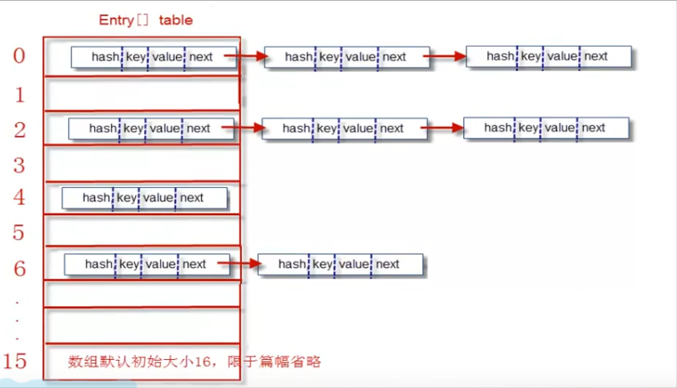

# 1.数组

## 1.1 数组的创建方式

### 1.1.1 一维数组的创建方式

> 1.int [ ] a
>
> 2.int [ ] a = new int[100] 使用这种创建方式，元素都会被初始化为类型对应的默认值
>
> 3.int [ ] a  = new int[ ] {1,2,3}
>
> 4.int [ ] a = {1,2,3}

### 1.1.2 二维数组的创建方式

> 1.int [ ] [ ] arr
>
> 2.int [ ] [ ] arr = {{1,2,3},{4,5,6}}
>
> 3.int [ ] [ ] arr = new int [2] [ ] 使用这种方式必须要指定二维数组之中一维数组的个数，一维数组长度不定。
>
> 4.int [ ] [ ] arr = new int [ ] [ ] {{1,2,3},{4,5,6}} 

### 1.1.3 获取数组的长度

> arr.length

### 1.1.4 数组的拷贝

浅拷贝：

> 定义：

> 浅拷贝--对于数组来说仅仅完成了第一层元素的拷贝，若第一层元素是基本类型元素则完成了深拷贝的效果，若第一层元素是引用类型元素则仅仅完成了对地址的拷贝，比如对于二维数组来说，其每个元素为一个一维数组为引用类型，若原二维数组中的一个一维数组元素中的元素发生改变会造成拷贝的数组的改变

> 实现方式：

> 数组变量 = Arrays.copyOf(原数组,长度)

深拷贝：

> 定义：

> 完全对数组复制出来了一份，与原来的数组没有任何关联。

> 实现方式：

> System.arraycopy(Object src,int srcPos,Object dest,int destPos,int length)
>
> > 参数说明：
>
> > ​	src 源数组
> >
> > ​	srcPos源数组要复制的起始位置
> >
> > ​	dest目标数组
> >
> > ​	destPos目的数组要放置的起始位置
> >
> > ​	length复制的长度

### 1.1.5 数组工具类Arrays的使用

1.自带的二分搜索

> Arrays.BinarySearch(type[ ] a,int start, int end ,type v)
>
> > 参数分析：
> >
> > a 要搜索的数组
> >
> > v 要在数组中搜索的元素
> >
> > start 起始位置
> >
> > end 终止位置

2.自带的数组就地排序--不是返回排序好的数组

> Arrays.sort(数组)

3.数组的整体填充

> Arrays.fill方法：
>
> public static void fill(@NotNull int[] a, int val)
>
> > 参数分析：
> >
> > 第一个参数是一个数组
> >
> > 第二个参数是要填充的值

4.将数组转换为对应的字符串形式

> Arrays.toString(type[ ] array)

5.将数组转换为对应的ArrayList

适用场景：

> 当我们存在现有的数组，而又不想创建循环添加到新的集合之中。

实现方式：

> Arrays.asList(type[ ] array)


# 2.集合概述

## 2.1 集合定义

它是用来存储引用数据类型的容器，不能够存储基本数据类型，如果基本类型数据类型想要进行存储的话需要将基本类型转换成为包装类对象，集合分为两类，一类是MAP--映射集合，一类是COLLECTION集合，MAP集合按照键值对的形式进行数据的存取，COLLECTION集合存取的时候是按照单个存取。所有的集合都是可以迭代的因为都继承了Iterable接口做了实现，迭代就是按照顺序进行集合之中每一个元素的访问

## 2.2 集合组成

java.util.Collection接口以及其子接口和众多实现类

java.util.Map接口以及其子接口和众多实现类

## 2.3 集合功能

集合框架具备了能够存放各种元素的功能，类似于数组

## 2.4 为什么需要集合，数组不够吗?

一个数组对象也可以保存各种元素，那么为什么需要集合呢？因为集合除了能够保存各种元素之外还封装了对其元素维护的基本方法，不用我们手动的编写方法，并且可以动态的缩容和扩容

# 3.Iterable接口和Iterator接口

## 3.1 Iterable接口概述

地位：

> Iterable接口是java集合框架的顶级接口，也就是祖先接口。

功能：

> 一个集合对象要表明自己支持迭代，能够有使用foreach语句的特权就必须实现Iterable接口，表明我是可迭代的。因为foreach其实是java的语法糖，其实在编译的时候会转换为迭代器方式

继承这个接口所需要重写的方法

> 格式：

> Iterator<T> iterator()

> 功能：

> 返回此集合的iterator迭代器对象。

## 3.2 Iterator接口

定义：

> Iterator对象是迭代器，主要用于遍历Collection集合之中的元素，GOF给迭代器模式的定义为：提供一种方法访问一个容器对象之中的各个元素，而又不暴露该对象的内部细节，迭代器模式就是为容器而生

完整代码：

> ```java
> public interface Iterator<E>
> {
> 	E next();
> 	boolean hasNext();
> 	void remove();
> 	default void forEachRemaining(Consumer<? Super E> action);
> }
> ```

代码解析：

> 1.初始的时候，iterator迭代器对象指向的是集合的第一个元素的前一个位置。
>
> 2.E next() 方法的功能是通过这个方法能够让iterator迭代器对象返回集合中的下一个元素。
>
> 3.boolean hasNext() 通过这个方法我们能够判断是否还存在下一个元素供next方法返回。
>
> 4.void remove() 通过这个方法会删除此时指针所指向的元素，所以我们如果想要删除第一个元素
>
> 的话我们需要调用一次next方法然后再调用remove方法。

注意：

> 1.java.lang.IllegalStateException 异常可能出现，出现的原因如下：
>
> > a.直接使用remove()方法而未在之前调用next()方法
> >
> > b.当调用next()方法之后，使用了remove()方法,但是接着又使用remove(),则会
> >
> > 出现该错误，因为没有重置上一次访问元素的索引，导致删除的是同一个元素。
>
> 2.ConcurrentModificationException 异常可能出现，出现的时机如下：
>
> > 使用迭代器遍历的时候不可使用集合的remove和add方法，但可以使用Java迭代器的
> >
> > remove和add方法，不然会产生ConCurrentModificationException异常。
>
> 出现的原因如下：
>
> > 当list.remove(Object o)方法之后，modCount和expectedModCount不相等了，然后当代码执行到next()方法时，判断了checkForComodification()，发现两个数值不等，就抛出该Exception；add(Object o)方法也是一样原因；另外，Iterator是工作在一个独立的线程中，并且拥有一个mutex锁， Iterator 被创建之后会建立一个指向原来对象的单链索引表，当原来的list对象数量发生变化时，这个索引表的内容不会同步改变，所以当索引指针往后移动的时候就找不到要迭代的对象，所以按照 fail-fast 原则 Iterator 会马上抛出 java.util.ConcurrentModificationException 异常。 所以 Iterator 在工作的时候是不允许被迭代的对象被改变的。但你可以使用 Iterator 本身的方法 remove() 来删除对象， Iterator.remove() 方法会在删除当前迭代对象的同时维护索引的一致性。
> >
> > 简单解析：
> >
> > 就是我们获取迭代器的时候它就已经知道要迭代多少次了。如果我们使用集合的删除方法删除了元素的话，不会在迭代器之中得到反映，迭代器依旧我行我素的迭代，不会减少迭代的次数，这样必然会造成越界，所以每次都会进行checkForComodification检查若不满足则会直接抛出异常

使用迭代器进行遍历的正确代码：

> ```java
> while(iter.hasNext())
> {
>     System.out.println(iter.next());
> }
> ```

## 3.3 Iterator接口子接口ListIterator

如何获取ListIterator对象：

> List接口之中的方法：ListIterator<E> listIterator( )
>
> 功能：调用这个方法将会返回一个ListIterator对象来指导对集合的遍历。

ListIterator的方法：

|     void add(E e)      |                将指定的元素插入列表(可选操作)                |
| :--------------------: | :----------------------------------------------------------: |
|   boolean hasNext( )   |                      进行列表的正向遍历                      |
| boolean hasPrevious( ) |                      进行列表的反向遍历                      |
|       E next( )        |           返回列表中的下一个元素，并且前进光标位置           |
|    int nextIndex( )    |             返回随后调用 next()返回的元素的索引              |
|     E previous( )      |          返回列表中的上一个元素，并向后移动光标位置          |
|  int previousIndex( )  |          返回由后续调用 previous()返回的元素的索引           |
|     void remove( )     | 从列表中删除由 next()或 previous()返回的最后一个元素（可选操作） |
|     void set (E e)     | 用 指定的元素替换由 next()或 previous()返回的最后一个元素（可选操作）。 |
|        函数格式        |                           函数功能                           |

# 4.Collection接口详解

## 4.1 Collection接口所含方法介绍

| 函数格式                                              | 函数功能                                                     |
| ----------------------------------------------------- | ------------------------------------------------------------ |
| Iterator<E> iterator                                  | 这个方法将会返回一个用来访问集合之中元素的迭代器。           |
| int size()                                            | 返回当前存储在集合之中的元素的个数                           |
| boolean isEmpty()                                     | 如果集合之中没有元素的话则会返回true，用来判断size是否是0.   |
| boolean contains(Object obj)                          | 判断集合之中是否包含obj元素，内部调用的是equals方法比较两个对象是否相等。 |
| boolean containsAll(Collection<?> other)              | 判断集合之中是否包含另一个集合之中的所有元素。同样不是采用==号比较而是采用equals方法比较 |
| boolean add (Object element)                          | 将一个元素添加到一个集合之中。                               |
| boolean addAll(Collection<?> other)                   | 只能够将元素为子类或者本类的进行添加进来。用来将另一个集合之中的元素一个一个添加进来。 |
| boolean remove(Object obj)                            | 这里会遍历调用equals方法，然后如果为true然后就将对象进行移除 |
| boolean removeAll(Collection<?>other)                 | 从这个集合之中删除other集合之中存在的元素，就相当于集合之中的差集。移除两个集合之间共有的元素。 |
| default boolean removeIf(Predicate<? super E> filter) | 删除满足给定谓词的此集合的所有元素.filter是一个用来进行元素判定的函数式接口，会将集合中的元素一个一个拿过来进行判定如果为true则进行保留，否则就过滤掉了 |
| void clear                                            | 将这个集合之中的所有元素删除                                 |
| boolean retainAll(Collection<?> other)                | 从这个集合之中删除所有与other集合中元素不同的元素，即保留两个集合之间的交集。 |
| Object[] toArray()                                    | 返回这个集合所对应的对象数组                                 |
| equals                                                | 需要两个集合之间的元素顺序以及对应的值都是完全一样才会返回true |
| hashCode()                                            | 返回当前的对象的哈希值。IntellijIdea以及Eclipse都会自动生成  |

## 4.2 java.util.List接口 -- Collection子接口

逻辑结构：

> 是可以存放重复元素的线性表(有序)

接口方法：

> 1.E get(int i)
>
> 功能：按照索引返回相应的元素。
>
> 2.add(E e)
>
> 功能：向List对象的末尾添加元素e
>
> 3.add(int index,E e)
>
> 功能：在index位置处插入元素e
>
> 4.remove(E e)
>
> 功能：将元素e从集合中移除
>
> 5.E remove(int index)
>
> 功能：将index索引处的元素删除并返回
>
> 6.List<E> subList(int fromIndex, int toIndex)
>
> 功能：返回左闭右开的截取于源列表的一个子列表
>
> 注意：截取出来的子集仍然引用的是源集合中的地址，原有的集合会因为sublist的变化而进行变化，修改源集合中的内容也会影响子集
>
> 使用：我们可以通过subList方法截取出一段元素然后调用clear方法完成对于一段元素的删除。

## 4.3 java.util.List接口的实现类

### 4.3.1 ArrayList

内部原理：

> 内部控制一个数组，查询\获取元素效率高，插入删除效率低

优点：

> 因为我们想要在运行的过程中方便的控制数组的长度，在C之中数组的长度是在一开始就被确定的，只能使用#DEFINE进行定义，除非使用malloc和free，但是在JAVA之中普通数组的定义又更进了一步，它可以在运行的时候确定数组的大小，但是大小一旦确定就比较难进行更改除非使用Arrays.copyOf来进行数组的扩容，所以最终我们给出了最方便的数组那就是泛型数组列表，它在添加或者删除元素的时候能够自动的进行数组容量的调整。

创建：

> 格式：ArrayList <E> 变量名 = new ArrayList<>();

> 解析：ArrayList是一个采用类型参数的泛型类，为了指定数组列表所保存的元素对象的类型（ADT只能够保存对象而不能够保存基本类型）需要使用一对尖括号将类名括起来加在后面。

方法：

| [add()](https://www.runoob.com/java/java-arraylist-add.html) | 将元素插入到指定位置的 arraylist 中           |
| ------------------------------------------------------------ | --------------------------------------------- |
| [addAll()](https://www.runoob.com/java/java-arraylist-addall.html) | 添加集合中的所有元素到 arraylist 中           |
| [clear()](https://www.runoob.com/java/java-arraylist-clear.html) | 删除 arraylist 中的所有元素                   |
| [clone()](https://www.runoob.com/java/java-arraylist-clone.html) | 复制一份 arraylist                            |
| [contains()](https://www.runoob.com/java/java-arraylist-contains.html) | 判断元素是否在 arraylist                      |
| [get()](https://www.runoob.com/java/java-arraylist-get.html) | 通过索引值获取 arraylist 中的元素             |
| [indexOf()](https://www.runoob.com/java/java-arraylist-indexof.html) | 返回 arraylist 中元素的索引值                 |
| [removeAll()](https://www.runoob.com/java/java-arraylist-removeall.html) | 删除存在于指定集合中的 arraylist 里的所有元素 |
| [remove()](https://www.runoob.com/java/java-arraylist-remove.html) | 删除 arraylist 里的单个元素                   |
| [size()](https://www.runoob.com/java/java-arraylist-size.html) | 返回 arraylist 里元素数量                     |
| [isEmpty()](https://www.runoob.com/java/java-arraylist-isempty.html) | 判断 arraylist 是否为空                       |
| [subList()](https://www.runoob.com/java/java-arraylist-sublist.html) | 截取部分 arraylist 的元素                     |
| [set()](https://www.runoob.com/java/java-arraylist-set.html) | 替换 arraylist 中指定索引的元素               |
| [sort()](https://www.runoob.com/java/java-arraylist-sort.html) | 对 arraylist 元素进行排序                     |
| [toArray()](https://www.runoob.com/java/java-arraylist-toarray.html) | 将 arraylist 转换为数组                       |
| [toString()](https://www.runoob.com/java/java-arraylist-tostring.html) | 将 arraylist 转换为字符串                     |
| [ensureCapacity](https://www.runoob.com/java/java-arraylist-surecapacity.html)() | 设置指定容量大小的 arraylist                  |
| [lastIndexOf()](https://www.runoob.com/java/java-arraylist-lastindexof.html) | 返回指定元素在 arraylist 中最后一次出现的位置 |
| [retainAll()](https://www.runoob.com/java/java-arraylist-retainall.html) | 保留 arraylist 中在指定集合中也存在的那些元素 |
| [containsAll()](https://www.runoob.com/java/java-arraylist-containsall.html) | 查看 arraylist 是否包含指定集合中的所有元素   |
| [trimToSize()](https://www.runoob.com/java/java-arraylist-trimtosize.html) | 将 arraylist 中的容量调整为数组中的元素个数   |
| [removeRange()](https://www.runoob.com/java/java-arraylist-removerange.html) | 删除 arraylist 中指定索引之间存在的元素       |
| [replaceAll()](https://www.runoob.com/java/java-arraylist-replaceall.html) | 将给定的操作内容替换掉数组中每一个元素        |
| [removeIf()](https://www.runoob.com/java/java-arraylist-removeif.html) | 删除所有满足特定条件的 arraylist 元素         |
| [forEach()](https://www.runoob.com/java/java-arraylist-foreach.html) | 遍历 arraylist 中每一个元素并执行特定操作     |


### 4.3.2 LinkedList

内部原理：

> 内部控制一个链表数据结构，增删效率高，查询遍历效率低

方法：

| 方法                                           | 描述                                                         |
| :--------------------------------------------- | :----------------------------------------------------------- |
| public boolean add(E e)                        | 链表末尾添加元素，返回是否成功，成功为 true，失败为 false。  |
| public void add(int index, E element)          | 向指定位置插入元素。                                         |
| public boolean addAll(Collection c)            | 将一个集合的所有元素添加到链表后面，返回是否成功，成功为 true，失败为 false。 |
| public boolean addAll(int index, Collection c) | 将一个集合的所有元素添加到链表的指定位置后面，返回是否成功，成功为 true，失败为 false。 |
| public void addFirst(E e)                      | 元素添加到头部。                                             |
| public void addLast(E e)                       | 元素添加到尾部。                                             |
| public boolean offer(E e)                      | 向链表末尾添加元素，返回是否成功，成功为 true，失败为 false。 |
| public boolean offerFirst(E e)                 | 头部插入元素，返回是否成功，成功为 true，失败为 false。      |
| public boolean offerLast(E e)                  | 尾部插入元素，返回是否成功，成功为 true，失败为 false。      |
| public void clear()                            | 清空链表。                                                   |
| public E removeFirst()                         | 删除并返回第一个元素。                                       |
| public E removeLast()                          | 删除并返回最后一个元素。                                     |
| public boolean remove(Object o)                | 删除某一元素，返回是否成功，成功为 true，失败为 false。      |
| public E remove(int index)                     | 删除指定位置的元素。                                         |
| public E poll()                                | 删除并返回第一个元素。                                       |
| public E remove()                              | 删除并返回第一个元素。                                       |
| public boolean contains(Object o)              | 判断是否含有某一元素。                                       |
| public E get(int index)                        | 返回指定位置的元素。                                         |
| public E getFirst()                            | 返回第一个元素。                                             |
| public E getLast()                             | 返回最后一个元素。                                           |
| public int indexOf(Object o)                   | 查找指定元素从前往后第一次出现的索引。                       |
| public int lastIndexOf(Object o)               | 查找指定元素最后一次出现的索引。                             |
| public E peek()                                | 返回第一个元素。                                             |
| public E element()                             | 返回第一个元素。                                             |
| public E peekFirst()                           | 返回头部元素。                                               |
| public E peekLast()                            | 返回尾部元素。                                               |
| public E set(int index, E element)             | 设置指定位置的元素。                                         |
| public Object clone()                          | 克隆该列表。                                                 |
| public Iterator descendingIterator()           | 返回倒序迭代器。                                             |
| public int size()                              | 返回链表元素个数。                                           |
| public ListIterator listIterator(int index)    | 返回从指定位置开始到末尾的迭代器。                           |
| public Object[] toArray()                      | 返回一个由链表元素组成的数组。                               |
| public T[] toArray(T[] a)                      | 返回一个由链表元素转换类型而成的数组。                       |


## 4.4 java.util.Set接口 -- Collection子接口

逻辑结构：

> 是不可以存放重复元素的无序的集合


## 4.5 Set接口实现类

### 4.5.1 HashSet

底层原理：

> HashSet底层就是HashMap，哈希表的每个Entry的key是每个元素，value统一都是new Object()

构造方法：

| 构造器                                           | 描述                                                         |
| :----------------------------------------------- | :----------------------------------------------------------- |
| `HashSet()`                                      | 构造一个新的空集; 支持`HashMap`实例具有默认初始容量（16）和加载因子（0.75）。 |
| `HashSet(int initialCapacity)`                   | 构造一个新的空集; 支持`HashMap`实例具有指定的初始容量和默认加载因子（0.75）。 |
| `HashSet(int initialCapacity, float loadFactor)` | 构造一个新的空集; 支持`HashMap`实例具有指定的初始容量和指定的加载因子。 |
| `HashSet(Collection<? extends E> c)`             | 构造一个包含指定集合中元素的新集合。                         |

方法摘要：

| 变量和类型       | 方法                 | 描述                                                         |
| :--------------- | :------------------- | :----------------------------------------------------------- |
| `boolean`        | `add(E e)`           | 如果指定的元素尚不存在，则将其添加到此集合中。               |
| `void`           | `clear()`            | 从该集中删除所有元素。                                       |
| `Object`         | `clone()`            | 返回此 `HashSet`实例的浅表副本：未克隆元素本身。             |
| `boolean`        | `contains(Object o)` | 如果此set包含指定的元素，则返回 `true` 。                    |
| `boolean`        | `isEmpty()`          | 如果此集合不包含任何元素，则返回 `true` 。                   |
| `Iterator<E>`    | `iterator()`         | 返回此set中元素的迭代器。                                    |
| `boolean`        | `remove(Object o)`   | 如果存在，则从该集合中移除指定的元素。                       |
| `int`            | `size()`             | 返回此集合中的元素数（基数）。                               |
| `Spliterator<E>` | `spliterator()`      | 在此集合中的元素上创建*[late-binding](https://www.runoob.com/manual/jdk11api/java.base/java/util/Spliterator.html#binding)*和*失败快速* [`Spliterator`](https://www.runoob.com/manual/jdk11api/java.base/java/util/Spliterator.html) 。 |


### 4.5.2 TreeSet

构造方法：

| 构造器                                      | 描述                                                         |
| :------------------------------------------ | :----------------------------------------------------------- |
| `TreeSet()`                                 | 构造一个新的空树集，根据其元素的自然顺序进行排序。           |
| `TreeSet(Collection<? extends E> c)`        | 构造一个新的树集，其中包含指定集合中的元素，并根据其元素的 *自然顺序进行排序* 。 |
| `TreeSet(Comparator<? super E> comparator)` | 构造一个新的空树集，根据指定的比较器进行排序。               |
| `TreeSet(SortedSet<E> s)`                   | 构造一个包含相同元素并使用与指定有序集相同排序的新树集。     |

方法摘要：

| 变量和类型        | 方法                                                         | 描述                                                         |
| :---------------- | :----------------------------------------------------------- | :----------------------------------------------------------- |
| `boolean`         | `add(E e)`                                                   | 如果指定的元素尚不存在，则将其添加到此集合中。               |
| `boolean`         | `addAll(Collection<? extends E> c)`                          | 将指定集合中的所有元素添加到此集合中。                       |
| `E`               | `ceiling(E e)`                                               | 返回此set中大于或等于给定元素的 `null`元素，如果没有这样的元素，则 `null` 。 |
| `void`            | `clear()`                                                    | 从该集中删除所有元素。                                       |
| `Object`          | `clone()`                                                    | 返回此 `TreeSet`实例的浅表副本。                             |
| `boolean`         | `contains(Object o)`                                         | 如果此set包含指定的元素，则返回 `true` 。                    |
| `Iterator<E>`     | `descendingIterator()`                                       | 以降序返回此集合中元素的迭代器。                             |
| `NavigableSet<E>` | `descendingSet()`                                            | 返回此set中包含的元素的逆序视图。                            |
| `E`               | `first()`                                                    | 返回此集合中当前的第一个（最低）元素。                       |
| `E`               | `floor(E e)`                                                 | 返回此set中小于或等于给定元素的最大元素，如果没有这样的元素，则 `null` 。 |
| `SortedSet<E>`    | `headSet(E toElement)`                                       | 返回此set的部分视图，其元素严格小于 `toElement` 。           |
| `NavigableSet<E>` | `headSet(E toElement, boolean inclusive)`                    | 返回此set的部分视图，其元素小于（或等于，如果 `inclusive`为true） `toElement` 。 |
| `E`               | `higher(E e)`                                                | 返回此集合中的最小元素严格大于给定元素，如果没有这样的元素，则 `null` 。 |
| `boolean`         | `isEmpty()`                                                  | 如果此集合不包含任何元素，则返回 `true` 。                   |
| `Iterator<E>`     | `iterator()`                                                 | 以升序返回此集合中元素的迭代器。                             |
| `E`               | `last()`                                                     | 返回此集合中当前的最后一个（最高）元素。                     |
| `E`               | `lower(E e)`                                                 | 返回此集合中的最大元素严格小于给定元素，如果没有这样的元素，则 `null` 。 |
| `E`               | `pollFirst()`                                                | 检索并删除第一个（最低）元素，如果此组为空，则返回 `null` 。 |
| `E`               | `pollLast()`                                                 | 检索并删除最后一个（最高）元素，如果此集合为空，则返回 `null` 。 |
| `boolean`         | `remove(Object o)`                                           | 如果存在，则从该集合中移除指定的元素。                       |
| `int`             | `size()`                                                     | 返回此集合中的元素数（基数）。                               |
| `Spliterator<E>`  | `spliterator()`                                              | 在此集合中的元素上创建*[late-binding](https://www.runoob.com/manual/jdk11api/java.base/java/util/Spliterator.html#binding)*和*故障快速* [`Spliterator`](https://www.runoob.com/manual/jdk11api/java.base/java/util/Spliterator.html) 。 |
| `NavigableSet<E>` | `subSet(E fromElement, boolean fromInclusive, E toElement, boolean toInclusive)` | 返回此set的部分视图，其元素范围为 `fromElement`到 `toElement` 。 |
| `SortedSet<E>`    | `subSet(E fromElement, E toElement)`                         | 返回此set的部分视图，其元素范围从 `fromElement` （含）到 `toElement` （独占）。 |
| `SortedSet<E>`    | `tailSet(E fromElement)`                                     | 返回此set的部分视图，其元素大于或等于 `fromElement` 。       |
| `NavigableSet<E>` | `tailSet(E fromElement, boolean inclusive)`                  | 返回此set的部分视图，其元素大于（或等于，如果 `inclusive`为true） `fromElement` 。 |


## 4.6 java.util.Queue接口 -- Collection子接口

逻辑结构：

> 一端进一端出，单端队列

实现类：

> LinkedList
>
> 注意：其实LinkedList实现了Deque，而Deque继承了Queue所以说它也是Queue接口的实现类

方法：

> | 变量和类型 | 方法         | 描述                                                         |
> | :--------- | :----------- | :----------------------------------------------------------- |
> | `boolean`  | `add(E e)`   | 如果可以在不违反容量限制的情况下立即执行此操作，则将指定的元素插入此队列，成功时返回 `true` ，如果当前没有空间，则抛出 `IllegalStateException` 。 |
> | `E`        | `element()`  | 检索但不删除此队列的头部。                                   |
> | `boolean`  | `offer(E e)` | 如果可以在不违反容量限制的情况下立即执行此操作，则将指定的元素插入此队列。 |
> | `E`        | `peek()`     | 检索但不删除此队列的头部，如果此队列为空，则返回 `null` 。   |
> | `E`        | `poll()`     | 检索并删除此队列的头部，如果此队列为空，则返回 `null` 。     |
> | `E`        | `remove()`   | 检索并删除此队列的头部。                                     |


## 4.7 java.util.Deque接口 -- Collection子接口

逻辑结构：

> 两端进，两端出，双端队列

实现类：

> LinkedList


## 4.8 LinkedList 

功能：

> A.单端队列
>
> B.双端队列
>
> C.栈

构造方法：

> | 构造器                                  | 描述                                                       |
> | :-------------------------------------- | :--------------------------------------------------------- |
> | `LinkedList()`                          | 构造一个空列表。                                           |
> | `LinkedList(Collection<? extends E> c)` | 按照集合的迭代器返回的顺序构造一个包含指定集合元素的列表。 |

方法：

> | 变量和类型        | 方法                                           | 描述                                                         |
> | :---------------- | :--------------------------------------------- | :----------------------------------------------------------- |
> | `void`            | `add(int index, E element)`                    | 将指定元素插入此列表中的指定位置。                           |
> | `boolean`         | `add(E e)`                                     | 将指定的元素追加到此列表的末尾。                             |
> | `boolean`         | `addAll(int index, Collection<? extends E> c)` | 从指定位置开始，将指定集合中的所有元素插入此列表。           |
> | `boolean`         | `addAll(Collection<? extends E> c)`            | 将指定集合中的所有元素按指定集合的迭代器返回的顺序附加到此列表的末尾。 |
> | `void`            | `addFirst(E e)`                                | 在此列表的开头插入指定的元素。                               |
> | `void`            | `addLast(E e)`                                 | 将指定的元素追加到此列表的末尾。                             |
> | `void`            | `clear()`                                      | 从此列表中删除所有元素。                                     |
> | `Object`          | `clone()`                                      | 返回此 `LinkedList`的浅表副本。                              |
> | `boolean`         | `contains(Object o)`                           | 如果此列表包含指定的元素，则返回 `true` 。                   |
> | `Iterator<E>`     | `descendingIterator()`                         | 以相反的顺序返回此双端队列中元素的迭代器。                   |
> | `E`               | `element()`                                    | 检索但不删除此列表的头部（第一个元素）。                     |
> | `E`               | `get(int index)`                               | 返回此列表中指定位置的元素。                                 |
> | `E`               | `getFirst()`                                   | 返回此列表中的第一个元素。                                   |
> | `E`               | `getLast()`                                    | 返回此列表中的最后一个元素。                                 |
> | `int`             | `indexOf(Object o)`                            | 返回此列表中第一次出现的指定元素的索引，如果此列表不包含该元素，则返回-1。 |
> | `int`             | `lastIndexOf(Object o)`                        | 返回此列表中指定元素最后一次出现的索引，如果此列表不包含该元素，则返回-1。 |
> | `ListIterator<E>` | `listIterator(int index)`                      | 从列表中的指定位置开始，返回此列表中元素的列表迭代器（按正确顺序）。 |
> | `boolean`         | `offer(E e)`                                   | 将指定的元素添加为此列表的尾部（最后一个元素）。             |
> | `boolean`         | `offerFirst(E e)`                              | 在此列表的前面插入指定的元素。                               |
> | `boolean`         | `offerLast(E e)`                               | 在此列表的末尾插入指定的元素。                               |
> | `E`               | `peek()`                                       | 检索但不删除此列表的头部（第一个元素）。                     |
> | `E`               | `peekFirst()`                                  | 检索但不删除此列表的第一个元素，如果此列表为空，则返回 `null` 。 |
> | `E`               | `peekLast()`                                   | 检索但不删除此列表的最后一个元素，如果此列表为空，则返回 `null` 。 |
> | `E`               | `poll()`                                       | 检索并删除此列表的头部（第一个元素）。                       |
> | `E`               | `pollFirst()`                                  | 检索并删除此列表的第一个元素，如果此列表为空，则返回 `null` 。 |
> | `E`               | `pollLast()`                                   | 检索并删除此列表的最后一个元素，如果此列表为空，则返回 `null` 。 |
> | `E`               | `pop()`                                        | 弹出此列表所代表的堆栈中的元素。                             |
> | `void`            | `push(E e)`                                    | 将元素推送到此列表所表示的堆栈上。                           |
> | `E`               | `remove()`                                     | 检索并删除此列表的头部（第一个元素）。                       |
> | `E`               | `remove(int index)`                            | 删除此列表中指定位置的元素。                                 |
> | `boolean`         | `remove(Object o)`                             | 从该列表中删除指定元素的第一个匹配项（如果存在）。           |
> | `E`               | `removeFirst()`                                | 从此列表中删除并返回第一个元素。                             |
> | `boolean`         | `removeFirstOccurrence(Object o)`              | 删除此列表中第一次出现的指定元素（从头到尾遍历列表时）。     |
> | `E`               | `removeLast()`                                 | 从此列表中删除并返回最后一个元素。                           |
> | `boolean`         | `removeLastOccurrence(Object o)`               | 删除此列表中最后一次出现的指定元素（从头到尾遍历列表时）。   |
> | `E`               | `set(int index, E element)`                    | 用指定的元素替换此列表中指定位置的元素。                     |
> | `int`             | `size()`                                       | 返回此列表中的元素数。                                       |
> | `Spliterator<E>`  | `spliterator()`                                | 在此列表中的元素上创建*[late-binding](https://www.runoob.com/manual/jdk11api/java.base/java/util/Spliterator.html#binding)*和*故障快速* [`Spliterator`](https://www.runoob.com/manual/jdk11api/java.base/java/util/Spliterator.html) 。 |
> | `Object[]`        | `toArray()`                                    | 以适当的顺序（从第一个元素到最后一个元素）返回包含此列表中所有元素的数组。 |
> | `<T> T[]`         | `toArray(T[] a)`                               | 以适当的顺序返回包含此列表中所有元素的数组（从第一个元素到最后一个元素）; 返回数组的运行时类型是指定数组的运行时类型。 |

# 5.Map接口详解

功能：

> Map对象就是用来进行键值对的存储的。

## 5.1 Map接口的实现类

### 5.1.1 HashMap

底层原理：

> HashMap底层采用了HashTable，这是一个非常重要的结构,是一个数组+链表的形式
>
> > 数组：占用空间连续，寻址容易，查询速度块，但是增加和删除效率非常低
> >
> > 链表：占用空间不连续，寻址困难，但是增加和删除的效率非常高
> >
> > 哈希表则综合了数组和链表的优点，弱化了它们两个的弱点。
>
> 碰撞问题的解决：
>
> > 当两个键的hash值相同的时候，在原来称之为碰撞，现在如果发生了这种情况，
> >
> > 直接将其链接在链表的后面。
>
> 
>
> HashTable存储键值对的过程：
>
> > 第一步：调用key对象的HashCode方法，生成hash值
> >
> > 
> >
> > 第二步：想办法建立hash值与table数组的索引映射。最简单的方式就是使用hash值对数组长度取余，
> >
> > 这样的话就可以让hash值均匀的映射到[0,数组长度-1]的区间之中。
> >
> > 
> >
> > 第三步：将要插入的键值对中的键对象挨个与链表中的结点的键进行equals比较，若发现相同的则更换value，如果没有则放在末尾
> >
> > 
> >
> > 第四步：在JDK8之中，当链表长度大于8的时候，链表就会转换成为红黑树，这样又大大提高了查找的效率。
>
> HashTable按键查找值的过程：
>
> > 第一步：获得key的hashCode,通过hash()散列算法得到索引值，进而定位到数组的位置,即为桶的位置
> >
> > 第二步：在链表上挨个比较key对象，调用equals方法，知道碰到返回true的node对象为止
> >
> > 第三步：返回equals()为true的节点对象的value对象
>
> 通过查找过程进一步理解HashCode和Equals的关系：
>
> > 1.当HashCode不相等的时候，一定不相等。
> >
> > 2.当HashCode相等的情况下不一定相等，所以还要调用equals方法，如果还相等才能够判断相等。
>
> HashTable的两种退化：
>
> > A.一种特别差的哈希算法，导致每一次都对应table数组的同一个索引，那么哈希表将会退化成为链表
> >
> > B.没有哈希算法，直接使用哈希值当成索引，那么哈希表就退化成为了数组，这样数组就会特别的长。
>
> HashTable的扩容：
>
> > HashMap的初始table数组长度为16，实际使用的时候大小是可变的，如果table数组中的元素达到(0.75*数组 length)就重新调整数组大小为原来的两倍大小，扩容非常耗时，扩容的本质是定义更大的数组然后进行拷贝

HashMap的方法：

> | 方法                                                         | 描述                                                         |
> | :----------------------------------------------------------- | :----------------------------------------------------------- |
> | [clear()](https://www.runoob.com/java/java-hashmap-clear.html) | 删除 hashMap 中的所有键/值对                                 |
> | [clone()](https://www.runoob.com/java/java-hashmap-clone.html) | 复制一份 hashMap                                             |
> | [isEmpty()](https://www.runoob.com/java/java-hashmap-isempty.html) | 判断 hashMap 是否为空                                        |
> | [size()](https://www.runoob.com/java/java-hashmap-size.html) | 计算 hashMap 中键/值对的数量                                 |
> | [put()](https://www.runoob.com/java/java-hashmap-put.html)   | 将键/值对添加到 hashMap 中                                   |
> | [putAll()](https://www.runoob.com/java/java-hashmap-putall.html) | 将所有键/值对添加到 hashMap 中                               |
> | [putIfAbsent()](https://www.runoob.com/java/java-hashmap-putifabsent.html) | 如果 hashMap 中不存在指定的键，则将指定的键/值对插入到 hashMap 中。 |
> | [remove()](https://www.runoob.com/java/java-hashmap-remove.html) | 删除 hashMap 中指定键 key 的映射关系                         |
> | [containsKey()](https://www.runoob.com/java/java-hashmap-containskey.html) | 检查 hashMap 中是否存在指定的 key 对应的映射关系。           |
> | [containsValue()](https://www.runoob.com/java/java-hashmap-containsvalue.html) | 检查 hashMap 中是否存在指定的 value 对应的映射关系。         |
> | [replace()](https://www.runoob.com/java/java-hashmap-replace.html) | 替换 hashMap 中是指定的 key 对应的 value。                   |
> | [replaceAll()](https://www.runoob.com/java/java-hashmap-replaceall.html) | 将 hashMap 中的所有映射关系替换成给定的函数所执行的结果。    |
> | [get()](https://www.runoob.com/java/java-hashmap-get.html)   | 获取指定 key 对应对 value                                    |
> | [getOrDefault()](https://www.runoob.com/java/java-hashmap-getordefault.html) | 获取指定 key 对应对 value，如果找不到 key ，则返回设置的默认值 |
> | [forEach()](https://www.runoob.com/java/java-hashmap-foreach.html) | 对 hashMap 中的每个映射执行指定的操作。                      |
> | [entrySet()](https://www.runoob.com/java/java-hashmap-entryset.html) | 返回 hashMap 中所有映射项的集合集合视图。                    |
> | [keySet](https://www.runoob.com/java/java-hashmap-keyset.html)() | 返回 hashMap 中所有 key 组成的集合视图。                     |
> | [values()](https://www.runoob.com/java/java-hashmap-values.html) | 返回 hashMap 中存在的所有 value 值。                         |
> | [merge(key, value, remappingFunction)](https://www.runoob.com/java/java-hashmap-merge.html) | merge() 方法会先判断指定的 key 是否存在，如果不存在，则添加键值对到 hashMap 中。 |
> | [compute(K key, BiFunction remappingFunction)](https://www.runoob.com/java/java-hashmap-compute.html) | 对 hashMap 中指定 key 的值进行重新计算                       |
> | [computeIfAbsent(K key, Function remappingFunction)](https://www.runoob.com/java/java-hashmap-computeifabsent.html) | 对 hashMap 中指定 key 的值进行重新计算，如果不存在这个 key，则添加到 hasMap 中 |
> | [computeIfPresent(K key, BiFunction remappingFunction)](https://www.runoob.com/java/java-hashmap-computeifpresent.html) | 对 hashMap 中指定 key 的值进行重新计算，前提是该 key 存在于 hashMap 中。 |

### 5.1.2 TreeMap

### 5.1.3 HashTable

定义：

> 它和HashMap类很相似，但是它支持同步。

区别：

> HashMap 线程不安全，效率高，允许key或者value为null
>
> HashTable 线程安全，效率低，不允许key或者value为null

### 5.1.4 Properties

定义：

> Properties 继承于 Hashtable。表示一个持久的属性集.属性列表中每个键及其对应值都是一个字符串。

父类：

> HashTable


# 6.Java.util.Collections

功能：

> 提供了操作集合的很多种工具性质的方法，类比于我们的Arrays是操作数组的工具类

方法：

> 排序方法：

> 重载形式1：
>
> public static <T extends Comparable<? super T>> void sort(@NotNull java.util.List<T> list)
>
> 功能：用来对List集合中的数据进行自然排序
>
> 重载形式2：
>
> public static <T> void sort(@NotNull java.util.List<T> list, @Nullable java.util.Comparator<? super T> c)
>
> 功能：按照自定义方式进行排序。第二个参数可以传入lambda表达式，类对象，匿名内部类对象。

> 打乱方法：

> void shuffle(List)

> 逆置方法：

> void reverse(List)

> 填充方法：

> void fill(List,Object)

> 二分查找方法：

> int binarySearch(List,Object)

# 7.PriorityQueue

实现方式：

> Java中PriorityQueue通过二叉小顶堆实现，可以用一棵完全二叉树表示。
> 优先队列的作用是能保证每次取出的元素都是队列中权值最小的

详情参考：

> https://www.cnblogs.com/Elliott-Su-Faith-change-our-life/p/7472265.html