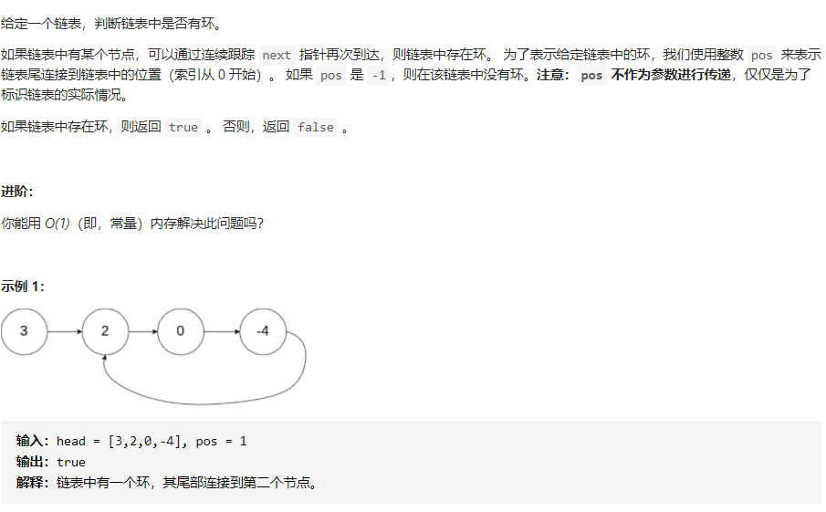
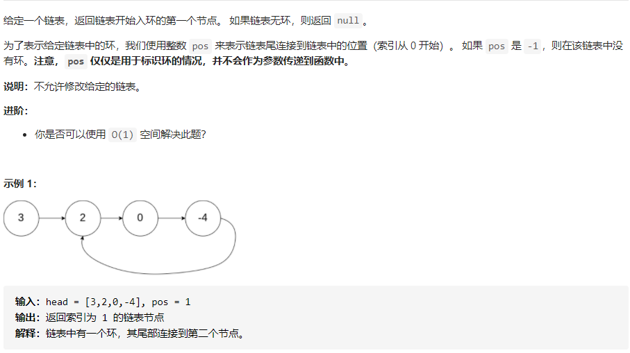
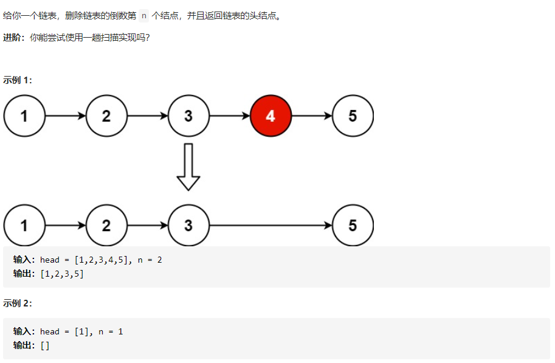

# 1. 双指针技巧

我们在另一本 LeetBook 中引入了双指针技巧：[数组和字符串](https://leetcode-cn.com/leetbook/read/array-and-string/yco3v/)。

让我们简要回顾一下这种技巧。 我们提到了两种使用双指针技巧的情景：

> 1. 两个指针`从不同位置出发`：一个从始端开始，另一个从末端开始；
> 2. 两个指针`以不同速度移动`：一个指针快一些，另一个指针慢一些。

对于单链表，因为我们只能在一个方向上遍历链表，所以第一种情景可能无法工作。然而，第二种情景，也被称为慢指针和快指针技巧，是非常有用的。

# 2.环形链表

题目：

## 2.1 使用快慢指针进行解决

思路：

> 可以使用快慢指针法， 分别定义 fast 和 slow指针，从头结点出发，fast指针每次移动两个节点，slow指针每次移动一个节点，如果 fast 和 slow指针在途中相遇 ，说明这个链表有环。
>

原理：

> 为什么fast 走两个节点，slow走一个节点，有环的话，一定会在环内相遇呢，而不是永远的错开呢？
>
> 首先第一点： fast指针一定先进入环中，如果fast 指针和slow指针相遇的话，一定是在环中相遇，这是毋庸置疑的,fast会从后面追上slow.

# 3. 环形链表进阶

题目：

思路：

方法1：使用HashSet进行解决。

> 这个方法很容易理解，不进行详解。

方法2：使用快慢指针。

思路：

> 这个方法是比较巧妙的方法，但是不容易想到，也不太容易理解，利用快慢指针判断是否有环很容易，但是判断环的入口就没有那么容易，之前说过快慢指针肯定会在环内相遇，见下图。
>
> 
>
> 上图黄色节点为快慢指针相遇的节点，此时
>
> 快指针走的距离：**a+(b+c)n+b**
>
> 很容易理解b+c为环的长度，a为直线距离，b为绕了n圈之后又走了一段距离才相遇，所以相遇时走的总路程为a+(b+c)n+b，合并同类项得a+(n+1)b+nc。
>
> 慢指针走的距离：a+(b+c)m+b,m代表圈数。
>
> 然后我们设快指针得速度是慢指针的2倍,含义为相同时间内，快指针走过的距离是慢指针的2倍。
>
> **a+(n+1)b+nc=2[a+(m+1)b+mc]整理得a+b=(n-2m)(b+c)，**那么我们可以从这个等式上面发现什么呢？b+c
>
> 为一圈的长度。也就是说a+b等于n-2m个环的长度。为了便于理解我们看一种特殊情况，当n-2m等于1，那么a+b=b+c整理得，a=c此时我们只需重新释放两个指针，一个从head释放，一个从相遇点释放，速度相同，因为a=c所以他俩必会在环入口处相遇，则求得入口节点索引。

算法流程：

> 1.设置快慢指针，快指针速度为慢指针的2倍
>
> 2.找出相遇点
>
> 3.在head处和相遇点同时释放相同速度且速度为1的指针，两指针必会在环入口处相遇

# 4.相交链表

思路：

> 方法1：同样可以使用Hash表找相同来求解，但是空间复杂度很高。
>
> 方法2：双指针算法

算法原理：

> 想清楚这样为什么可行，可以考量以下两个链表
>
> A = {1，3，5，7，9，11}和B={2，4，9，11}，相交于结点9，由于B.length(=4) < A.length(=6)
>
> Pb比Pa少经过2个结点，会先行到达尾部。

一句话总结：

> 1.从A到终点的路径长度+B到交点的路径长度 == B到终点的路径长度+A到交点的路径长度。

算法流程：

> 1.创建两个指针Pa和Pb，分别初始化为链表A和B的头结点，然后让它们向后逐个结点的遍历
>
> 2.当pA到达链表的尾部后，将它重定位到链表B的头结点；类似的，当Pb到达链表的尾部后，将其定位到 链表A的头结点
>
> 3.若某一时刻Pa和Pb相遇，则任意一个索引指向的为交点。

# 5. 删除链表的倒数第N个结点

给你一个链表，删除链表的倒数第n个结点，并且返回链表的头结点。

