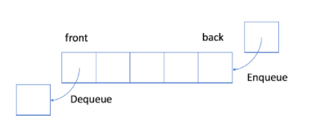
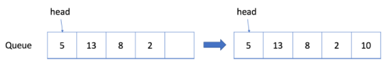

# 1.队列

## 1.1 先入先出的数据结构



在 FIFO 数据结构中，将首先处理添加到队列中的第一个元素。

如上图所示，队列是典型的 FIFO 数据结构。插入（insert）操作也称作入队（enqueue），新元素始终被添加在队列的末尾。 删除（delete）操作也被称为出队（dequeue)。 你只能移除第一个元素。

 

## 1.2 队列的实现

为了实现队列，我们可以使用动态数组和指向队列头部的索引。

如上所述，队列应支持两种操作：入队和出队。入队会向队列追加一个新元素，而出队会删除第一个元素。 所以我们需要一个索引来指出起点。

这是一个供你参考的实现：

```java
// "static void main" must be defined in a public class.

class MyQueue {
    // store elements
    private List<Integer> data;         
    // a pointer to indicate the start position
    // p_start 指向了队列的头部
    private int p_start;            
    public MyQueue() {
        data = new ArrayList<Integer>();
        p_start = 0;
    }
    /** Insert an element into the queue. Return true if the operation is successful. */
    public boolean enQueue(int x) {
        data.add(x);
        return true;
    };    
    /** Delete an element from the queue. Return true if the operation is successful. */
    public boolean deQueue() {
        if (isEmpty() == true) {
            return false;
        }
        p_start++;
        return true;
    }
    /** Get the front item from the queue. */
    public int Front() {
        return data.get(p_start);
    }
    /** Checks whether the queue is empty or not. */
    public boolean isEmpty() {
        return p_start >= data.size();
    }     
};

public class Main {
    public static void main(String[] args) {
        MyQueue q = new MyQueue();
        q.enQueue(5);
        q.enQueue(3);
        if (q.isEmpty() == false) {
            System.out.println(q.Front());
        }
        q.deQueue();
        if (q.isEmpty() == false) {
            System.out.println(q.Front());
        }
        q.deQueue();
        if (q.isEmpty() == false) {
            System.out.println(q.Front());
        }
    }
}
```

上述实现的缺点：

上面的实现很简单，但在某些情况下效率很低。 随着起始指针的移动，浪费了越来越多的空间,指针前面的空间浪费了。 当我们有空间限制时，这将是难以接受的。



## 1.3 循环队列

此前，我们提供了一种简单但低效的队列实现。

更有效的方法是使用循环队列。 具体来说，我们可以使用固定大小的数组和两个指针来指示起始位置和结束位置。 目的是重用我们之前提到的被浪费的存储。

让我们通过一个示例来查看循环队列的工作原理。 你应该注意我们入队或出队元素时使用的策略。

第一步：


第二步：


第三步：


第四步：


第五步：


第六步：


第七步：


第八步：


第九步：

