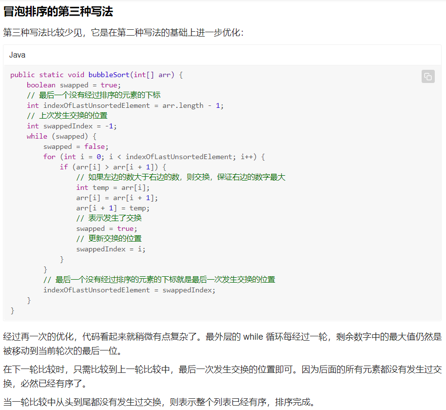

# 1.冒泡排序

冒泡排序是入门级的算法，但也有一些有趣的玩法。通常来说，冒泡排序有三种写法：

> 一边比较一边向后两两交换，将最大值 / 最小值冒泡到最后一位；
>
> 经过优化的写法：使用一个变量记录当前轮次的比较是否发生过交换，如果没有发生交换表示已经有序，不再继续排序；
>
> 进一步优化的写法：除了使用变量记录当前轮次是否发生交换外，再使用一个变量记录上次发生交换的位置，下一轮排序时到达上次交换的位置就停止比较。

优化思路：当没有发生交换，则说明前面已经有序，则不需要再进行交换了。

优化思路：当经过一轮之后，最后一个元素已经占据了其应该占据的位置，当经过两轮之后，倒数第二大的元素已经占据了其应该占据的位置。

冒泡排序的特性：

冒泡排序不会改变相等元素的相对位置。是数值稳定的排序。