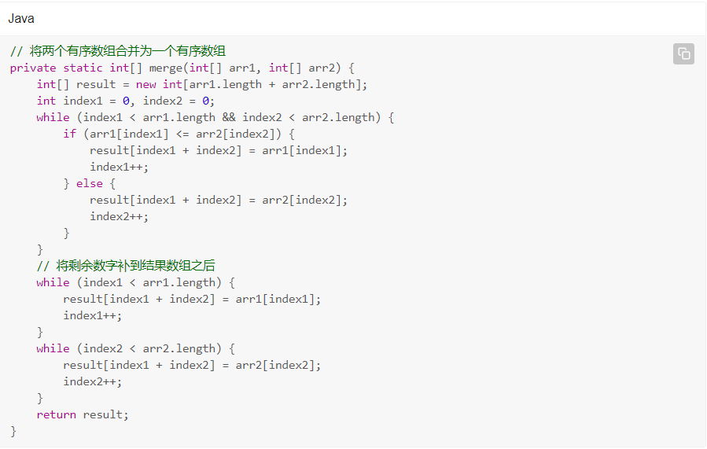
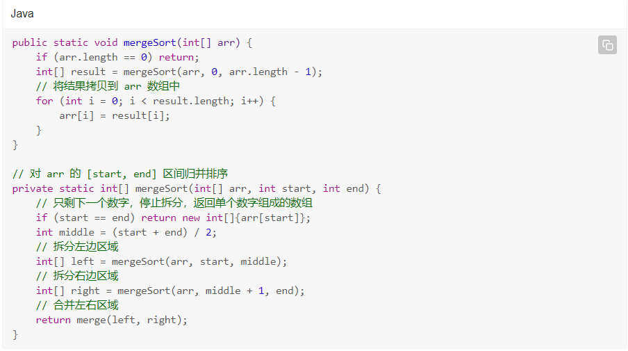

# 1.归并排序

## 1.2 历史

约翰·冯·诺伊曼在 1945 年提出了归并排序。在讲解归并排序之前，我们先一起思考一个问题：如何将两个有序的列表合并成一个有序的列表？

## 1.3 将两个有序的列表合并成为一个有序的列表

这太简单了，笔者首先想到的思路就是，将两个列表拼接成一个列表，然后之前学的冒泡、选择、插入、希尔、堆、快排都可以派上用场了。

觉得太暴力了一点？那我们换个思路。

既然列表已经有序了，通过前几章的学习，我们已经知道，插入排序的过程中，被插入的数组也是有序的。这就好办了，我们将其中一个列表中的元素逐个插入另一个列表中即可。

但是按照这个思路，我们只需要一个列表有序就行了，另一个列表不管是不是有序的，都会被逐个取出来，插入第一个列表中。那么，在两个列表都已经有序的情况下，还可以有更优的合并方案吗？

深入思考之后，我们发现，在第二个列表向第一个列表逐个插入的过程中，由于第二个列表已经有序，所以后续插入的元素一定不会在前面插入的元素之前。在逐个插入的过程中，每次插入时，只需要从上次插入的位置开始，继续向后寻找插入位置即可。这样一来，我们最多只需要将两个有序数组遍历一次就可以完成合并。

思路很接近了，如何实现它呢？我们发现，在向数组中不断插入新数字时，原数组需要不断腾出位置，这是一个比较复杂的过程，而且这个过程必然导致增加一轮遍历。

但好在我们有一个替代方案：只要开辟一个长度等同于两个数组长度之和的新数组，并使用两个指针来遍历原有的两个数组，不断将较小的数字添加到新数组中，并移动对应的指针即可。

根据这个思路，我们可以写出合并两个有序列表的代码：



合并有序数组的问题解决了，但我们排序时用的都是无序数组，那么上哪里去找这两个有序的数组呢？

答案是 —— 自己拆分，我们可以把数组不断地拆成两份，直到只剩下一个数字时，这一个数字组成的数组我们就可以认为它是有序的。

然后通过上述合并有序列表的思路，将 1 个数字组成的有序数组合并成一个包含 2 个数字的有序数组，再将 2 个数字组成的有序数组合并成包含 4 个数字的有序数组...直到整个数组排序完成，这就是归并排序（Merge Sort）的思想。

## 1.4 归并排序的底层框架



## 1.5 完整代码

```java
public static void mergeSort(int[] arr) {
    if (arr.length == 0) return;
    int[] result = new int[arr.length];
    mergeSort(arr, 0, arr.length - 1, result);
}

// 对 arr 的 [start, end] 区间归并排序
private static void mergeSort(int[] arr, int start, int end, int[] result) {
    // 只剩下一个数字，停止拆分
    if (start == end) return;
    int middle = (start + end) / 2;
    // 拆分左边区域，并将归并排序的结果保存到 result 的 [start, middle] 区间
    mergeSort(arr, start, middle, result);
    // 拆分右边区域，并将归并排序的结果保存到 result 的 [middle + 1, end] 区间
    mergeSort(arr, middle + 1, end, result);
    // 合并左右区域到 result 的 [start, end] 区间
    merge(arr, start, end, result);
}

// 将 result 的 [start, middle] 和 [middle + 1, end] 区间合并
// 默认[start,middle]区间以及[middle+1,end]区间是已经排好序了的。
private static void merge(int[] arr, int start,  int end, int[] result) {
    int middle = (start + end) / 2;
    // 数组 1 的首尾位置
    int start1 = start;
    int end1 = middle;
    // 数组 2 的首尾位置
    int start2 = middle + 1;
    int end2 = end;
    // 用来遍历数组的指针
    int index1 = start1;
    int index2 = start2;
    // 结果数组的指针
    int resultIndex = start1;
    while (index1 <= end1 && index2 <= end2) {
        if (arr[index1] <= arr[index2]) {
            result[resultIndex++] = arr[index1++];
        } else {
            result[resultIndex++] = arr[index2++];
        }
    }
    // 将剩余数字补到结果数组之后
    while (index1 <= end1) {
        result[resultIndex++] = arr[index1++];
    }
    while (index2 <= end2) {
        result[resultIndex++] = arr[index2++];
    }
    // 将 result 操作区间的数字拷贝到 arr 数组中，以便下次比较
    for (int i = start; i <= end; i++) {
        arr[i] = result[i];
    }
}

```

