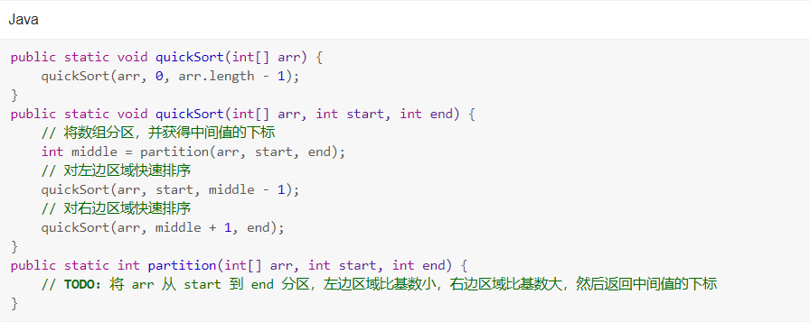
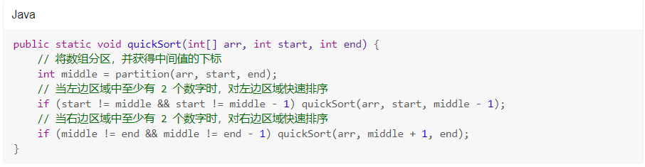
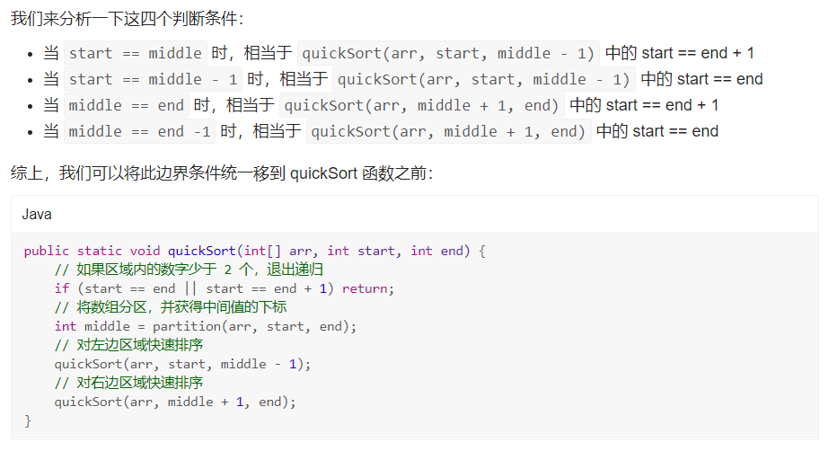
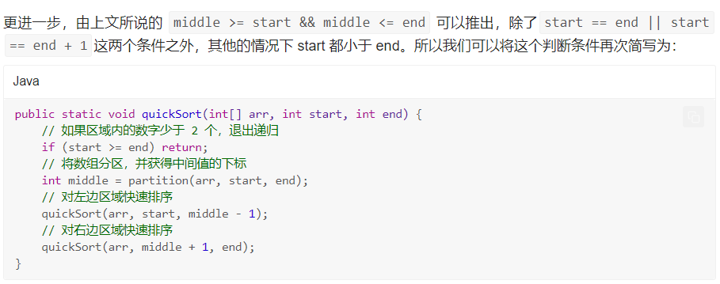

# 1.快速排序

## 1.2 历史

快速排序算法由 C. A. R. Hoare 在 1960 年提出。它的时间复杂度也是 O(nlogn)O(nlogn)，但它在时间复杂度为 O(nlogn)O(nlogn) 级的几种排序算法中，大多数情况下效率更高，所以快速排序的应用非常广泛。再加上快速排序所采用的分治思想非常实用，使得快速排序深受面试官的青睐，所以掌握快速排序的思想尤为重要。

## 1.3 基本思想

> 1.从数组中取出一个数，称之为基数（pivot）
>
> 2.遍历数组，将比基数大的数字放到它的右边，比基数小的数字放到它的左边。遍历完成后，数组被分成了左右两个区域
>
> 3.将左右两个区域视为两个数组，重复前两个步骤，直到排序完成

## 1.4 快速排序递归框架



partition 意为“划分”，我们期望 partition 函数做的事情是：将 arr 从 start 到 end 这一区间的值分成两个区域，左边区域的每个数都比基数小，右边区域的每个数都比基数大，然后返回中间值的下标。

只要有了这个函数，我们就能写出快速排序的递归函数框架。首先调用 partition 函数得到中间值的下标 middle，然后对左边区域执行快速排序，也就是递归调用 quickSort(arr, start, middle - 1)，再对右边区域执行快速排序，也就是递归调用 quickSort(arr, middle + 1, end)。

现在还有一个问题，何时退出这个递归函数呢？

## 1.5 退出递归的边界条件

递归的边界条件
很容易想到，当某个区域只剩下一个数字的时候，自然不需要排序了，此时退出递归函数。实际上还有一种情况，就是某个区域只剩下 0 个数字时，也需要退出递归函数。当 middle 等于 start 或者 end 时，就会出现某个区域剩余数字为 0。



在递归之前，先判断此区域剩余数字是否为 0 个或者 1 个，当数字至少为 2 个时，才执行这个区域的快速排序。因为我们知道 middle >= start && middle <= end 必然成立，所以判断剩余区域的数字为 0 个或者 1 个也就是指 start 或 end 与 middle 相等或相差 1。

## 1.5.1 边界条件的简化



进一步进行简化到最简形式：



## 1.6 分区算法--双指针

分区的方式也有很多种，最简单的思路是：从 left 开始，遇到比基数大的数，就交换到数组最后，并将 right 减一，直到 left 和 right 相遇，此时数组就被分成了左右两个区域。再将基数和中间的数交换，返回中间值的下标即可。

```java
public static int partition(int[] arr, int start, int end) {
    // 取第一个数为基数
    int pivot = arr[start];
    // 从第二个数开始分区
    int left = start + 1;
    // 右边界
    int right = end;
    while (left < right) {
        // 找到第一个大于基数的位置
        while (left < right && arr[left] <= pivot) left++;
        // 找到第一个小于基数的位置
        while (left < right && arr[right] >= pivot) right--;
        // 交换这两个数，使得左边分区都小于或等于基数，右边分区大于或等于基数
        if (left < right) {
            exchange(arr, left, right);
            left++;
            right--;
        }
    }
    // 如果 left 和 right 相等，单独比较 arr[right] 和 pivot
    if (left == right && arr[right] > pivot) right--;
    // 将基数和轴交换
    exchange(arr, start, right);
    return right;
}

```

## 1.7 快速排序的优化思路

第一种就是我们在前文中提到的，每轮选择基数时，从剩余的数组中随机选择一个数字作为基数。这样每轮都选到最大或最小值的概率就会变得很低了。所以我们才说用这种方式选择基数，其平均时间复杂度是最优的

第二种解决方案是在排序之前，先用洗牌算法将数组的原有顺序打乱，以防止原数组正序或逆序。

Collections.shuffle() 洗牌函数可以对函数进行洗牌的操作。

