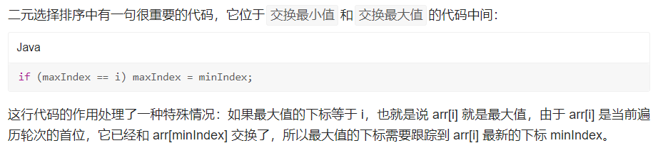

# 1.选择排序

思想：

> 双重循环遍历数组，每经过一轮比较，找到最小元素的下标，将其交换至首位。

> 选择排序就好比第一个数字站在擂台上，大吼一声：“还有谁比我小？”。剩余数字来挨个打擂，如果出现比第一个数字小的数，则新的擂主产生。每轮打擂结束都会找出一个最小的数，将其交换至首位。经过 n-1 轮打擂，所有的数字就按照从小到大排序完成了。

冒泡排序和选择排序的比较:

相同点：

> - 都是两层循环，时间复杂度都为 O(n^2)
> - 都只使用有限个变量，空间复杂度 O(1)

不同点：

> - 冒泡排序在比较过程中就不断交换；而选择排序增加了一个变量保存最小值 / 最大值的下标，遍历完成后才交换，减少了交换次数。

# 2.排序算法的稳定性

## 2.1 稳定性的定义

假定在待排序的记录序列中，存在多个具有相同的关键字的记录，若经过排序，这些记录的相对次序保持不变，即在原序列中，r[i] = r[j]，且 r[i] 在 r[j] 之前，而在排序后的序列中，r[i] 仍在 r[j] 之前，则称这种排序算法是稳定的；否则称为不稳定的。

理解了稳定性的定义后，我们就能分析出：冒泡排序中，只有左边的数字大于右边的数字时才会发生交换，相等的数字之间不会发生交换，所以它是稳定的。

而选择排序中，最小值和首位交换的过程可能会破坏稳定性。比如数列：[2, 2, 1]，在选择排序中第一次进行交换时，原数列中的两个 2 的相对顺序就被改变了，因此，我们说选择排序是不稳定的。

## 2.2 稳定性的意义

那么排序算法的稳定性有什么意义呢？其实它只在一种情况下有意义：当要排序的内容是一个对象的多个属性，且其原本的顺序存在意义时，如果我们需要在二次排序后保持原有排序的意义，就需要使用到稳定性的算法。

举个例子，如果我们要对一组商品排序，商品存在两个属性：价格和销量。当我们按照价格从高到低排序后，要再按照销量对其排序，这时，如果要保证销量相同的商品仍保持价格从高到低的顺序，就必须使用稳定性算法。

当然，算法的稳定性与具体的实现有关。在修改比较的条件后，稳定性排序算法可能会变成不稳定的。如冒泡算法中，如果将“左边的数大于右边的数，则交换”这个条件修改为“左边的数大于或等于右边的数，则交换”，冒泡算法就变得不稳定了。

同样地，不稳定排序算法也可以经过修改，达到稳定的效果。思考一下，选择排序算法如何实现稳定排序呢？

实现的方式有很多种，这里给出一种最简单的思路：新开一个数组，将每轮找出的最小值依次添加到新数组中，选择排序算法就变成稳定的了。

但如果将寻找最小值的比较条件由arr[minIndex] > arr[j]修改为arr[minIndex] >= arr[j]，即使新开一个数组，选择排序算法依旧是不稳定的。所以分析算法的稳定性时，需要结合具体的实现逻辑才能得出结论，我们通常所说的算法稳定性是基于一般实现而言的。

## 2.3 选择排序的稳定性

选择排序是不稳定的。

# 3.选择排序的优化--二元选择排序

选择排序算法也是可以优化的，既然每轮遍历时找出了最小值，何不把最大值也顺便找出来呢？这就是二元选择排序的思想。使用二元选择排序，每轮选择时记录最小值和最大值，可以把数组需要遍历的范围缩小一倍。

```java
public static void selectionSort2(int[] arr) {
    int minIndex, maxIndex;
    // i 只需要遍历一半
    for (int i = 0; i < arr.length / 2; i++) {
        minIndex = i;
        maxIndex = i;
        for (int j = i + 1; j < arr.length - i; j++) {
            if (arr[minIndex] > arr[j]) {
                // 记录最小值的下标
                minIndex = j;
            }
            if (arr[maxIndex] < arr[j]) {
                // 记录最大值的下标
                maxIndex = j;
            }
        }
        // 如果 minIndex 和 maxIndex 都相等，那么他们必定都等于 i，且后面的所有数字都与 arr[i] 相等，此时已经排序完成
        if (minIndex == maxIndex) break;
        // 将最小元素交换至首位
        int temp = arr[i];
        arr[i] = arr[minIndex];
        arr[minIndex] = temp;
        // 如果最大值的下标刚好是 i，由于 arr[i] 和 arr[minIndex] 已经交换了，所以这里要更新 maxIndex 的值。
        if (maxIndex == i) maxIndex = minIndex;
        // 将最大元素交换至末尾
        int lastIndex = arr.length - 1 - i;
        temp = arr[lastIndex];
        arr[lastIndex] = arr[maxIndex];
        arr[maxIndex] = temp;
    }
}
```

细节分析：

