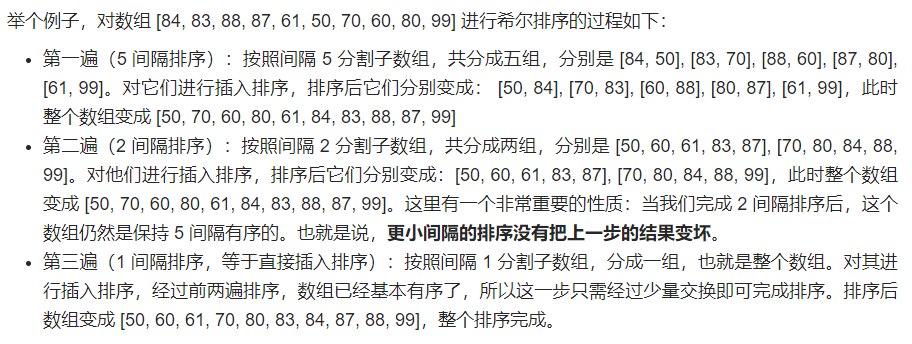
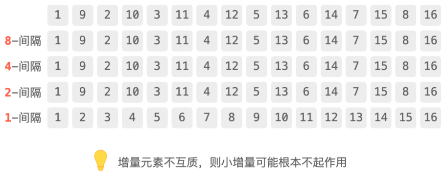
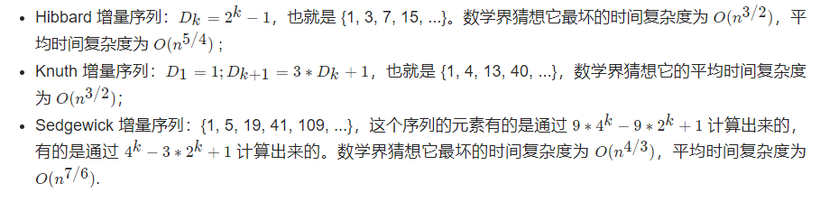
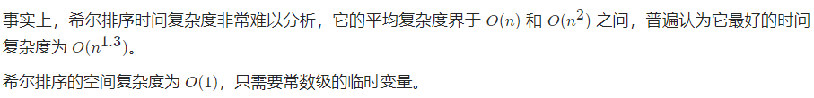
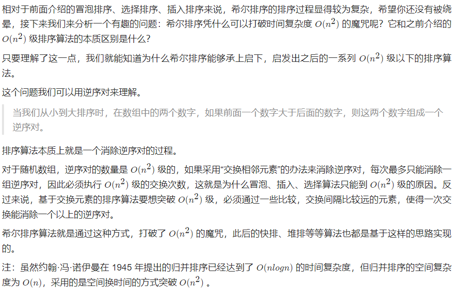

# 1.希尔排序

## 1.1 历史

1959 年 7 月，美国辛辛那提大学的数学系博士 Donald Shell 在 《ACM 通讯》上发表了希尔排序算法，成为首批将时间复杂度降到 O(n^2) ) 以下的算法之一。虽然原始的希尔排序最坏时间复杂度仍然是 O(n^2) ) ，但经过优化的希尔排序可以达到 O(n^{1.3}) 甚至 O(n^{7/6}) )。

略为遗憾的是，所谓“一将功成万骨枯”，希尔排序和冒泡、选择、插入等排序算法一样，逐渐被快速排序所淘汰，但作为承上启下的算法，我们不可否认的是，希尔排序身上始终闪耀着算法之美。

## 1.2 基本思想

> A.将待排序数组按照一定间隔分为多个子数组，每组分别进行插入排序，这里按照间隔分组指的不是取连续的一段数组，而是每跳跃一定间隔取一个值组成一组
>
> B.逐渐缩小间隔进行下一轮排序
>
> C.最后一轮时，取间隔为1，也就相当于直接使用插入排序，但这时经过前面的“宏观调控”，数组已经基本有序了，所以此时的插入排序只需进行少量交换便可完成。

## 1.3 举例



## 1.4 增量的定义

其中，每一遍排序的间隔在希尔排序中被称之为增量，所有的增量组成的序列称之为增量序列，也就是本例中的 [5, 2, 1]。增量依次递减，最后一个增量必须为 1，所以希尔排序又被称之为“缩小增量排序”。要是以专业术语来描述希尔排序，可以分为两个步骤：

> 1.定义增量序列 D_m > Dm-1 > Dm-2 > ... > D1 = 1。
>
> 2.对每个Dk进行Dk间隔排序。

## 1.5 增量序列

上文说到，增量序列的选择会极大地影响希尔排序的效率。增量序列如果选得不好，希尔排序的效率可能比插入排序效率还要低



在这个例子中，我们发现，原数组 8 间隔、4 间隔、2 间隔都已经有序了，使用希尔排序时，真正起作用的只有最后一轮 1 间隔排序，也就是直接插入排序。希尔排序反而比直接使用插入排序多执行了许多无用的逻辑。

于是人们发现：增量元素不互质，则小增量可能根本不起作用。

事实上，希尔排序的增量序列如何选择是一个数学界的难题，但它也是希尔排序算法的核心优化点。数学界有不少的大牛做过这方面的研究。比较著名的有 Hibbard 增量序列、Knuth 增量序列、Sedgewick 增量序列。



以 Knuth 增量序列为例

```java
public static void shellSortByKnuth(int[] arr) {
    // 找到当前数组需要用到的 Knuth 序列中的最大值
    int maxKnuthNumber = 1;
    while (maxKnuthNumber <= arr.length / 3) {
        maxKnuthNumber = maxKnuthNumber * 3 + 1;
    }
    // 增量按照 Knuth 序列规则依次递减
    for (int gap = maxKnuthNumber; gap > 0; gap = (gap - 1) / 3) {
        // 从 gap 开始，按照顺序将每个元素依次向前插入自己所在的组
        for (int i = gap; i < arr.length; i++) {
            // currentNumber 站起来，开始找位置
            int currentNumber = arr[i];
            // 该组前一个数字的索引
            int preIndex = i - gap;
            while (preIndex >= 0 && currentNumber < arr[preIndex]) {
                // 向后挪位置
                arr[preIndex + gap] = arr[preIndex];
                preIndex -= gap;
            }
            // currentNumber 找到了自己的位置，坐下
            arr[preIndex + gap] = currentNumber;
        }
    }
}
```

## 1.6 时间与空间复杂度



## 1.7 为什么希尔排序能够打破n平方的魔咒

