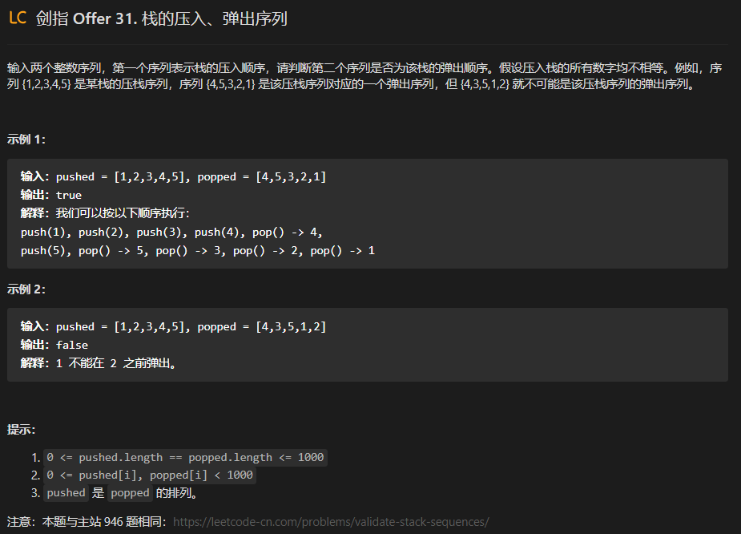

# 1.栈的压入和弹出序列

题目：

## 1.1 解题思路

如下图所示，给定一个压入序列pushed和弹出序列popped，则压入/弹出操作的顺序(即排列)是唯一确定的。

由于栈具有先进后出的特点，因此某些弹出序列是无法实现的，如下图所示

考虑借用一个辅助栈 stack ，**模拟** 压入 / 弹出操作的排列。根据是否模拟成功，即可得到结果。

- **入栈操作：** 按照压栈序列的顺序执行。

- **出栈操作：** 每次入栈后，循环判断 “栈顶元素 == 弹出序列的当前元素” 是否成立，将符合弹出序列顺序的栈顶元素全部弹出。

举例说明：

> 1.首先pushed序列是1 2 3 4 5
>
> 2.然后popped序列是4 5 3 2 1
>
> 3.所以我们首先进行的操作是将1进行压栈，发现1没有和4相同，所以继续
>
> 4.然后我们将2，3，4进行压栈，发现4和popped的第一个相同，所以将4 pop出来
>
> 5.然后将5 进行压栈，将5 pop出来。当pushed序列完结后，查看之后的弹栈序列有没有对应上。