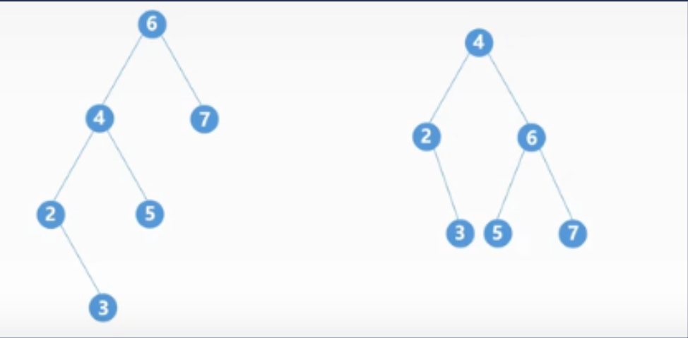
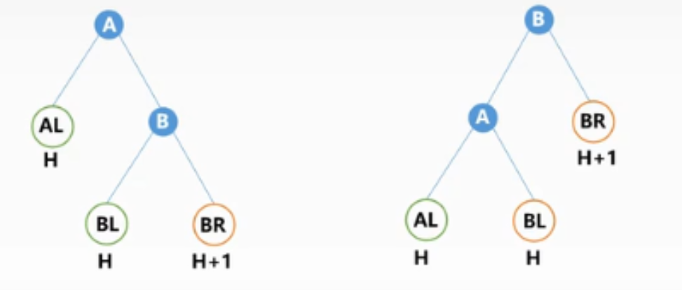
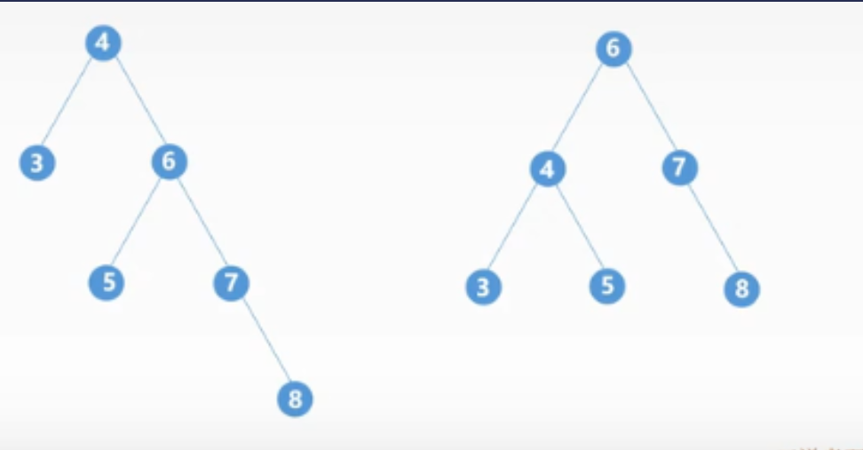
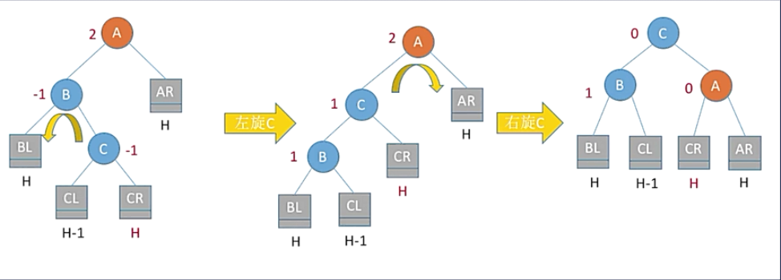
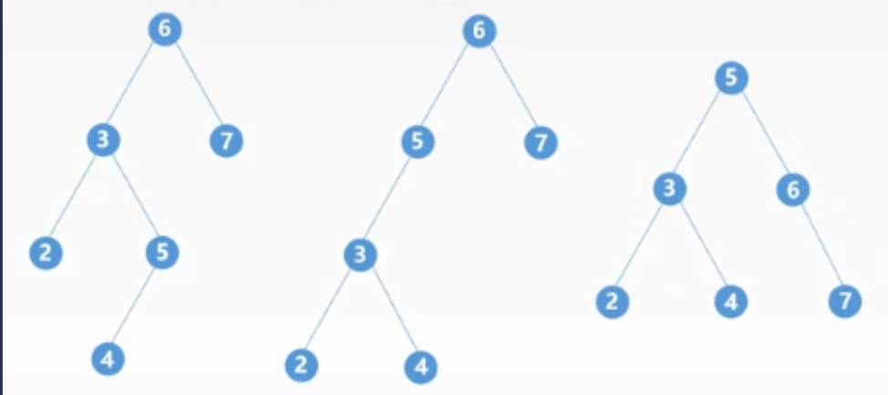
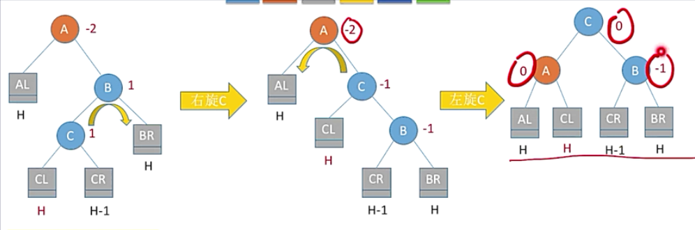
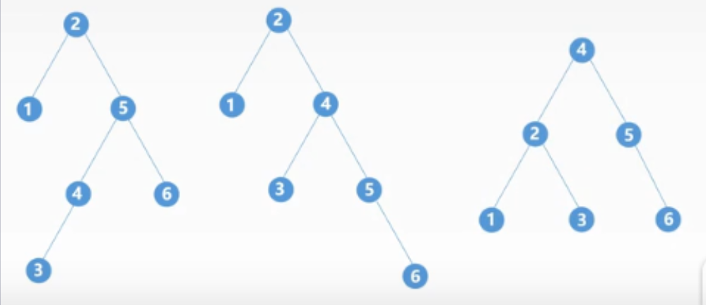

# 1.AVL 平衡搜索二叉树

## 1.1 左旋和右旋

概念：我们的红黑树，平衡搜索二叉树在进行结点的插入和删除的时候会出现不平衡的情况，而需要通过一系列左旋右旋操作使得整棵树恢复其平衡，下面开始介绍我们的左旋和右旋

### 1.1.1 右旋

概念：原来的头结点变成了新的头结点的右孩子

举例：右旋的例子如下图所示，原来的头结点5变成了4的右孩子。

### 1.1.2 左旋

概念：原来的头结点变成了新的头结点的左孩子

举例：左旋的例子如下图所示，原来的头结点5变成了新的头结点6的左孩子

## 1.2 AVL树如何运用左旋和右旋操作将不平衡转平衡

概念：AVL树将左树高度和右树高度记录在结点之中，当插入一个结点的时候，它会从插入结点开始向上进行寻找，将沿途的左子树或者右子树的高度进行更改。经过这个过程我们就可能会发现不平衡的情况，然后我们就使用左旋和右旋的组合进行调整

## 1.3 AVL树左旋和右旋的组合

### 1.3.1 LL旋转

发生情形：在一个结点A(这个结点开始发现两侧不平衡)，的左孩子的左子树上插入一个新的结点。

举例：下图之中6的左子树的左子树的以2为根节点左子树上插入了3，此时进行LL平衡旋转

### 1.3.2 RR旋转

发生情形：在一个结点A(这个结点开始发现两侧不平衡)，的右孩子的右子树上插入了新的结点

举例：

### 1.3.3 LR旋转

发生情形：在一个结点A(这个结点开始发现两侧不平衡)，的左孩子的右子树上插入了新的结点

举例：

### 1.3.4 RL旋转

发生情形：在一个结点A(这个结点开始发现两侧不平衡)，的右孩子的左子树上插入了新的结点

举例：

## 1.4 左程云的忠告

AVL树或者红黑树不会让我们手撸一个实现，而是要求我们会使用就行了。

