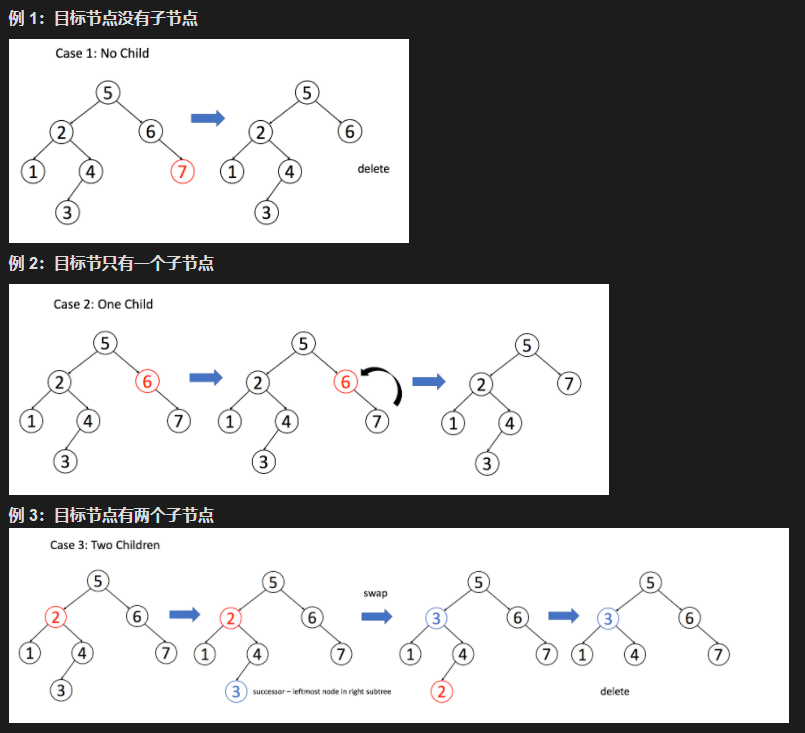

# 1.二叉搜索树

定义：

> 二叉搜索树(Binary Search Tree) 是二叉树的一种特殊的表现形式，它满足如下特性：
>
> > 1.每个结点中的值必须大于(或者等于)存储在其左子树之中的任何值
> >
> > 2.每个结点中的值必须小于(或者等于)存储在其右子树之中的任何值。

举例：

> 

# 2.二叉搜索树中的基本操作

## 2.1 操作概述

二叉搜索树支持三个操作：搜索，插入和删除。

## 2.2 搜索操作

根据二叉树的特性，对于每个结点：

> 如果目标值等于节点的值，则返回该结点
>
> 如果目标值小于节点的值，则继续在左子树之中搜索
>
> 如果目标值大于节点的值，则继续在右子树之中搜索

举例：

> 

## 2.3 插入操作

二叉搜索树中的另一个常见操作是插入一个新节点。有许多不同的方法去插入新节点，这篇文章中，我们只讨论一种使整体操作变化最小的经典方法。 它的主要思想是为目标节点找出合适的叶节点位置，然后将该节点作为叶节点插入。 因此，搜索将成为插入的起始。

与搜索操作类似，对于每个节点，我们将：

> 根据节点值与目标节点值的关系，搜索左子树或右子树；
> 重复步骤 1 直到到达外部节点；
> 根据节点的值与目标节点的值的关系，将新节点添加为其左侧或右侧的子节点。

## 2.4 删除操作

删除要比我们前面提到过的两种操作复杂许多。有许多不同的删除节点的方法，这篇文章中，我们只讨论一种使整体操作变化最小的方法。我们的方案是用一个合适的子节点来替换要删除的目标节点。根据其子节点的个数，我们需考虑以下三种情况：

> 1. 如果目标节点没有子节点，我们可以直接移除该目标节点。
> 2. 如果目标节只有一个子节点，我们可以用其子节点作为替换。
> 3. 如果目标节点有两个子节点，我们需要用其中序后继节点或者前驱节点来替换，再删除该目标节点。后继节点是右子树上的最左侧节点。
>

# 3.二叉搜索树的优点

二叉搜索树的有优点是，即便在最坏的情况下，也允许你在O(h)的时间复杂度内执行所有的搜索、插入、删除操作。

通常来说，如果你想有序地存储数据或者需要同时执行搜索、插入、删除等多步操作，二叉搜索树这个数据结构是一个很好的选择。
