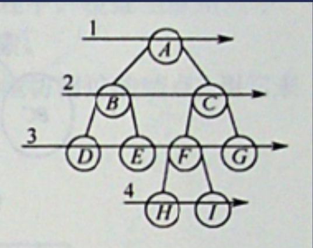

# 1.树

## 1.1 二叉树

### 1.1.1 二叉树的定义：

二叉树，结点数大于等于0的有限集合，每个结点至多只有两颗子树，并且二叉树是一颗有序树，即左右子树步可以随意的进行交换。

### 1.1.2 二叉树的五种基本形态：

A.空的二叉树

B.只有一个根结点的二叉树

C.只有一个根节点和左子树

D.只有一个根结点和右子树

E.有一个根结点和左右子树

### 1.1.3  二叉树VS度为2的有序树

A.二叉树可以为空，而度为2的有序树至少有3个结点,因为度为2代表至少一个结点有2个孩子。

B.二叉树的孩子结点始终有左右之分，而度为2有序树的华子结点次序是相对的，即如果只有一个子结点

则这个子结点甚至可以垂直放置。

### 1.1.4 特殊的二叉树

#### 1.1.4.1 满二叉树

定义：一颗高度为h，并且含有2^h-1个结点的二叉树为满二叉树，即为树的每层都含有最多的结点

编号前提：从上到下，从左到右进行编号，从1开始进行编号

特征：

> 编号特征：
>
> > 若一个结点的编号为i，那么其左孩子的编号为2i,其右孩子的编号为2i+1
> >
> > 若一个结点的编号为i，则其双亲结点的编号为i/2取下界。
>
> 结点特征：
>
> > 满二叉树的叶子结点都集中在满二叉树的最下面一层。
> >
> > 不存在度为1的结点，只有度为2的结点和度为0的叶子结点。

#### 1.1.4.2 完全二叉树

定义：设一个高度为h，有n个结点的二叉树，当且仅当其每个结点都与高度为h的满二叉树中编号1-n的结点一一对应的时候，称之为完全二叉树，也就是说完全二叉树的结点排列一定要从上到下从左至右进行排列才可以。

特征：

> 1.若i<=n/2取下界，则i为分支结点，否则为叶子结点。
>
> 2.叶子结点只可能在层次最大的两层上出现，对于最大层次中的叶子结点都依次排列在该层最左侧的位置上
>
> 3.若有度为1的结点，则只可能有一个，且该结点只有左孩子而无右孩子(重要特征)--因为结点的编号是从左往右从上至下的。
>
> 4.按层序编号后，一旦出现某结点(编号为i)为叶子结点或者只有左孩子，则编号大于i的结点将均为叶子结点，因为这将是最后一个分支结点。
>
> 5.若n为奇数，则每个分支结点都有左子和右子，若n为偶数，则编号最大的分支结点只有左子没有右子。
>
> 6.若一个结点的编号为i，那么其左孩子的编号为2i,其右孩子的编号为2i+1
>
> 7.若一个结点的编号为i，则其双亲结点的编号为i/2取下界。

#### 1.1.4.3 二叉排序树

定义：一颗二叉树，或者是空二叉树，或者是具有如下性质的二叉树：左子树上所有结点的关键字均小于根节点的关键字，右子树上所有结点的关键字均大于根节点的关键字。左子树和右子树又各为一棵二叉排序树

#### 1.1.4.4 平衡二叉树

定义：树上任意结点的左子树和右子树的深度之差不超过1

### 1.1.5 二叉树的性质

#### 性质：

> 1.非空二叉树上的叶子结点数等于度为2的结点树+1，即n0=n2+1
>
> > 证明：
> >
> > 由于度数+1 = 结点数并且结点数=度为0的结点+度为1的结点+度为2的结点，共同得出度为0的结点等于度为2的结点数+1
>
> 2.非空二叉树上第k层上至多有2^(k-1)个结点(k>=1)
>
> 3.高度为h的二叉树至多有2^h-1个结点
>
> 4.n = n1 + 2n2 +1  
>
> > 证明：
> >
> > 因为n1(度数为1的结点)只有一个孩子，度数和结点一一对应，n2(度数为2的结点)有两个孩子，度数和结点也是一一对应，最终还有一个根节点不是任意结点的孩子结点

### 1.1.6 二叉树的存储结构

#### 1.1.6.1 顺序存储结构

定义：

> 二叉树的顺序存储结构是指用一组地址连续的存储单元依次自上而下，从左至又存储完全二叉树上的结点，即将完全二叉树上编号为i的结点元素存储在某个数组下标为i-1的分量中。

适合的场景：

> 适合的特殊二叉树：
>
> > 1.完全二叉树
> >
> > 2.满二叉树

> 适合的原因：
>
> > 数组下表能够反映二叉树结点之间的逻辑关系，能最大限度的节省存储空间，又能利用数组元素的下标确定结点在二叉树之中的位置以及结点之间的关系，我们让第一个位置空缺，就可以保证数组下表和结点编号一致。

不适合的场景

> 一般的二叉树

> 不适合的原因：
>
> 对于一般的二叉树，为了让数组下表能够反映二叉树中结点之间的逻辑关系，只能添加一些并不存在的空结点，入上图所示，让其每个结点与完全二叉树上的结点相对照，再存储到一维数组的相应分量之中，我们让第一个位置空缺，就可以保证数组下标和结点的编号一致。

最坏情况：

> 一个高度为h且只有h个结点的单支树取却需要占据近2^h-1个存储单元，因为需要构造很多的空结点。

对顺序存储结构的维护：

> 基本假设：
>
> > 假设本结点的编号为i
>
> 基本操作：
>
> > 找到左孩子：数组[2i]
> >
> > 找到右孩子：数组[2i+1]
> >
> > 找到父结点：i/2取下界
> >
> > 对于完全二叉树：
> >
> > >  判断是否存在左孩子：2i <= n
> > >
> > > 判断是否存在右孩子：2i+1 <=n
> > >
> > > 判断i是否是叶子结点：i > n/2 取下界
>
> 注意：
>
> > 1.在数组0索引位置我们一般不存放节点，这样可以保持编号和数组索引的一致性
> > 2.在数组0位置我们一般存放结点的个数的负值

#### 1.1.6.2 链式存储结构

定义：

> 由于一般的二叉树，使用顺序存储的空间利用率较低，因此一般都采用链式存储结构，链式结构是指用一个链式来存储一棵二叉树，二叉树中的每个结点用链表的一个链结点来存储，二叉树中，结点结构通常包括若干数据域和若干指针域

特性：

> 在含有n个结点的二叉链表之中，由于含有2n个指针，并且有n-1的度数对应n-1个指针，所以含有n+1个空链域，这个空链域可以用来构造线索二叉树

基本操作：

> 寻找左右孩子：仅仅需要检索左指针和右指针
>
> 寻找父亲结点：只能从根节点开始进行遍历寻找
>
> 问题：使用空间换时间，增加一个指向父亲的指针。

#### 1.1.7 二叉树的遍历

定义：

> 按照某条搜索路径访问树之中的每个结点，使得每个结点均被访问一次，而且仅被访问一次。

#### 1.1.7.1 深度优先遍历

先序遍历：

> 步骤：
>
> > 1.先访问根结点
> >
> > 2.先序遍历左子树
> >
> > 3.先序遍历右子树
>
> 伪代码：
>
> 
>
> > ```java
> > void PreOrder(BiTree T)
> > {
> > 	if(T!=null)
> > 	{
> > 		visit(T);
> > 		PreOrder(T->lchild);
> > 		PreOrder(T->rchild);
> > 	}
> > }
> > ```

中序遍历：

> 步骤：
>
> > 1.中序遍历左子树
> >
> > 2.访问根结点
> >
> > 3.中序遍历右子树
>
> 伪代码：
>
> > ```java
> > void InOrder(BiTree T)
> > {
> > 	if(T!=null)
> >     {
> > 		InOrder(T->lchild);
> >          visit(T);
> > 		InOrder(T->rchild);
> > 	}
> > }
> > ```

后序遍历：

> 步骤：
>
> > 1.后序遍历左子树
> >
> > 2.后序遍历右子树
> >
> > 3.访问根结点
>
> 伪代码：
>
> > ```java
> > void PostOrder(BiTree T)
> > {
> > 	if(T!=null)
> >     {
> > 		PostOrder(T->lchild);
> > 		PostOrder(T->rchild);
> >          visit(T);
> > 	}
> > }
> > ```

#### 1.1.7.2 广度优先遍历 -- 层序遍历

定义：

> 按照上图的箭头方向所指，按照1，2，3，4……层的顺序对二叉树之中的各个结点进行访问。



思想：

> 1.初始时将根入队并访问根结点，此时还没有出队
>
> 2.若有左子树，将左子树的根入队
>
> 3.若有右子树，将右子树的根入队
>
> 4.若队列非空则进行出队(左根和右根入队后再执行出队/或者先执行出队并访问再进行左根和右根的入队也可以)
>
> 5.反复该过程直到队列为空

# 2.运用递归解决树的问题

## 2.1 自顶向下的解决方案：

自顶向下意味着在每个递归层级，我们将首先访问结点来计算一些值，并在递归调用函数时将这些值传递到子结点之中，所有自顶向下可以被认为是一种前序遍历，具体来说，递归函数top_down(root,params)的原理如下

```java
1. return specific value for null node
2. update the answer if needed                      // answer <-- params
3. left_ans = top_down(root.left, left_params)		// left_params <-- root.val, params
4. right_ans = top_down(root.right, right_params)	// right_params <-- root.val, params
5. return the answer if needed                      // answer <-- left_ans, right_ans
```

例如，思考这样一个问题：给定一个二叉树，请寻找它的最大深度。

我们知道根节点的深度是1。 对于每个节点，如果我们知道某节点的深度，那我们将知道它子节点的深度。 因此，在调用递归函数的时候，将节点的深度传递为一个参数，那么所有的节点都知道它们自身的深度。 而对于叶节点，我们可以通过更新深度从而获取最终答案。 这里是递归函数 maximum_depth(root, depth) 的伪代码：

```java
1. return if root is null
2. if root is a leaf node:
3. 		answer = max(answer, depth)         // update the answer if needed
4. maximum_depth(root.left, depth + 1)      // call the function recursively for left child
5. maximum_depth(root.right, depth + 1)		// call the function recursively for right child
```

下面是完整代码:

```java
private int answer;		// don't forget to initialize answer before call maximum_depth
private void maximum_depth(TreeNode root, int depth) {
    if (root == null) {
        return;
    }
    if (root.left == null && root.right == null) {
        answer = Math.max(answer, depth);
    }
    maximum_depth(root.left, depth + 1);
    maximum_depth(root.right, depth + 1);
}
```

## 2.2 自底向上的解决方案

自底向上 是另一种递归方法。 在每个递归层次上，我们首先对所有子节点递归地调用函数，然后根据返回值和根节点本身的值得到答案。 这个过程可以看作是后序遍历的一种。 通常， “自底向上” 的递归函数 bottom_up(root) 为如下所示：

```java
1. return specific value for null node
2. left_ans = bottom_up(root.left)			// call function recursively for left child
3. right_ans = bottom_up(root.right)		// call function recursively for right child
4. return answers                           // answer <-- left_ans, right_ans, root.val
```

让我们继续讨论前面关于树的最大深度的问题，但是使用不同的思维方式：对于树的单个节点，以节点自身为根的子树的最大深度x是多少？

如果我们知道一个根节点，以其左子节点为根的最大深度为l和以其右子节点为根的最大深度为r，我们是否可以回答前面的问题？ 当然可以，我们可以选择它们之间的最大值，再加上1来获得根节点所在的子树的最大深度。 那就是 x = max（l，r）+ 1。

这意味着对于每一个节点来说，我们都可以在解决它子节点的问题之后得到答案。 因此，我们可以使用“自底向上“的方法。下面是递归函数 maximum_depth(root) 的伪代码：

```java
1. return 0 if root is null                 // return 0 for null node
2. left_depth = maximum_depth(root.left)
3. right_depth = maximum_depth(root.right)
4. return max(left_depth, right_depth) + 1	// return depth of the subtree rooted at root
```

完整代码：

```java
public int maximum_depth(TreeNode root) {
	if (root == null) {
		return 0;                                   // return 0 for null node
	}
	int left_depth = maximum_depth(root.left);
	int right_depth = maximum_depth(root.right);
	return Math.max(left_depth, right_depth) + 1;	// return depth of the subtree rooted at root
}
```

