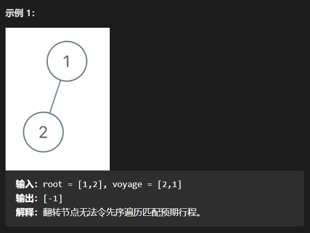
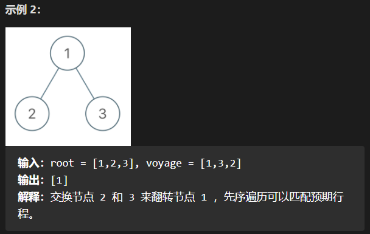

# 1.翻转二叉树以匹配先序遍历

题目：

给你一棵二叉树的根节点 root ，树中有 n 个节点，每个节点都有一个不同于其他节点且处于 1 到 n 之间的值。

另给你一个由 n 个值组成的行程序列 voyage ，表示 预期 的二叉树 先序遍历 结果。

通过交换节点的左右子树，可以 翻转 该二叉树中的任意节点。例，翻转节点 1 的效果如下：

请翻转 最少 的树中节点，使二叉树的 先序遍历 与预期的遍历行程 voyage 相匹配 。 

如果可以，则返回 翻转的 所有节点的值的列表。你可以按任何顺序返回答案。如果不能，则返回列表 [-1]。

举例：

思路：

> 当做先序遍历的时候，我们可能会翻转某一个节点，尝试使我们当前的遍历序列与给定的行程序列相匹配。如果我们希望先序遍历序列的下一个数字是 `voyage[i]` ，那么至多只有一种可行的遍历路径供我们选择，因为所有节点的值都不相同。