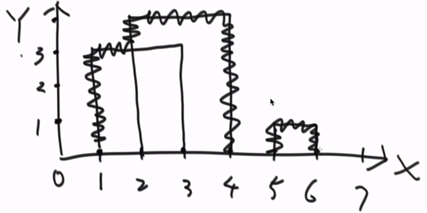

# 1.正视建筑物的轮廓

题目：

> 给定一个N行3列的二维数组，每一行表示有一座大楼，一共有N座大楼，所有大楼的底部都坐落在x轴上，每一行的三个值(a,b,c)代表每座大楼从(a,0)开始，到(b,0)点结束，高度为c,输入的数据可以保证a<b,且a,b,c均为正数，大楼之间可以有重合。请输出整体的轮廓线。

举例：

> 给定一个二维数组[[1,3,3],[2,4,4],[5,6,1]]
> 输出轮廓线为[[1,2,3],[2,4,4],[5,6,1]]

>  

 思路：

> step1：将给我们的二维数组进行转化，假设我们原来给我们的数组是[[1,3,3],[2,4,4],[5,6,1]],[1,3,3]将变为{1,3,上},{3,3,下}就说明在1位置有一个高度为3的上去了，在3位置有一个高度为3的下来了，[2,4,4]将变为{2,4,上}{4,4下},[5,6,1]将变为{5,1,上}.{6,1,下}
>
> step2：经过这样的转化之后，按照第一个维度进行排序，变成{1,3,上},{2,4,上}, {3,3,下},{4,4下},{5,1,上}.{6,1,下}
>
> step3：构建一个TreeMap，记录的记录中key是高度，value是这个高度出现的次数，当{1,3,上}出现的时候，TreeMap之中存储的是<3,1>,接着{2,4,上}出现的时候，TreeMap之中存储的是<4,1>,并且此时出现一条轮廓{1,2,3},之后{3,3,下}出现了，TreeMap之中的<3,1>记录被删除，因为出现的次数变为0，之后{4,4,下}出现了，TreeMap之中的<4,1>记录被删除，因为出现的次数变为0，并且此时出现一条轮廓{2,4,4}，之后{5,1,上}出现，TreeMap之中存储的是<5,1>,将<1,1>放入TreeMap之中，之后{6,1,下}出现，出现一条轮廓{5,6,1}结束。

总结:

> 如果存在更高高度的出现必然有轮廓线的出现。