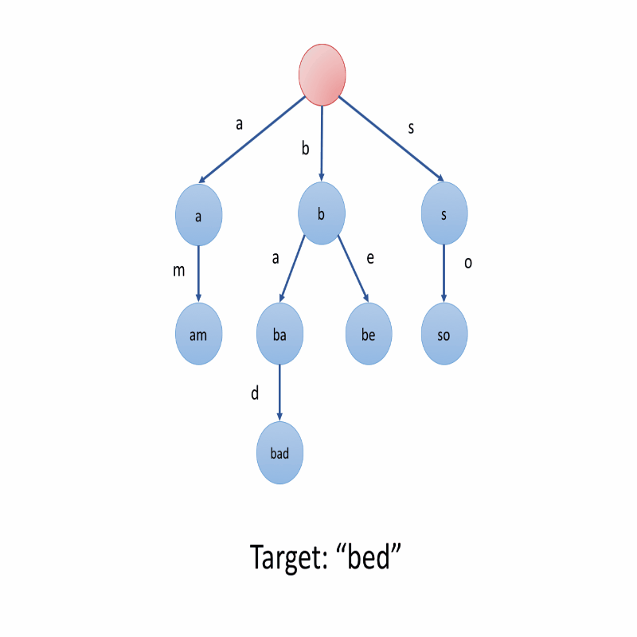

# 1.前缀树

定义：

> 前缀树是N叉树的一种特殊形式，通常来说，一个前缀树是用来存储字符串的，前缀树的每一个结点代表一个字符串(前缀)。每一个结点会存在多个子节点，通往不同子节点的路径上有着不同的字符，子节点代表的字符串是由结点本身的原始字符串，以及通往该子结点路径上所有的字符组成的。

图示：

> 

分析：

> 在上图示例之中，我们在结点种标记的值是该结点对应表示的字符串，例如：我们从根节点开始选择第二条路径b，然后选择它的第一个子节点a,接下来选择子节点d，我们最终会到达叶子结点bad,结点的值是由从根结点开始，与其经过的路径之中的字符按顺序形成的，值得注意的是，根节点表示空字符串。

为什么称之为前缀树：

> 前缀树的一个重要特性是，结点所有的后代都与该节点相关的字符串有着共同的前缀。

# 2.如何表示一个前缀树

## 2.1 使用数组表示

例如，如果我们只存储含有字母 a 到 z 的字符串，我们可以在每个节点中声明一个大小为 26 的数组来存储其子节点。对于特定字符 c ，我们可以使用 c - 'a' 作为索引来查找数组中相应的子节点。

```java
class TrieNode {
    // change this value to adapt to different cases
    public static final int N = 26;
    public TrieNode[] children = new TrieNode[N];
    
    // you might need some extra values according to different cases
};

/** Usage:
 *  Initialization: TrieNode root = new TrieNode();
 *  Return a specific child node with char c: root.children[c - 'a']
 */
```

访问子节点十分 快捷 。访问一个特定的子节点比较 容易 ，因为在大多数情况下，我们很容易将一个字符转换为索引。但并非所有的子节点都需要这样的操作，所以这可能会导致 空间的浪费 。

## 2.2 Map

第二种方法是使用 `Hashmap` 来存储子节点。

我们可以在每个节点中声明一个 Hashmap 。Hashmap 的键是字符，值是相对应的子节点。

```java
class TrieNode {
    public Map<Character, TrieNode> children = new HashMap<>();
    
    // you might need some extra values according to different cases
};

/** Usage:
 *  Initialization: TrieNode root = new TrieNode();
 *  Return a specific child node with char c: root.children.get(c)
 */

```

通过相应的字符来访问特定的子节点 更为容易 。但它可能比使用数组 稍慢一些 。但是，由于我们只存储我们需要的子节点，因此 节省了空间 。这个方法也更加 灵活 ，因为我们不受到固定长度和固定范围的限制。


# 3.前缀树的基本操作

## 3.1 前缀树的插入操作

当我们在二叉搜索树中插入目标值时，在每个节点中，我们都需要根据 节点值 和 目标值 之间的关系，来确定目标值需要去往哪个子节点。同样地，当我们向前缀树中插入一个目标值时，我们也需要根据插入的 目标值 来决定我们的路径。

更具体地说，如果我们在前缀树中插入一个字符串 S，我们要从根节点开始。 我们将根据 S[0]（S中的第一个字符），选择一个子节点或添加一个新的子节点。然后到达第二个节点，并根据 S[1] 做出选择。 再到第三个节点，以此类推。 最后，我们依次遍历 S 中的所有字符并到达末尾。 末端节点将是表示字符串 S 的节点。



利用伪代码对上述策略进行总结：

```java
1. Initialize: cur = root
2. for each char c in target string S:
3. 		if cur does not have a child c:
4.			cur.children[c] = new Trie node
5.		cur = cur.children[c]
6. cur is the node which represents the string S
```

通常情况情况下，你需要自己构建前缀树。构建前缀树实际上就是多次调用插入函数。但请记住在插入字符串之前要 `初始化根节点` 。


## 3.2 前缀树的搜索操作

搜索前缀

正如我们在前缀树的简介中提到的，所有结点的后代都与该结点向对应的字符串有着共同的前缀，因此，很容易搜索以特定前缀开头的任何单词。

同样地，我们可以根据给定的前缀沿着树形结构搜索下去。一旦我们找不到我们想要的子节点，搜索就以失败终止。否则，搜索成功。为了更具体地解释搜索的过程，我们提供了下列示例：

利用伪代码对上述策略进行总结：

```java
1. Initialize: cur = root
2. for each char c in target string S:
3. 		if cur does not have a child c:
4.			search fails
5.		cur = cur.children[c]
6. search successes
```

