# 1.划分型动态规划

定义：

给定长度为N的序列或者字符串，要求划分成为若干段。

段数可能不限，每一段需要满足一定的性质

解决方案：

类似于序列型动态规划，但是通常需要加上段数信息，

一般使用f [ i ] [ j ]记录前i个元素划分成为j段的性质，如最小代价。

## 1.1 解密字符串

题目：

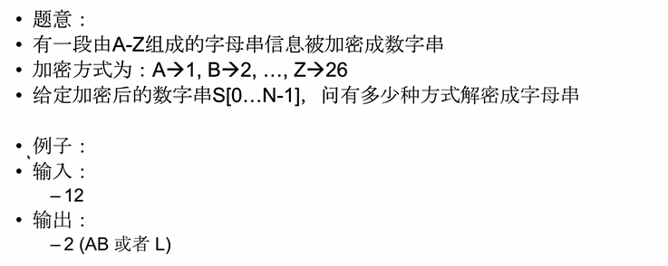

最后一步：

> 通过一个数得到最后一个字母，这个数可能是一位，可能是两位。

原问题和子问题：

> 原问题：我们想要知道长度为N的数字串有多少种解密方式。
>
> 子问题：我们想要知道长度为N-1的数字串有多少种解密方式，长度为N-2的数字串有多少种解密方式

转移方程：

> 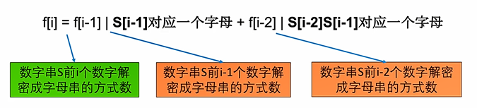

初始条件和边界情况：

> 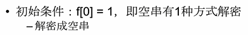

## 1.2 Perfect Squares

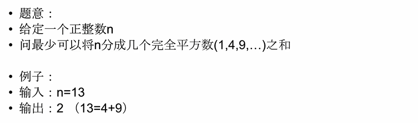

最后一步：

> 关注最优策略之中的最后一个完全平方数。
>
> 最优策略中的n-j^2也一定被划分成最少的完全平方数之和。

原问题与子问题：

> 原问题：我们原先想要知道n最少被划分成几个完全平方数之和。
>
> 子问题：需要知道n-j^2最少被划分成几个完全平方数之和。

状态：

> f [ i ] 表示i最少被划分为多少个完全平方数之和。

转移方程：

> 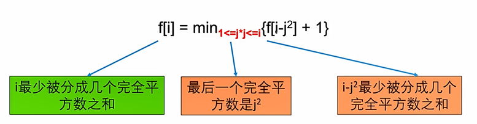

初始条件：

> 0只能被分成0个完全平方数之和。

计算顺序：

> 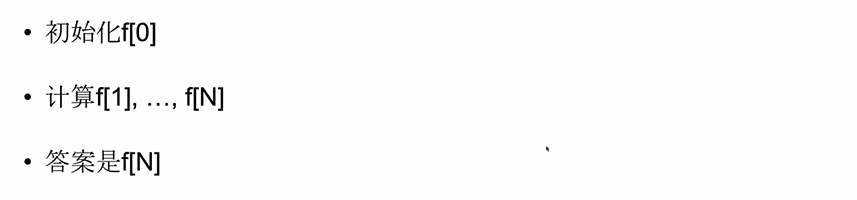

## 1.3 Palindrome Partitioning 2

题目：

> 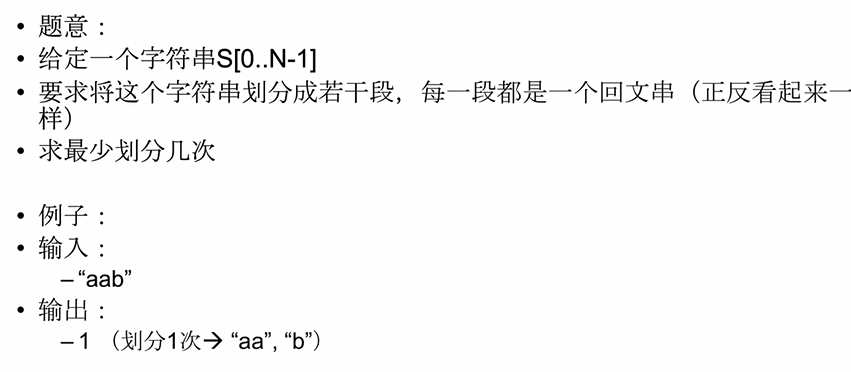

最后一步：

> 划分出最后一个回文串。

原问题与子问题：

> 原问题：最少将字符串划分多少次
>
> 子问题：若找到最后一个被划分出来回文串，则只要找前面最少划分几次。
>
> 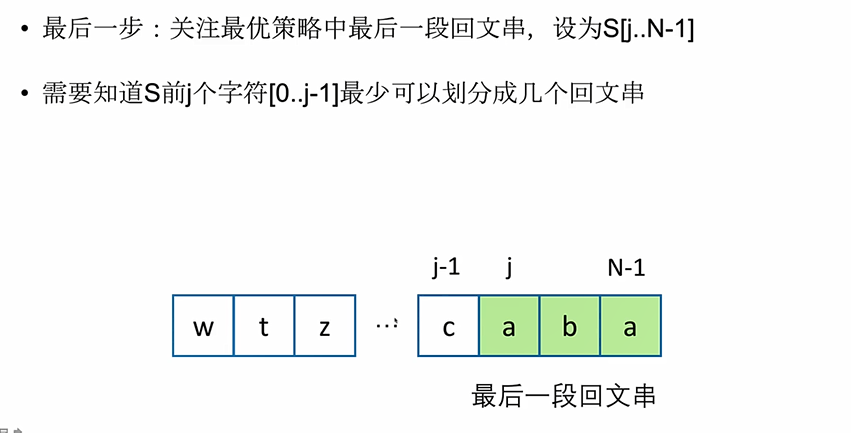

状态：

> f [ i ] 表示前i个字符最少可以划分成f[i]个回文串。

 转移方程：

> 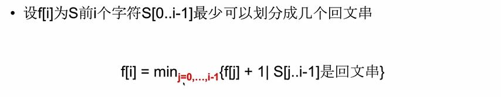

初始条件：

> 空串可以被划分成为0个回文串。

优化方式：

> 回文串的判断方式：
>
> > 使用双指针从两头向中间移动，每一步两个指针指向的字符必须相等。
> >
> > 一旦发现不相等就是回文串。
>
> 回文串分为两种
>
> > 长度为奇数
> >
> > 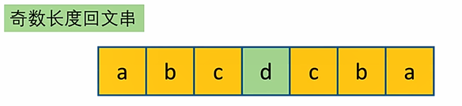
> >
> > 长度为偶数
> >
> > 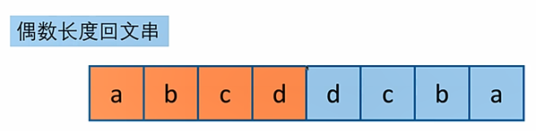
>
> 在字符串中找到所有回文串
>
> > 以字符串的每一个字符为中点，向两边进行扩展，找到所有的回文串
> >
> > 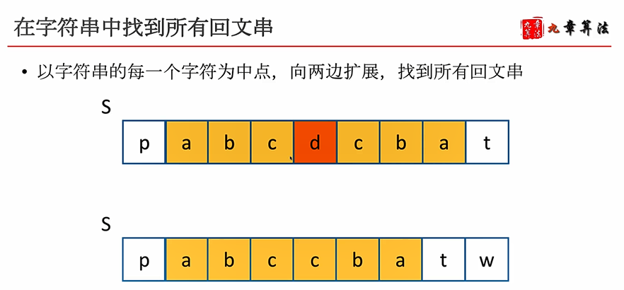
>
> 记录回文串：
>
> > 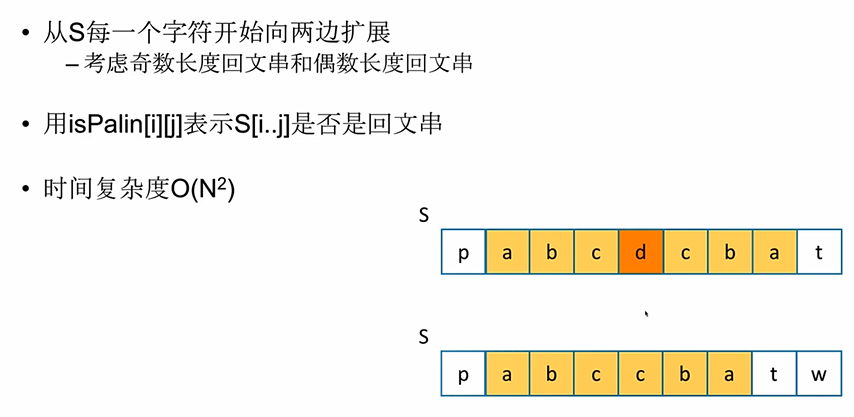
>
> 题目如何借助这个形成的字符串进行优化:
>
> > 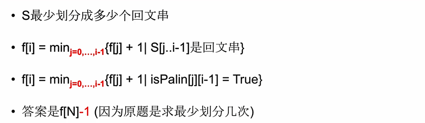

## 1.4 CopyBooks

题目：

> 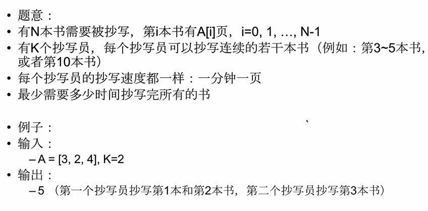

题目分析：

> 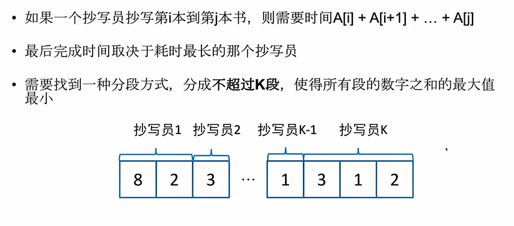

最后一步：

> 选择最后一个抄写员抄写最后的i本书.

原问题与子问题：

> 原问题：最少需要多少时间抄写完成所有的书。
>
> 子问题：前面的抄写员丙烯那个操作用了多少时间抄完前面的N-i本书,如果最后一个抄写员所耗费的时间不是最高的，那么 答案是抄完前N-1本书所用的时间，如果最后一个抄写员所耗费的时间是最高的，那么答案就是最后一个抄写员所耗费的时间。

状态：

> f [ k ] [ i ] 表示为k个抄写员最少需要多少时间抄完前i本书

状态转移方程：

> 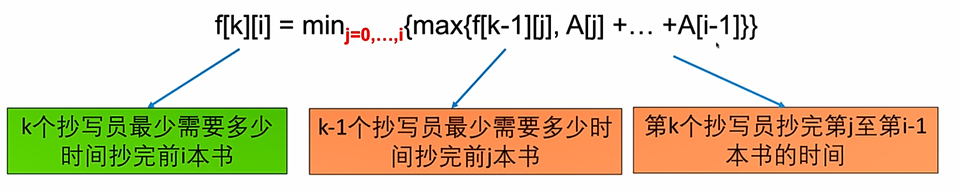

初始条件：

> 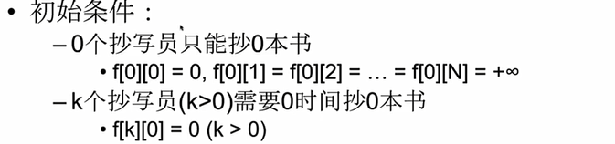

计算顺序：

> 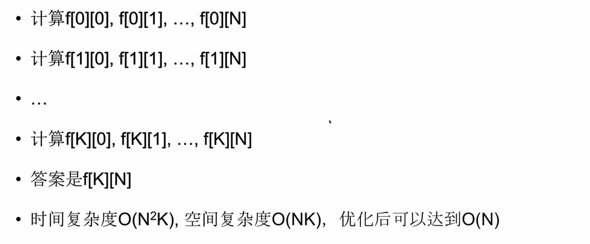