# 1.动态规划(Dynamic Programming)定义

动态规划是一种在数学，管理科学，计算机科学，经济学，生物信息学之中使用的，通过将原问题分解为相对简单的子问题的方式求解复杂问题的方法。

动态规划不是某一种具体的算法，而是一种算法思想：若要解决一个给定的问题，我们需要解决其不同部分(即子问题)，再根据子问题的解以得出原问题的解。

应用这种算法思想解决问题的可行性，对子问题和原问题的关系，以及子问题之间的关系这两方面有一些要求，它们分别对应了最优子结构和重复子问题。

# 2.最优子结构

最优子结构规定的是子问题和原问题的关系

动态规划要解决的都是一些问题的最优解，即从很多解决问题的方案中找到最优的一个，当我们在求一个问题最优解的时候，如果可以将这个问题分解成为多个子问题，然后递归的找到每个子问题的最优解，最终通过一定的数学方法对各个子问题的最优解进行组合得出最终的结果，总结来说就是一个问题的最优解是由它的各个子问题的最优解决定的。

将子问题的解进行组合可以得到原问题的解是动态规划可行性的关键，在解体中一般使用状态转移方程描述这种组合，例如原问题的解为f(n),f(n)也称之为状态，状态转移方程f(n) = f(n-1) + f(n-2)描述了一种原问题与子问题的组合关系

在原问题上有一些选择，不同选择可能对应不同的子问题或者不同的组合方式：
$$
f\left( n \right) \,\,=\,\,\begin{cases}
	f\left( n-1 \right) +f\left( n-2 \right)&		n=2k\\
	f\left( n-1 \right)&		n=2k+1\\
\end{cases}
$$
n = 2k 和 n = 2k + 1 对应了原问题n上不同的选择，分别对应了不同的子问题和组合方式。

找到了最优子结构，也就能推导出一个状态转移方程f(n)，通过这个状态转移方程，我们很快的写出问题的递归实现方法


# 3.重复子问题

重复子问题规定的是子问题与子问题的关系

当我们在递归地寻找每个子问题的最优解的时候，有可能会会重复的遇到一些更小的子问题，而且这些子问题会重叠的出现在子问题里，出现这样的情况，会有很多重复的计算，动态规划可以保证每个重叠的子问题仅仅被求解一次，当重复的问题很多的时候，动态规划可以减少很多重复的计算。

重复子问题不是保证解的正确性必须的，但是如果递归求解子问题的时候，没有出现重复子问题，则没有必要使用动态规划，直接普通的递归就可以了。

## 3.1 重复子问题的举例

例如：斐波那契问题的状态转移方程f(n) = f(n-1) + f(n-2),在求解f(5)时，需要先求解子问题f(4)和f(3)，得到结果后再组合成原问题f(5)的解，递归的求解f(4)的时候，又要先求解子问题f(3)和f(2)，这里的f(3)与求f(5)时的子问题重复了。


# 4.动态规划题目的特点

## 4.1 A类问题--途径数问题--计数问题

> 1.问存在多少种方式走到右下角
>
> 2.问有多少种方法选出k个数使得和为SUM

## 4.2 B类问题--求最大最小值

> 1.从左上角走到右下角路径的最大数字和。
>
> 2.最长上升子序列的长度

## 4.3 C类问题--求存在性问题--是否问题

> 1.取石子游戏
>
> 2.能否选出k个数使得和是SUM

# 5.动态规划的组成部分

## 举例：找零钱问题

总共存在2元，5元，7元

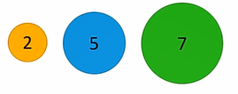

我们想要使用最少的硬币找出27元。

## 5.1 组成部分1--确定状态

状态是什么，简单的说，解动态规划的时候需要开一个数组，数组的f[i]或者f [ i ] [ j ] 代表什么

## 5.2 确定状态的两个意识

### 5.2.1 第一个意识

#### 最后一步：

##### 对应到CoinChange问题，其最后一步，就是加上我们的最后一枚硬币ak，因为这是

##### 最后一枚硬币，所以前面的硬币的币值加起来应该是27 - ak.

#### 关键点：

##### 关键点1：

> 我们并不关心前面的k-1枚硬币是如何拼凑出27-ak的(可能有一种拼凑方法，可能有100种拼凑方法)，
>
> 而且我们甚至不知道我们ak和k，但是我们确定前面的硬币拼凑出了27 - ak

##### 关键点2：

> 因为是最优策略，所以拼凑出27-ak的硬币数也一定要最少，否则这就不是最优策略了。


### 5.2.1 第二个意识

#### 原问题和子问题：

原问题：

> 我们需要使用最少使用多少枚硬币拼凑出27，即f(27)

子问题：

> 我们需要使用最少枚硬币拼凑出27 - ak
>
> 即为 f(27) = f(27-ak) + 1
>
> 因为27-ak相较于27规模更小所以称之为子问题。
>
> 所以我们的状态的定义就出来了f(X) = 最少用多少枚硬币拼凑出X

遍历ak的情况：

> ak的取值--可能为2，5，7
>
> > 如果ak是2的话，f(27) = f(27 - 2) + 1
> >
> > 如果ak是5的话，f(27) = f(27 - 5) + 1
> >
> > 如果ak是7的话，f(27) = f(27 - 7) + 1
>
> 除此之外没有别的可能,所以原问题被改写为如下形式：
>
> > 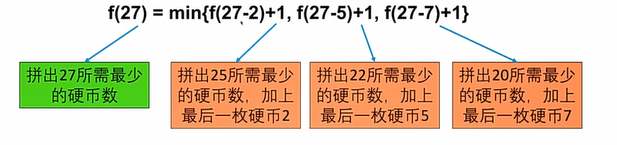

递归解决方案：

> ```java
> public static int func(int X){
>             /*
>             * input-> 即X形式参数:最少用多少枚硬币拼出X
>             * */
>             if(X == 0) return 0;//如果X == 0，只需要0枚硬币
>             int res = Integer.MAX_VALUE; // 假设结果是无穷多枚硬币
>             //最后一枚硬币是2块钱,判断条件的含义是，只有总钱数大于等于2最后一枚才可能是2
>             if(X >= 2){
>                 res = Math.min(func(X-2)+1,res);
>             }
>             //最后一枚硬币是5块钱，判断条件的含义是，只有总钱数大于等于5最后一枚才可能是5
>             if(X >= 5){
>                 res = Math.min(func(X-5)+1,res);
>             }
>             //最后一枚硬币是7块钱，判断条件的含义是，只有总钱数大于等于7最后一枚才可能是7
>             if(X >= 7){
>                 res = Math.min(func(X-7)+1,res);
>             }
>             return res;
> }
> ```

递归的问题：

> ```
> 									递归树：
>                                          f(27)
>                                     /      |      \
>                                  f(25)   f(22)    f(20)
>                                 /  |  \  / | \    / | \
>                                23 20 18 20 17 15 18 15 13
>                               …… …… …… …… …… …… …… …… …… ……
> 			   f(20)重复计算了三次 f(15)重复计算了两次……还有很多重复计算
> ```

如何解决递归代码出现的重复计算问题：

## 5.2 组成部分2--转移方程

```
                                          CoinChange问题的转移方程：
                                f(X) = min{f(X - 2) + 1,f(X - 5) + 1,f(X - 7) + 1}
```


## 5.3 组成部分3--初始条件和边界情况

### 初始条件：

用转移方程无法进行计算的，需要人工进行定义的，比如f(0) = 0，类似于特殊情况。我们无法用硬币凑出0块钱，但是

我们根本就不需要凑。

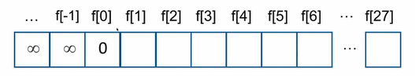

### 边界情况：

为了不让数组越界，越下界，越上界。

## 5.4 计算顺序

### 递归的重复计算问题的解决：当我们从小到大进行计算的时候，在计算更大的问题的时候，小问题都已经求解完毕了，就不涉及重复计算问题了。

### CoinChange问题的计算顺序：

```
                                    CoinChange问题的计算顺序：
                            
                            1. 初始条件f[0] = 0
                            
                            2. 然后计算f[1],f[2],f[3]……f[27]
                            
                            3. 因为要当我们计算到f[X]的时候，f[X-2],f[X-5],f[X-7]都已经算过了
                            
                            4. 计算过程：
                            f[负数] = +∞ //我们认为负数为总数的都是凑不出来的，设置为+∞
                            f[0] = 0
                            f[1] = +∞
                            f[2] = min{f[0]+1,f[-3]+1,f[-5]+1} = 1
                            ……以此类推即可。
```

### 图示过程：

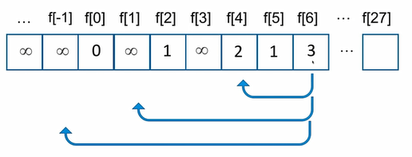

# 6.UniquePath -- 计数型动态规划问题

题目：

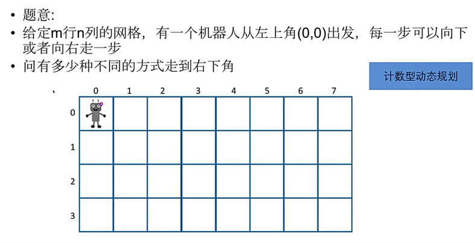

## 6.1 最后一步

无论机器人用何种方式走到右下角，它的最后一步总归是向右或者是向下；

设定右下角坐标为(m-1,n-1)，那么前一步机器人一定是在(m-2,n-1)或者(m-1,n-2)

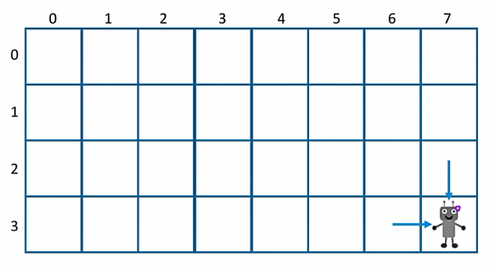

## 6.2 子问题

那么，如果机器人有X种方式从左上角走到(m-2,n-1),有y种方式从左上角走到(m-1,n-2),则机器人有X+Y种

方式走到(m-1,n-1)。

原问题：机器人有多少种方式从左上角走到(m-1,n-1)

通过最后一步转化为两个子问题的和：机器人有多少种方式走到(m-2,n-1)以及机器人有多少种方式走到(m-1,n-2)

状态随之出来：f[ i ] [ j ] 为机器人有多少种方式从坐上角走到(i,j)

## 

## 6.3 转移方程

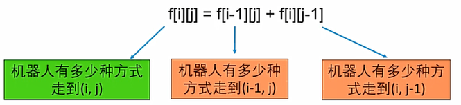


## 6.4 初始条件和边界情况

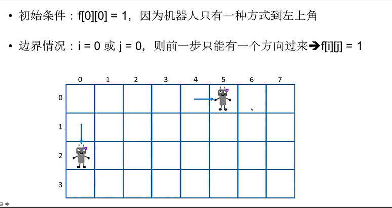

## 6.5 计算顺序--从上到下，从左到右

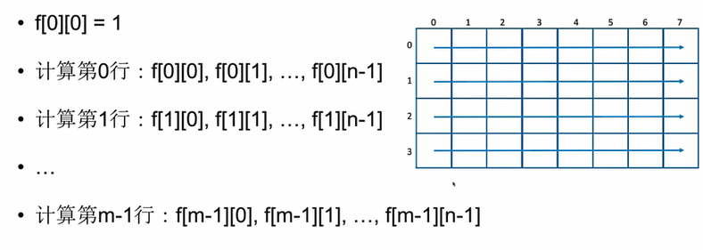


# 7. JumpGame -- 存在型动态规划问题

题目：

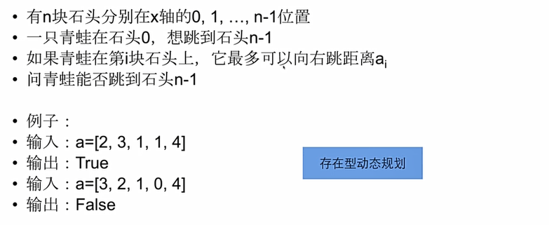

## 7.1 最后一步

1.如果青蛙能跳到最后一块石头n-1,我们考虑它跳的最后一步。

2.这一步是从石头i，跳过来的，i < n-1

3.这需要满足两个条件：

> 1.青蛙可以跳到石头i，然后才可以跳到石头n-1
>
> 2.最后一步不超过跳跃的最大举例n-1-i <= ai

## 7.2 子问题

原问题：我们原先想要直到青蛙能不能跳到石头n-1

现在经过最后一步的子问题：青蛙能不能跳到石头n-1

状态随之出来：设f[i] 表示青蛙能否跳到石头i


## 7.3 状态转移方程

$$
f\left[ j \right] \,\,=\,\,for_{\left[ 0<=i<j \right]}\left( f\left[ i \right] \,\,AND\,\,\left( i+a\left[ i \right] \right) \,\,>=\,\,j \right) 
$$


## 7.4 初始条件和边界情况

$$
f\left[ 0 \right] \,\,=\,\,true
\\
\text{因为青蛙一开始就在石头}0
$$

## 7.5 计算顺序

$$
f\left[ 1 \right] ,f\left[ 2 \right] ,……f\left[ n-1 \right] 
$$


# 8.Maximum Product Subarray -- 最值类型

题目：

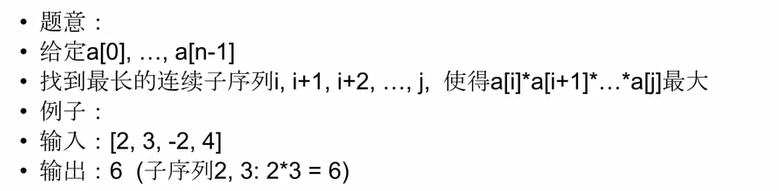

## 8.1 最后一步

对于最优的策略(乘积最大),一定有最后一个元素a[j]

第一种情况：最优策略的序列就是{a[j]},答案是a[j]

第二种情况：连续子序列长度大于1，那么最优策略中a[j]前一个元素肯定是a[j-1]

如果a[j]是正数，我们希望以a[j-1]结尾的连续子序列乘积最大。

如果a[j]是负数，我们希望以a[j-1]结尾的连续子序列乘积最小。

这里我们就涉及到需要同时保留两个极值的问题--一个是以a[j-1]结尾乘积最小，一个是以a[j-1]结尾乘积最大。

## 8.2 子问题

原问题：以a[j]结尾的连续子序列的最大乘积

子问题：以a[j-1]结尾的最大乘积连续子序列，以a[j-1]结尾的最小乘积连续子序列

## 8.3 转移方程

### 8.3.1 计算连续子序列的最小乘积

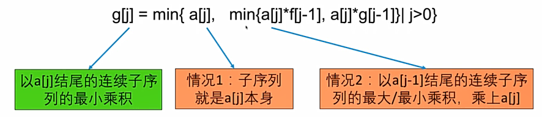

### 8.3.2 计算连续子序列的最大乘积

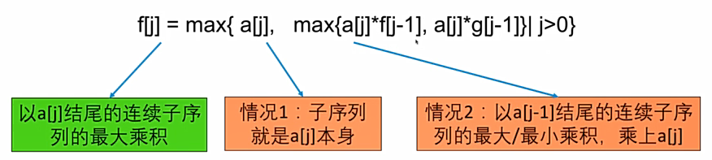

## 8.4 初始条件

f[0] = g[0] = a[0]

## 8.5 计算顺序

$$
\text{交错计算}
\\
f\left[ 0 \right] ,g\left[ 0 \right] ,f\left[ 1 \right] ,g\left[ 1 \right] ,……f\left[ n-1 \right] ,g\left[ n-1 \right] 
\\
\text{答案是}\left\{ \max \left\{ f\left[ 0 \right] ,f\left[ 1 \right] ,……f\left[ n-1 \right] \right\} \right\} 
$$

