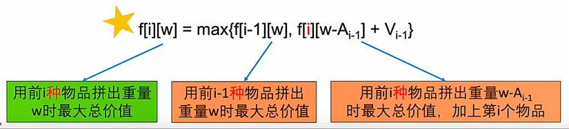

# 1.背包问题

定义：根据不同的目标，拥有不同的变种。

# 2.背包问题的分类

## 2.1 01 背包问题

01 背包的问题描述：

## 2.2 完全背包问题

## 2.3 多重背包问题

# 3. BackPack

题目：

如何下手：

背包问题公理：背包问题中，数组大小和总承重有关。

最后一步：

> 我们需要知道N个物品是否能够拼凑出重量W(W=0,1,……,M)
>
> 最后一步：最后来了一个物品An-1进不进入背包。
>
> 情况1：最后一个物品不进入背包，前N-1个物品就已经能拼凑出w
>
> 情况2：最后一个物品进入背包，前N-1个物品拼凑出w-AN-1

原问题和子问题：

> 原问题：要求N个物品能不能拼凑出重量0，1，……M
>
> 子问题：需要知道前N-1个物品能不能拼凑出重量0，1，……M

状态：

> 设f [ i ] [ w ]  = 能否用前i个物品拼凑出重量w

 转移方程：

> 

初始条件：

> 

举例子：

> 1.首先0个物品只能拼凑出物品0
>
> 2.然后又来了一个物品重量为2，能够拼凑出2,因为使用前i-1个物品能够拼凑出0，加上本身拼凑出2
>
> 3.然后又来了一个物品重量为3，能够拼凑出3 5.
>
> ……以此类推。
>
> 

计算顺序：

> 

# 4.Backpack V

题目：

> 

分析：

> 

最后一步：

> 第N个物品(重量A(N-1))是否进入背包
>
> 情况1：用前N-1个物品就能够拼凑出W，第N个物品不进入背包
>
> 情况2：用前N-1个物品能拼凑出W-A(N-1),再加上最后的物品A(N-1),拼凑出W
>
> 情况1的个数+情况2的个数 == 用前N个物品拼凑出W的方式。

原问题与子问题：

> 原问题：要求前N个物品有多少种方式拼凑出重量0，1，……Target
>
> 子问题：需要知道前N-1个物品有多少种方式拼凑出重量0，1，……Target
>
> 状态：设置f [ i ] [ w ]  = 用前i个物品有多少种方式拼凑出重量W

转移方程：

> 将之前的or变成加法
>
> 

初始条件：

> 

计算顺序：

> 

# 5. BackPack VI

题目：

两个关键点：

> 1.关键点1：任何一个正确的组合之中，所有物品的总重量是Target
>
> 2.关键点2：如果最后一个物品重量是K，则前面的物品重量是Target-K

最后一步：

> 最后凑成Target的最后一个数,这里的最后一步不能是最后一个物体进不进去了，
>
> 这已经没有物体这个概念了。

原问题与子问题：

> 原问题：要求有多少种组合能拼凑出Target
>
> 子问题：如果最后一个物品重量是A0，则要求多少种组合能拼成Target-A0
>
> ​		 	 如果最后一个物品重量是A1，则要求多少种组合能拼成Target-A1
>
> ​			  ……以此类推。

状态：

> f[ i ] = 有多少种组合能拼凑出重量i

转移方程：

> 

# 6. Backpack 2 -- 01背包问题

题目：

> 

如何下手：

> 需要知道N个物品
>
> > 1.是否能拼凑出重量W。
> >
> > 2.对于每个重量W，最大总价值是多少。
>
> 

最后一步：

> 最后一个物体是否进入背包。
>
> 两种情况：
>
> > 
> >
> > 我们对两种选择进行pk，选出最大值就是结果

例子：

> 

原问题和子问题：

> 原问题：要求前N个物品能否拼凑出重量0，1，……M，以及拼凑出重量W能获得的最大价值。
>
> 子问题：需要知道前N-1个物品能不能拼凑出重量0，1，……M，以及拼凑出重量W能获得的最大价值

状态：

> 设f [ i ] [ w ] = 用前i个物品拼凑出重量w时的最大总价值(-1表示不能拼凑出)

状态转移方程：

> $$
> f\left[ i \right] \left[ w \right] \,\,=\,\,\max \left\{ f\left[ i-1 \right] \left[ w \right] ,f\left[ i-1 \right] \left[ w-A_{i-1} \right] \,\,+\,\,V_{i-1}\,\,| \left( w\geqslant A_{i-1}\,\,\&\& f\left[ i-1 \right] \left[ w-A_{i-1} \right] \,\,!=-1 \right) \right\}
> $$
>
>    用前i个物品拼凑出w时的最大总价值 = 情况1和情况2的最大值，其中情况2需要满足两个边界条件。

计算顺序：

> 

# 7.BackPack 3 -- 完全背包问题

题目：

> 

最后一步：

> 最后一个物体进入或者不进入背包。

状态：

> 设 f [ i ] [ w ] = 用前i种物品拼凑出重量w时的最大总价值(-1表示不能拼凑出w)

 转移方程：

> > 浓缩式子
>
> > 
>
> > 展开式子
>
> > 
> >
> > 优化式子：
> >
> > 

# 8.区间型动态规划

定义：

> 给定一个序列/字符串，进行一些操作。
>
> 最后一步会将字符串去头去尾
>
> 剩下的回使一个区间[i,j]
>
> 状态自然定义为f [ i ] [ j ] 表示面对子序列[i……j]时的最优的性质。

## 8.1 Longest  Palindromic Subsequence

题目：

> 注意：注意回文子序列不需要连续。
>
> 

最优策略：

> 最优策略产生最长的回问子串T，长度为M

最后一步：

> 情况1：回文串长度是1即1个字母
>
> 情况2：回文串长度大于1，那么必定存在T[0] = T[M-1]

原问题与子问题：

> 原问题：求S[i……j]的最长回问子串
>
> 子问题：如果S[i] == S[j],需要知道S[i+1,j-1]的最长回文子串
>
> ​              否则，答案是S[i+1,j]的最长回文子串，或者S[i,j-1]的最长回文子串。

状态：

> 设f [ i ] [ j ] 为 S [i……j]的最长回文字符串长度。

状态转移方程：

> 去头，去尾，去头并去尾
>
> 

初始条件：

> 

计算顺序：

> 长度大的依赖于长度小的提供的信息。
>
> 

## 8.2 Scramble String

题目：

确定状态：

> 1.显然，T如果长度和S不一样，那么肯定不能由S变换而来。
>
> 2.如果T是S变换而来的，并且我们知道S最上层二分被分成S = S1S2，那么一定有：
>
> > 情况1：T也是由两部分组成，T = T1T2,T1由S1变换而来，T2由S2变换而来
> >
> > 情况2--[因为某些结点可以交换左右孩子]：T也是由两部分组成，T1是S2变换而来的，
> >
> > T2是S1变换而来的。

原问题和子问题：

> 

状态的优化：

> 每个串都可以用(起始位置，长度)表示
>
> > 
>
> 状态可以省略长度这一维度：
>
> > 

状态转移方程：

> 
>
> > 转移方程的第一个OR：没有交换顺序
> >
> > 转移方程的第二个OR：交换了顺序

初始条件：

> 

计算顺序：

> 

完整代码：

> 
>
> 

## 8.3 Burst Balloons

题目：

> 注意：此处需要想象最左侧和最右侧分别有一个不能被扎破的气球值都为1
>
> 

思路：

> 假设蓝色是最后一个被扎破的气球。则1，2号气球与4号气球所赚取的金币是独立的
>
> 
>
> 所以我们可以先算，扎破1-(i-1)号气球最多获得的金币数量，再算i+1-N号气球获得的金币数量。

最后一步：

> 一定有最后一个气球被扎破，编号是i
>
> 扎破的时候，获得的金币是1 * ai * 1 =  ai

原问题与子问题：

> 原问题：要求扎破1-N号气球最多获得的金币数量。
>
> 子问题：要求扎破1-i-1号气球最多获得的金币数量和扎破i+1-N号气球最多获得的金币数量。

状态：

> 

转移方程：

> 

初始条件：

> 

计算顺序：

> 

完整代码：

> 
>
> 

