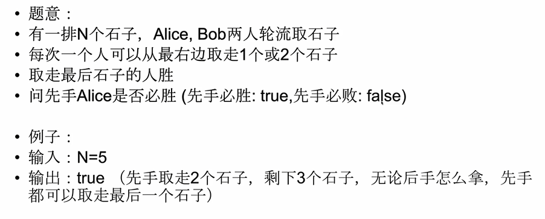
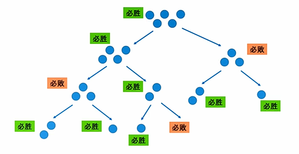
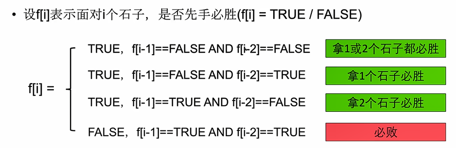
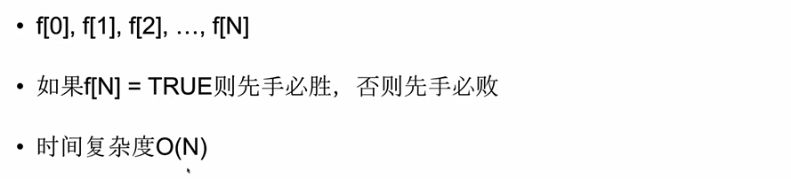

# 1.博弈型动态规划

定义：

> 过程：
>
> > 一方先下棋，在一定规则下依次出招，如果满足一定条件，则一方胜利。
>
> 目标：
>
> > 能够在博弈当中取胜。
>
> 先手：
>
> > 先出招的一方，出招后，先手换人，新的先手面对一个新的局面

## 1.1 Coins in A line

题目：

> 

博弈动态规划通常从第一步开始分析，而不是最后一步开始分析：

> 原因：因为局面越来越简单，石子数越来越少。
>
> 分析：面对N个石子，先手Alice第一步可以拿到1个或者两个石子，这样
>
> 后手Bob就面对N-1个石子或者N-2个石子，先手Alice一定会选择能让自己
>
> 赢得那一步。

必胜和必败的概念：

> 1.如果取走一个或者两个石子，能让剩下的局面先手必败，则当前先手必胜
>
> 2.如果不管怎么走，剩下的局面都是先手必胜，则当前先手必败。
>
> 
>
> 宗旨：若我们先手的情况下想要必胜，则要走出一步，让对手无路可逃。若我们无法达到这一点则必败。

原问题和子问题：

> 原问题：要求面对N个石子，是否先手必胜
>
> 子问题：需要知道面对N-1个石子和N-2个石子，是否先手必胜。

状态：

> 设f [ i ] 表示面对N个石子，是否先手必胜。

转移方程：

> 我们只要走出一步，将对手置于False状态即可。

> 

计算顺序：

> 

