# 1.双序列型动态规划

定义：

> 1.有两个序列/字符串，需要进行一些操作
>
> 2.每个序列本身是一维的。
>
> 3.可以转化为二维动态规划

## 1.2 LCS Longest Common Subsequence

题目：

> 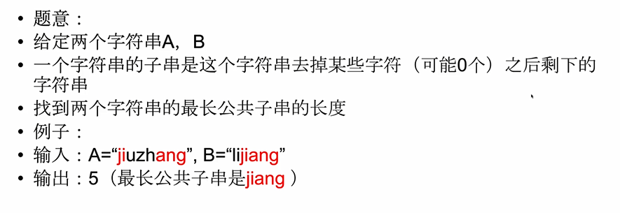

题目分析：

> 虽然绝对位置可以不同，但是相对位置一定是要相同的。
>
> 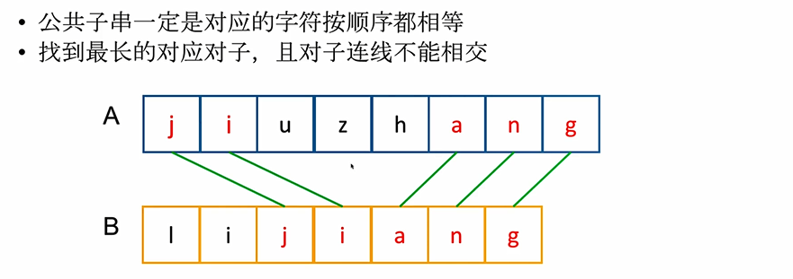

最后一步：

> 设A长度是m,B长度是n
>
> 现在我们考虑最优策略产生出的最长公共子串(虽然还不知道是什么)
>
> 但是最后一步：我们观察A[m-1]和B[n-1]这两个字符是否作为一个对子在最优策略之中。
>
> 分情况讨论：
>
> > 1.情况1：对子之中没有A[m-1]，
> >
> > 那么A和B的最长公共子串就是A前m-1个字符和B前n个字符的最长公共子串
> >
> > 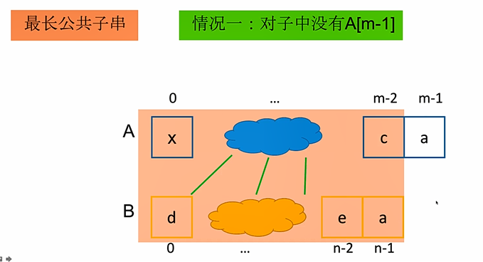
> >
> > 2.情况2：对子之中没有B[n-1]
> >
> > 那么A和B的最长公共子串就是A前m个字符和B前n-1个字符的最长公共子串
> >
> > 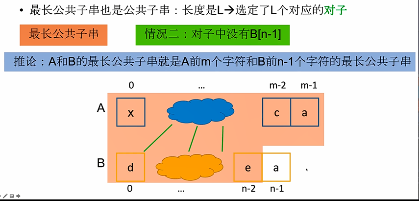
> >
> > 3.情况3：对子之中有A[m-1]和B[n-1]
> >
> > 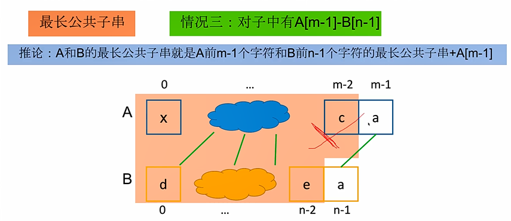

原问题和子问题：

> 原问题：要求A[0……(m-1)]和B[0……(n-1)]的最长公共子串。
>
> 子问题：要求A[0……(m-1)] 和 B[0……n-2]的最长公共子串，A[0……(m-2)] 和 B[0……(n-1)]的最长公共子串和A[0……m-2]和B[0……n-2]的最长公共子串。

状态：

> 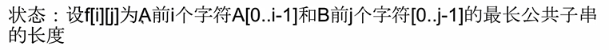

转移方程：

> 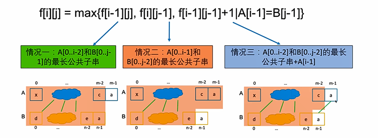

初始条件：

> 

计算顺序：

> 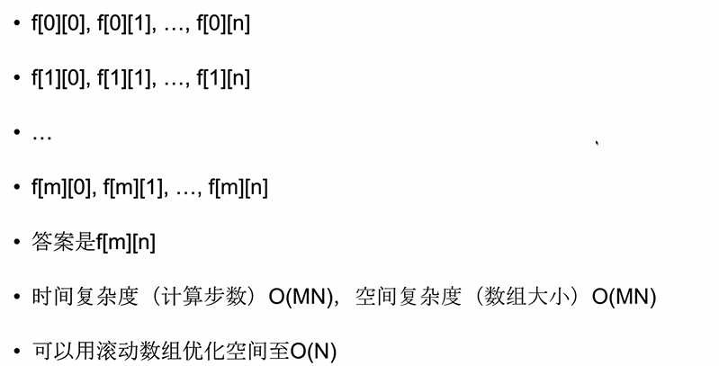

## 1.2 Interleaving String

题目：

> 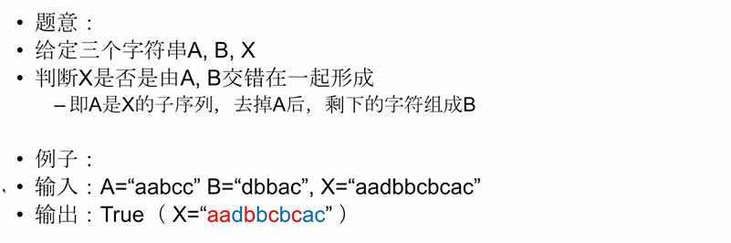

题目分析：

> 1.首先，如果X的长度不等于A的长度+B的长度，直接输出False

最后一步：

> 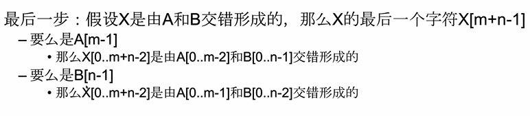

原问题和子问题：

> 原问题：要求X[0……m+n-1]是否由A[0,……m-1]和B[0,……n-1]交错形成
>
> 子问题：需要知道X[0……m+n-2]是否由A[0……m-2]和B[0……n-1]交错形成，以及X[0……m+n-2]是否由A[0……m-1]和B[0,……n-2]交错形成。

状态：

> 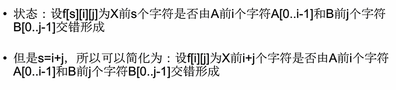

状态转移方程：

> 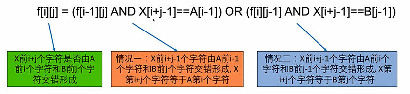

初始条件和边界情况：

> 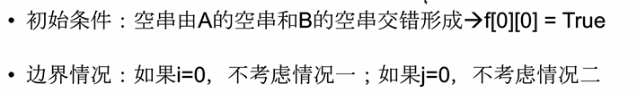

## 1.3 Edit Distance

题目：

最后一步：

> 设A的长度m，B的长度是n
>
> 全部操作完成后A的长度也是n，并且A[n-1] = B[n-1]
>
> 于是最优策略最终都是让A的最后一个字符变成B的最后一个字符。

分情况：

> 既然知道了最后一步，那么最后一步可以怎样到达呢？
>
> 情况1：A在最后插入B[n-1]
>
> 情况2：A最后一个字符替换成为B[n-1]
>
> 情况3：A删掉最后一个字符
>
> 情况4：A和B最后一个字符相等。

原问题和子问题：

> 原问题：是求A[0……m-1]和B[0……n-1]的最小编辑距离
>
> 子问题：设f [ i ] [ j ] 为A前i个字符[0……i-1]到B前j个字符B[0……j-1]的最小编辑距离

状态转移方程：

> 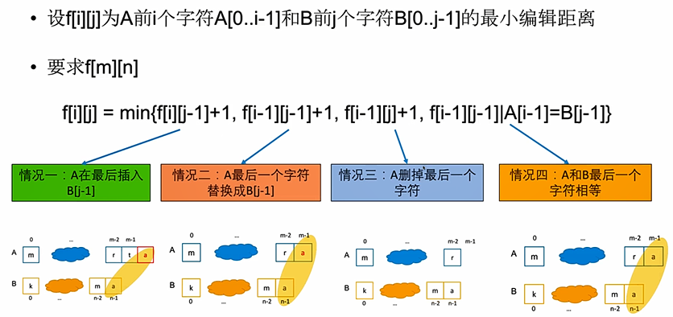

初始条件：

> 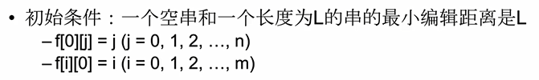

计算顺序：

> 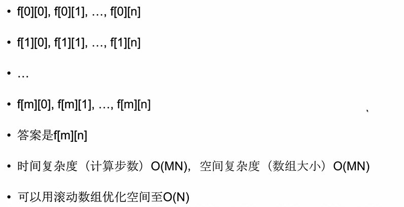

## 1.4 Distinct Subsequences

题目：

> 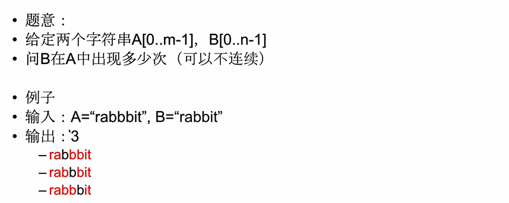

分析：

> 使用最长公共子串的对子思路，但是不同的地方是，B的每个字符必须都被用到。

情况2：

> 情况1：B[n-1] = A[m-1]，结成对子
>
> 对应的子问题：
>
> > 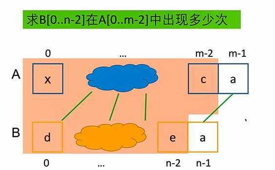
>
> 情况2：B[n-1] 不和 A[m-1]结成对子。
>
> 对应的子问题：
>
> > 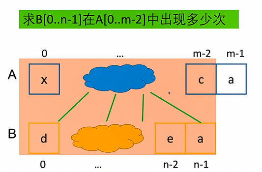

原问题子问题和状态：

> 

转移方程：

> 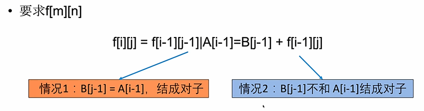

初始条件：

> 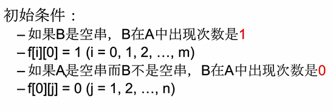

计算顺序：

> 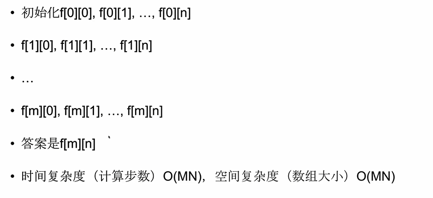

## 1.5 RegularExpressionMatching

题目：

> 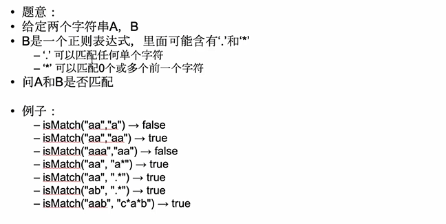

最后一步：

> 关注最后的字符，主要取决于正则表达式B之中最后的字符B[n-1]是什么。
>
> 情况1：
>
> >  如果B[n-1]是一个正常字符(既不是' . ' 也不是 ' * '),则如果A[m-1] = B[n-1]，能否匹配取决于
> >
> > A[0,……m-2]和B[0,……n-2]是否匹配，否则不能匹配
>
> 情况2：
>
> > 如果B[n-1]是一个 ‘ . ’ ，则A[m-1]一定是和 ' . ' 匹配，之后能否匹配取决于A[0……m-2]和B[0……n-2]是否能匹配
>
> 情况3：
>
> >    如果B[n-1]是一个 ' * '， 它代表B[n-2] = c可以重复0次或者多次，他们是一个整体c*,需要考虑A[m-1]是 
> >
> >    0 个 c，还是多个c中的最后一个。此时又是两种情况：
> >
> > > A[m-1]是0个C，能否匹配取决于A[0……m-1]和B[0……n-3]是否匹配
> > >
> > > A[m-1]是多个C中的最后一个，能否匹配取决于A[0……m-2] 和 B[0……n-1]是否匹配
> > >
> > > 这种情况必须A[m-1] = c 或者 c=' . '

原问题和子问题：

> 原问题：要求A前m个字符和B前n个字符能否匹配
>
> 子问题：需要知道A前m个字符和B前n-1个字符，A前m-1个字符和B前n个字符以及A前m个字符和B前n-2个字符能否匹配。

状态：

> 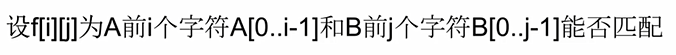

状态转移方程：

> 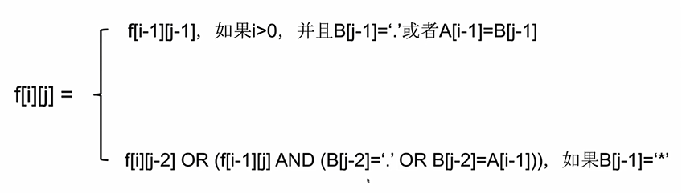

初始条件和边界情况：

> 注意：不能直接将f [0] [ j ]初始化为False,因为有可能出现A是空串，B是a* b* c*这样也能完成最终的匹配。 
>
> 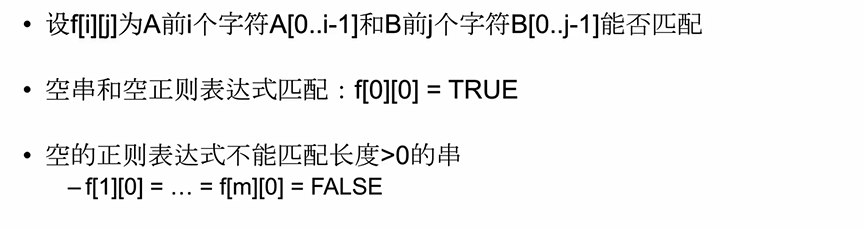

计算顺序：

> 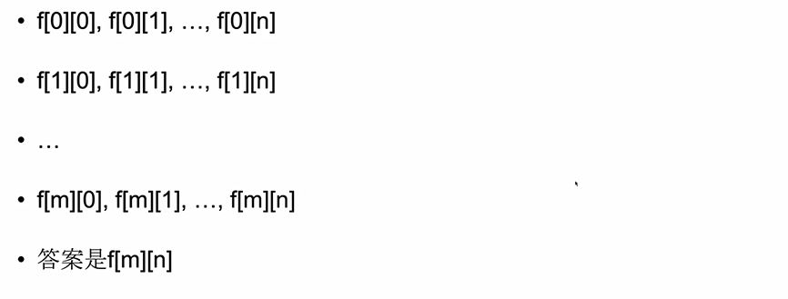

## 1.6 WildCard Matching

注意：

> 本题与RegularExpressionMatching的区别在于对' * '的定义，这里的星号
>
> 与前面的一个字符无关。

题目：

> 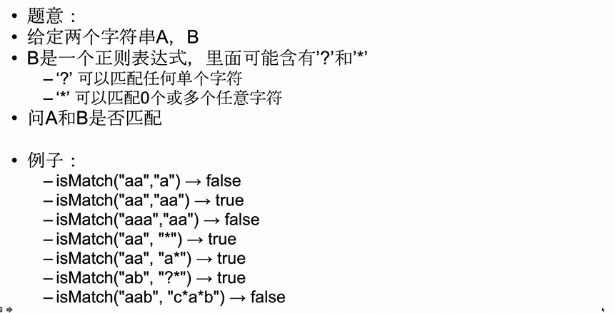

最后一步：

> 情况1：
>
> 如果B[n-1]是一个正常字符(既不是*也不是?),则如果A[m-1] = B[n-1]，能否匹配
>
> 取决于A[0……m-2] 和 B [0 …… n-2]是否匹配，否则不能匹配
>
> 情况2：
>
> 如果B[n-1]是‘?’,则A[m-1]一定是和'?'匹配，之后能否匹配取决于A[0……m-2]和B[0……n-2]是否匹配
>
> 情况3：
>
> 如果B[n-1]是*。它可以匹配0个或者任意多个任意字符，需要考虑A[m-1]有没有被这个 * 匹配，
>
> > 情况1：若A[m-1]不被' * ' 匹配，能否匹配取决于A[0……m-1] 和 B [0……m-2]是否匹配
> >
> > 情况2：若A[m-1]被‘ * ’ 匹配，能否匹配取决于A[0,……m-2] 和 B[0,……n-1]是否匹配。

原问题和子问题和状态：

> 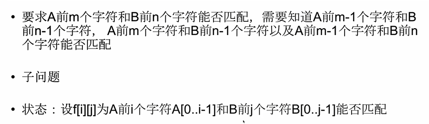

状态转移方程：

> 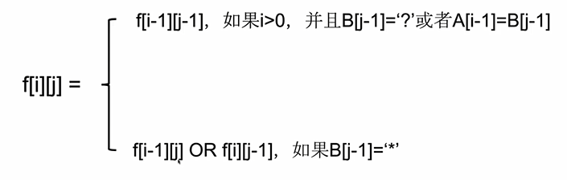

初始条件和边界情况：

> 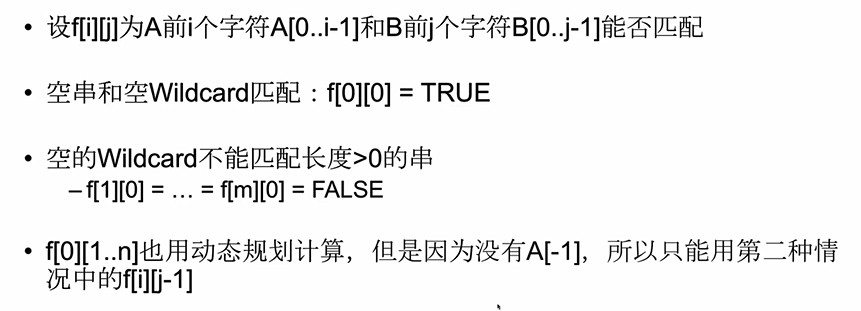

计算顺序：

> 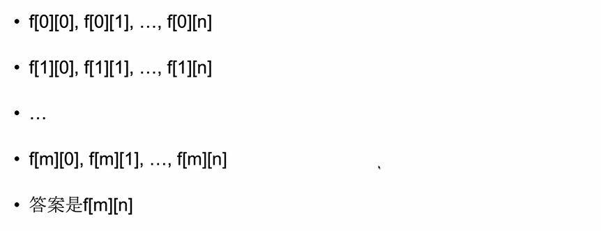

