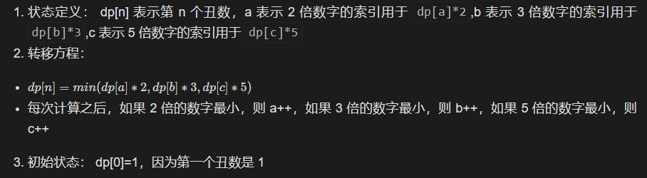

# 1.解决方案

标签：动态规划

整体思路：

> 除了第一个丑数外，所有的丑数都是某一个丑数的 2、3 或 5 倍的数字
> 因为要从小到大求第 n 个丑数，所以需要按照顺序每次获取下一个最小的丑数，最终获得第 n 个

复杂度：

>
> 
> 时间复杂度：O(n)。只需要 n 次遍历即可求得第 n 个丑数
> 空间复杂度：O(n)。需要保存动态规划的整体状态数组

算法流程：

> 

