# 1.坐标型动态规划

定义：

> 1.最简单的动态规划类型
>
> 2.给定了一个序列或者网格
>
> 3.数组下表[ i ] [ j ]即为坐标(i, j)
>
> 4.需要找到序列之中某个/些子序列或者网格之中的某条路径使得：
>
> > 4.1 某种性质最大/最小
> >
> > 4.2 计数
> >
> > 4.3 存在性。

特点：

> 动态规划方程f[i]中的下表i表示以ai为结尾的满足条件的子序列的性质，f[ i ] [ j ] 之中的下标
>
> i,j 表示以格子(i,j) 为结尾的满足条件的路径的性质。


## 1.1 UniquePath2

题目：

> 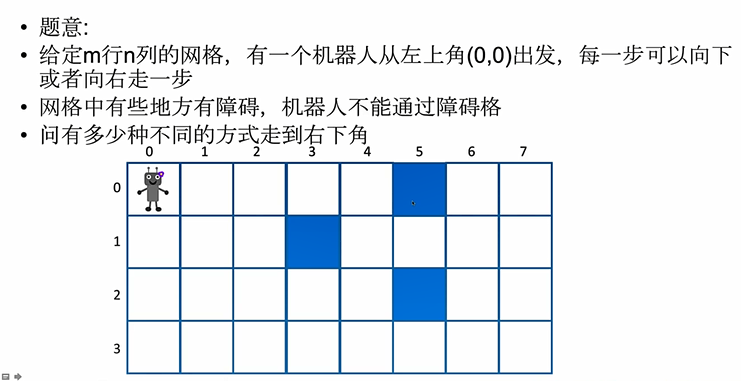

与动态规划入门时UniquePath题目的状态转移方程一致：

> 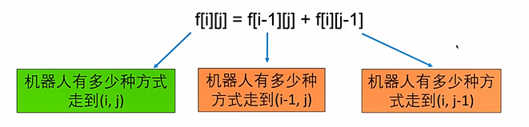

初始条件和边界情况

> 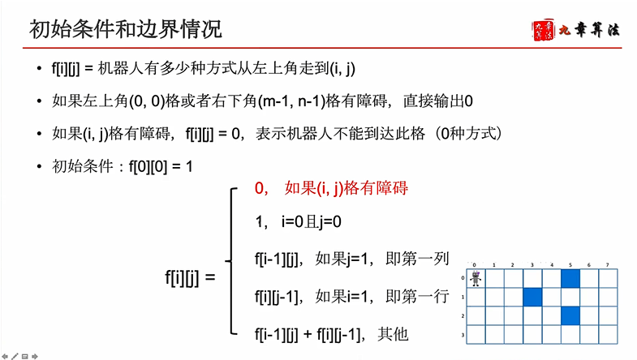

## 1.2 LongestIncreasingContinuousSubsequence

题目：

注意：本类之中求解的是最长单调子序列，无论是单调增还是单调减，
所以进行了一次reverse之后调用了同样的函数，希望不要造成误解。

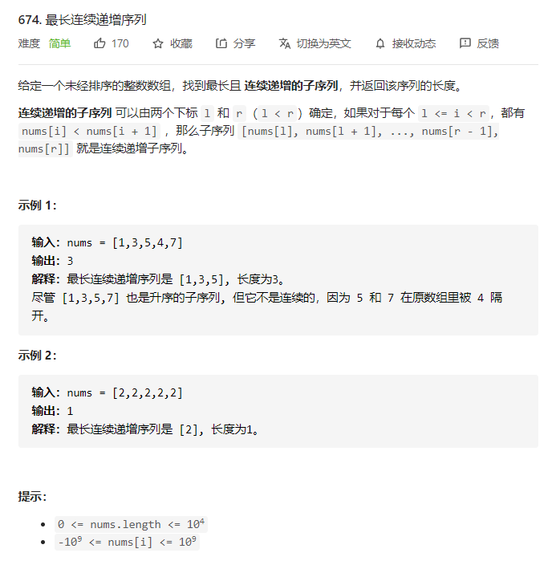

最后一步：

> 不管怎么样，我们的最长子序列一定存在最后一个元素a[j]

两种情况：

> 第一种情况：
>
> 最优策略中最长连续上升子序列就是{a[j]},要么只有一个元素，要么全部都是不相同的
>
> 第二种情况：
>
> 子序列长度大于1，那么最优策略中最长子序列的最后一个元素a[j]前一个元素肯定是a[j-1]。因为是最优策略，那么它选中的以a[j-1]结尾的连续上升子序列一定是最长的。

状态的选择：

> f [ i ] 代表以索引为i元素结尾的最长子序列的长度

原问题与子问题：

> 原问题：以索引i元素结尾的最长子序列的长度
>
> 子问题：以索引i-1元素结尾的最长子序列长度

转移方程：

> ```
> // 要满足递增，即索引i-1位置元素小于i位置元素
> // 并且存在两种情况，要么序列长度为1，要么序列长度大于1。
> f[j] = max{1, f[j-1]+1|j>0 and a[j-1] < a[j]}
> ```

初始条件：

> 无初始条件。

计算顺序：

> 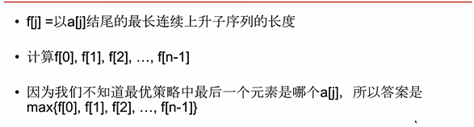


## 1.3 Minimum Path Sum

题目：

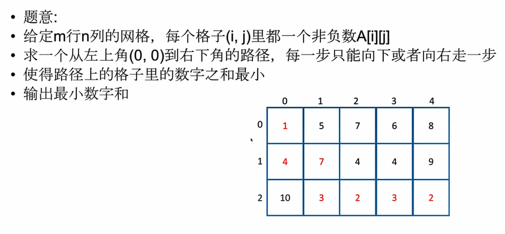

最后一步：

> 与UniquePath一致，无论使用何种方式到达右下角，总归要走最后一步，向右或者向下。

两种情况：

> 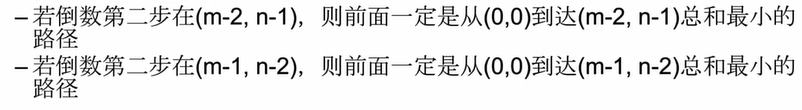

原问题和子问题：

> 原问题：要求从左上角走到(m--1,n-1)的路径的最小数字综合
>
> 子问题：要求从左上角走到(m-2,n-1)的最小路径，以及从左上角走到(m-1,n-2)的最小路径

转移方程：

> 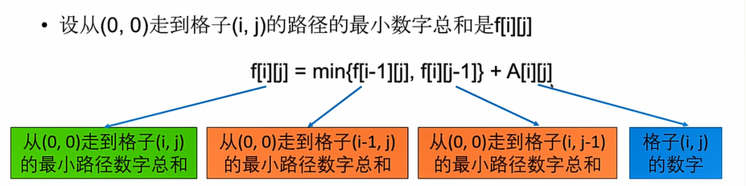

初始条件：

> f [ 0 ] [ 0 ] = A [ 0 ] [ 0 ]

计算顺序：

> 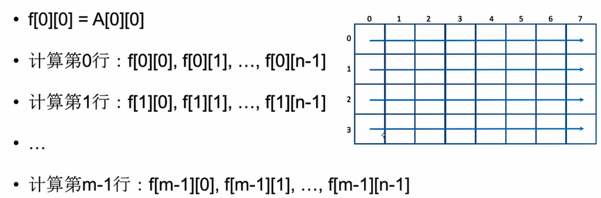


## 1.4 使用滚动数组进行空间优化

原理：

> 由于状态转移方程
>
> 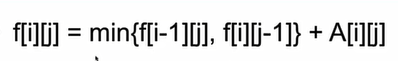
>
> 当我们计算第i行的时候，只需要第i行和第i-1行的 f 数组。
>
> 比如我们在计算第二行的时候，只需要第一行和第二行，那么第0行的值我们是不需要的。

优化结果：

> 我们仅仅需要保存两行f值，就可以完成我们的计算了。

过程：

> 理论操作：
>
> 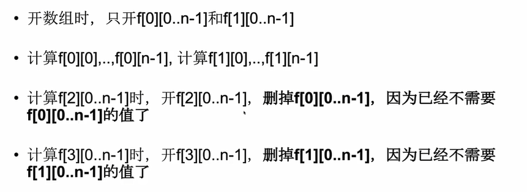

> 实际操作：
>
> 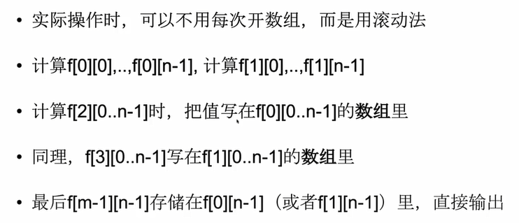

注意：

> 如果网格行数少列数多(大胖子网格)，那么就可以逐列进行计算，滚动数组的长度为行数。空间复杂度为O(M)
>
> 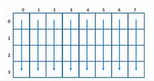

## 1.5 BombEnemy

题目：

> 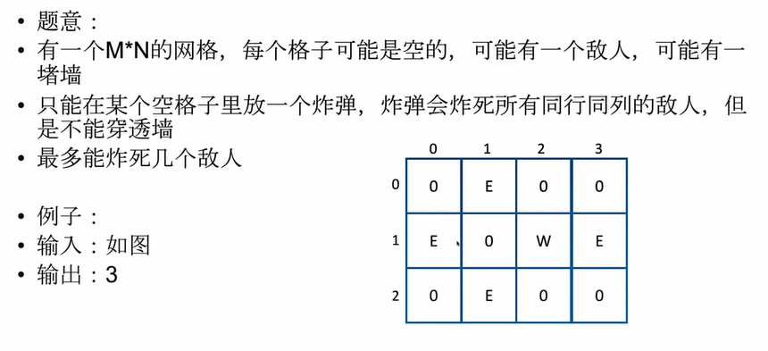

最憨批的办法：

> 遍历每个格子，让格子向上下左右走，碰到墙就停止，看能炸死多少人，然后求最大值即可。
>
> 这样的时间复杂度为O(MN * (M+N))
>
> 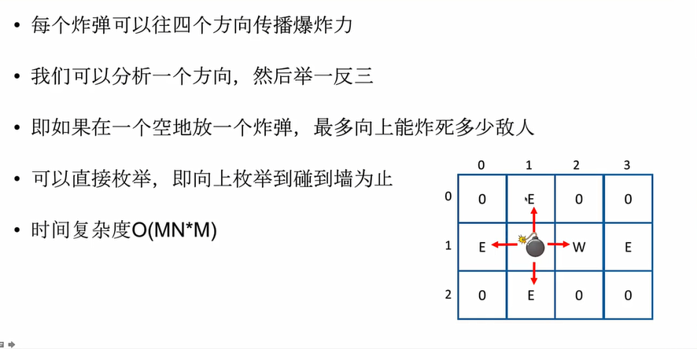

使用动态规划的思想--此处仅仅研究炸弹向上能够炸死的敌人数目：

> 在(i,j)格放一个炸弹，它向上能炸死的地人数是：
>
> > (i,j) 格为空地的情况下：为(i-1,j) 格向上能炸死的敌人数。
> >
> > (i,j) 格为敌人：（i-1,j）格向上能炸死的敌人数 + 1。
> >
> > (i,j) 格为墙： 0

状态转移方程--此处仅仅研究炸弹向上能够炸死的敌人数目：

> 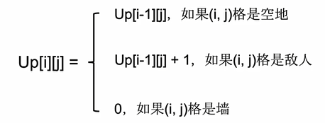

初始条件：

> 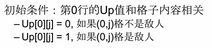

计算顺序：

> 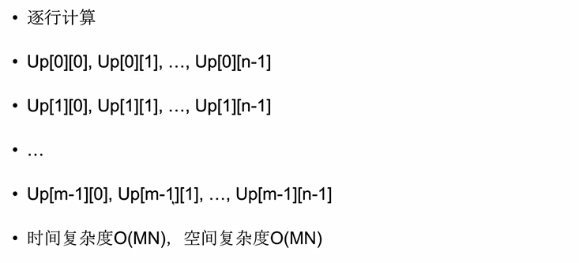

现在我们存在四个方向，但是四个方向的计算顺序有所不同：

> 1.当我们计算向上能炸死多少敌人，我们需要从上向下进行计算
>
> 2.当我们计算向下能炸死多少敌人，我们需要从下向上进行计算
>
> 3.当我们计算向左能炸死多少敌人，我们需要从左向右进行计算
>
> 4.当我们计算向右能炸死多少敌人，我们需要从右向左进行计算

最终的计算：

> 如果(i,j)是空地，放置一个炸弹最多炸死的敌人数是：
>
> Up[ i ] [ j ] + Down[ i ] [ j ] + Left [ i ] [ j ] + Right [ i ] [ j ]