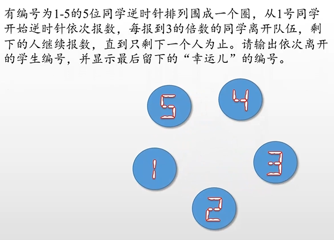

# 1.圆圈中最后剩下的数字 -- 解决方案

题目：

解决方案：

>  既然约塞夫问题就是用人来举例的，那我们也给每个人一个编号（索引值），每个人用字母代替
>
> 下面这个例子是N=8 m=3的例子
>
> 我们定义F(n,m)表示最后剩下那个人的索引号，因此我们只关系最后剩下来这个人的索引号的变化情况即可
>
> 

> 从8个人开始，每次杀掉一个人，去掉被杀的人，然后把杀掉那个人之后的第一个人作为开头重新编号

> 第一次C被杀掉，人数变成7，D作为开头，（最终活下来的G的编号从6变成3）
> 第二次F被杀掉，人数变成6，G作为开头，（最终活下来的G的编号从3变成0）
> 第三次A被杀掉，人数变成5，B作为开头，（最终活下来的G的编号从0变成3）
> 以此类推，当只剩一个人时，他的编号必定为0！（重点！）

> 现在我们知道了G的索引号的变化过程，那么我们反推一下
> 从N = 7 到N = 8 的过程
>
> 如何才能将N = 7 的排列变回到N = 8 呢？
>
> 我们先把被杀掉的C补充回来，然后右移m个人，发现溢出了，再把溢出的补充在最前面
>
> 神奇了 经过这个操作就恢复了N = 8 的排列了！
>
> 
>
> 

# 2.约瑟夫环问题

