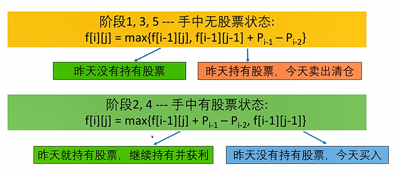

# 1.序列型动态规划

特征：……前i个……最小/方式数/可行性

## 1.1 PaintHouse

题目：

>

示例：

> 

最后一步：

> 最优策略之中，最后一栋房子一定被染成了红色，蓝色，绿色之中的一种，但是因为相邻的两种房子不能油漆成同一种颜色所以：
>
> > 如果最优策略之中房子N-1是红色，房子N-2只能是蓝色或者绿色
> >
> > 如果最优策略之中房子N-1是红色，房子N-2只能是红色或者绿色
> >
> > 如果最优策略之中房子N-1是绿色，房子N-2只能是红色或者蓝色
>
> 所以如果直接套用以前的思路，记录油漆前N栋房子的最小花费，根据套路，也需要记录前N-1栋房子的最小花费
>
> 但是前N-1栋房子的最小花费的最优策略之中，不知道房子N-2是什么颜色，所以很可能和房子N-1撞色。
>
> 
>
> 为了解决这个问题，我们采取不知道房子N-2是什么颜色，就将他记录下来的方式。分别记录油漆前N-1栋房子并且房子N-2是红色，蓝色，绿色的最小花费。然后我们遍历最后一栋房子的颜色，如果房子颜色是红色，则找到对应N-2栋房子是蓝色和绿色的相比较找出最小的，如果房子颜色是绿色，则找到对应N-2栋房子是蓝色和红色的相比较找出最小的，然后综合比较。
>
> 
>
> 

原问题与子问题：

原问题：

> 求油漆前N栋房子的最小花费

子问题：

> 求油漆前N-1栋房子，且房子N-2是红色，蓝色，绿色的最小花费

状态：

> 设油漆前i栋房子并且房子i-1是红色，蓝色，绿色的最小花费分别为 f[ i ] [ 0 ] f[ i ] [ 1 ] f[ i ] [ 2 ]

转移方程：

> 
>
> 同上：
>
> 

初始条件和边界情况：

> 

计算顺序：

> 

## 1.2 PaintHouse 2

题目：

> 

算法思路：

> 动态规划思路和paintHouse一样，我们需要记录油漆前i栋房子并且房子i-1是颜色1，颜色2，颜色3，
>
> ……颜色k的最小花费：f [ i ] [ 1 ] f [ i ] [ 2 ] …… f [ i ] [ k ]

转移方程：

> 

时间复杂度分析：

> $$
> i\,\,\text{从}0\text{到}N
> \\
> j\text{从}1\text{到}K
> \\
> k\text{从}1\text{到}K
> \\
> \text{时间复杂度}O\left( NK^2 \right)
> $$

能不能对上述过程进行优化？

> 需求：
>
> 回到我们的状态转移方程，我们每次需要求 f [ i - 1 ] [ 1 ] …… f [ i -1 ] [  K ] 之中除了一个元素之外，其他元素之中的最小值。
>
> 思路：
>
> 
>
> 原理：
>
> 

## 1.3 HouseRobber

最后一步：

> 在窃贼的最优策略之中，有可能偷或者不偷最后一栋房子。
>
> 如果他偷了最后一栋房子，则他不能偷倒数第一栋房子。
>
> 若他没有偷最后一栋房子，则他可以偷倒数第二栋房子。

原问题和子问题：

> 原问题：最多偷窃多少金币
>
> 子问题：
>
> > 在不偷最后一栋房子的情况下，前i栋房子最多偷多少金币
>
> > 在偷最后一栋房子的情况下，前i栋房子最多偷多少金币

状态确定：

> 

状态转移方程：

> 

算法优化：

> 在确定偷房子i-1的情况下，我们确定房子i-2是一定不能被偷的，我们可以直接越过房子i-2去询问
>
> 前i-2栋房子。

改良后的状态：

> f [ i ] 为窃贼在前i栋房子最多偷窃多少金币。

改良后的状态转移方程：

> 

初始条件：

> 

计算顺序：

> 从左向右进行依次的计算。

## 1.4 HouseRobber 2

题目：

> 

思路：

> 圈的情况相较于我们的序列来说更加的复杂，我们需要想尽办法将圈破开。
>
> 比如对于房子0和房子N-1不能同时偷的原理，进行分情况处理。
>
> 当不偷房子0的时候，转换成HouseRobber1问题
>
> 当不偷房子N-1的时候，转换成HouseRobber1问题

# 2.股票问题 -- Best Time To Buy And Sell Stock

## 2.1 题目1 -- 最多可以买入一次，并且卖出一次。

题目：

> 

题目分析：

> 低买高卖，先买后卖

动态规划解决方案：

> 

## 2.2 题目2 -- 可以买卖一股任意多次

题目：

> 

思想：

> 贪心策略--抓住每一段的上升期。
>
> 

## 2.3 题目 -- 可以进行最多两次买和两次卖，每次买卖都是一股，意思是买完了就必须先卖掉才能再买，总共只能买和卖两次。

题目：

>

最后一步：

> 最优策略中，最后一步操作，也就是最后一次卖发生在第j天。

股民所处的五个状态：

> 阶段1：没有买卖过
>
> 阶段3：买卖过1次
>
> 阶段5：买卖过2次

> 

确定状态：

> 若要求前N天(第N-1天)结束后，处在阶段5的最大获利
>
> 情况1：前一天就已经处在阶段5
>
> 情况2：前一天处在阶段4，今天将持有的那一股给卖掉了，总的收益为阶段4的收益加上卖掉那一股的收益。
>
> 

> 若要求前N天(第N-1天)结束后，处在阶段4的最大获利
>
> 情况1：前一天就已经处在阶段4，这个阶段的最大获益就是将股票卖掉。
>
> f [ N ] [ 4 ] = f [ N-1 ] [ 4 ] + (Pn-1 - Pn-2)
>
> 情况2：前一天还在阶段3，这个阶段没有赚钱
>
> f [ N ] [ 4 ] = f [ N-1] [ 3 ] 

原问题与子问题：

> 原问题：我们想要求出f [ N ] [ 1 ] , …… f [ N ] [ 5 ] 并找出其中的最大值
>
> 子问题：我们需要知道f [ N-1 ] [ 1 ] , …… f [ N-1 ] [ 5 ] 。  

转移方程：

> 

初始条件和边界情况：

> 

## 2.4 可以进行最多K次买和K次卖，每次买卖都是一股，意思是买完了就必须先卖掉才能再买，总共只能买和卖K次。

小技巧：

> 如果K很大，K > N/2 则题目可以花间成为BestTimeToBuyAndSellStock2即无限次买和无限次卖出。

其他类比2.3节。

# 3.序列+状态型动态规划小结

当思考动态规划的最后一步的时候，这一步的选择依赖于前一步的某种状态。就是后一步依赖前面的信息，有一种后续遍历的思想。

