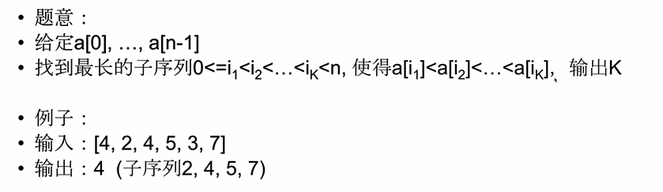
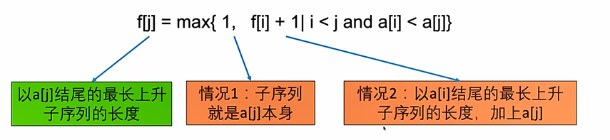
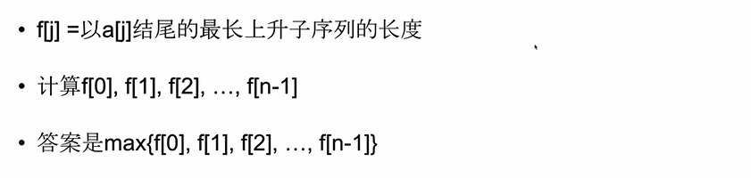
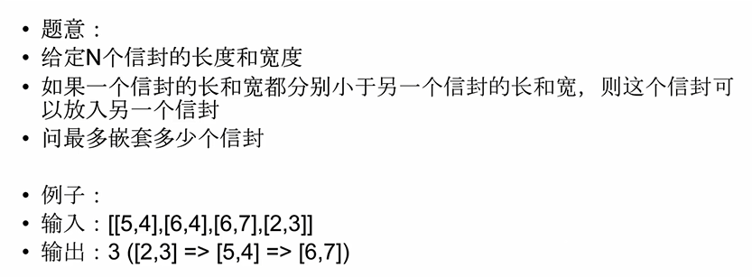
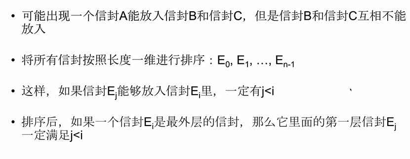
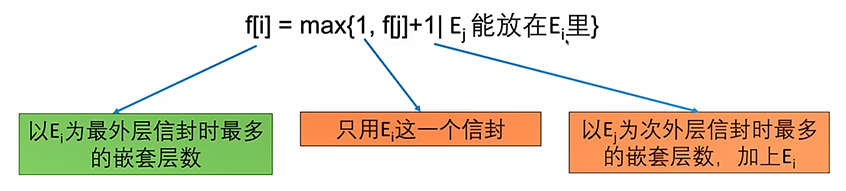

# 1.最长序列型动态规划

定义：

> 题目给定一个序列，需要我们找出符合条件的最长子序列

方法：

> 记录以每个元素i结尾的最长子序列的长度。

> 计算时，在i之前枚举子序列上一个元素是哪个。

注意：

> 最长序列型动态规划也就是坐标型动态规划。

# 2. Longest Increasing Subsequence

题目：

> 要注意区别于坐标型动态规划之中的Longest Continuous Increasing Subsequence,那里面的序列要求是紧紧挨着的，这里面只要递增就可以，序列之中的元素可以不相邻。

最后一步：

> 第一种情况：最优策略种最长上升子序列就是{a[j]}
>
> 第二种情况：子序列长度大于1，那么最优策略种a[j]的前一个元素是a[i].并且a[i] < a[j]

原问题与子问题：

> 原问题：以a[i]结尾的最长上升子序列
>
> 子问题：以a[j]结尾的最长上升子序列
>
> 因为i > j，所以称之为子问题

转移方程：

> 

计算顺序：

> 

# 3.Russian Doll Envelopes

题目：

> 

预先处理：

> 

最后一步：

> 总会存在最外面的一个信封--Ei
>
> 我们现在需要考虑次外层的信封是哪个：这个次外层信封一定是某个Ej (j<i)

原问题和子问题：

> 原问题：以Ei为最外层信封的最多的嵌套层数
>
> 子问题：以Ej为最外层信封的最多的嵌套层数

转移方程：

> Ej能放入Ei之中存在两个条件：
>
> 条件1：Ej的宽度要小于Ei
>
> 条件2：j<i
>
> 