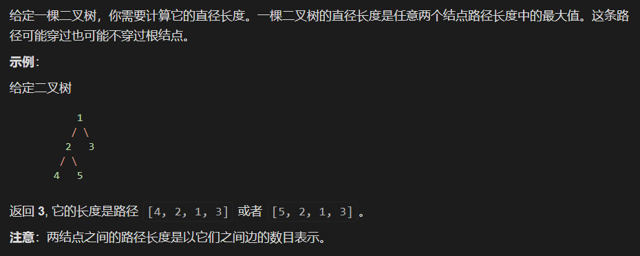

# 1.树型动态规划问题

在动态规划问题之中，存在一类问题叫做树型动态规划问题，这一类问题通常的解决的思路是：通过对树结构执行一次深度优先遍历，采用后序遍历的方式，一层一层的向上进行信息的传递，并且利用[无后效性]的思想(固定住一些状态，或者对当前维度进行升维)解决问题，即这一类问题通常采用[后序遍历] + [动态规划] 解决。


## 1.1 无后效性的解释

友情提示：「无后效性」是「动态规划」的一个重要特征，也是一个问题可以使用「动态规划」解决的必要条件，「无后效性」就是字面意思：当前阶段的状态值一旦被计算出来就不会被修改，即：在计算之后阶段的状态值时不会修改之前阶段的状态值。

利用「无后效性」解决动态规划问题通常有两种表现形式：

> 对当前维度进行「升维」，在「自底向上递推」的过程中记录更多的信息，避免复杂的分类讨论；
>
> 固定住一种的状态，通常这种状态的形式最简单，它可以组合成复杂的状态。


## 1.2 例题




## 1.3 思路分析

> 1.首先要理解题目含义，在题目最后的注意之中强调：两个结点之间的边的数目为直径，二不是结点的数目为直径
>
> 2.要理解树当中的信息，通常来说需要执行一次深度优先遍历，最后在根节点汇总值，自底向上，一层层向上汇报信息，这就是后序遍历。
>
> 3.我们再看直径的概念，题目中已经强调了：直径可能穿过，也可能不穿过根节点，并且示例给出的路径 [4, 2, 1, 3] 或者 [5, 2, 1, 3] 是弯曲的，不是「从根结点到叶子结点的最长路径」，因此一条路径是否经过某个结点，就需要分类讨论。在动态规划里，可以利用一个概念，叫做「无后效性」，即：将不确定的事情确定下来，以方便以后的讨论。


## 1.4 完整代码

> ```java
> public class Solution {
> 
>     private int res;
> 
>     public int diameterOfBinaryTree(TreeNode root) {
>         dfs(root);
>         return res;
>     }
> 
> 
>     /**
>      * @param node
>      * @return 必需经过当前 node 结点的路径长度的「最大值」
>      */
>     private int dfs(TreeNode node) {
>         if (node == null) {
>             return 0;
>         }
> 
>         int left = dfs(node.left);
>         int right = dfs(node.right);
>         // 注意：在深度优先遍历的过程中，记录最大值
>         res = Math.max(res, left + right);
> 
>         return Math.max(left, right) + 1;
>     }
> }
> ```
>
> 