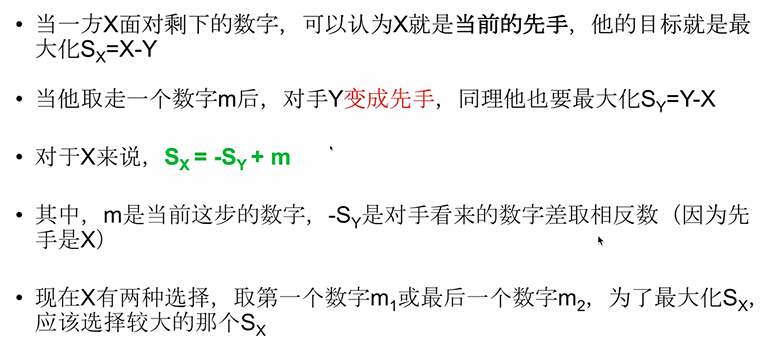

# 1.记忆化搜索

定义：

> 我们将计算的中间结果进行保存，下次要进行计算的时候直接从数组之中进行提取，而不用递归的重复再算。

# 2.记忆化搜索的缺陷

说明：

> 记忆化搜索不能够像递推一样可以使用滚动数组进行优化。记忆化搜索必须存储所有的f值。

# 3. Coins In A Line

题目：

> 

分析：

> 
>
> 

状态的确定：

> 

子问题：

> 

转移方程：

> > 注意：f [i+1] [ j ] 以及 f [i] [ j-1 ] 都可以认为是对手的获利。 
>
> 