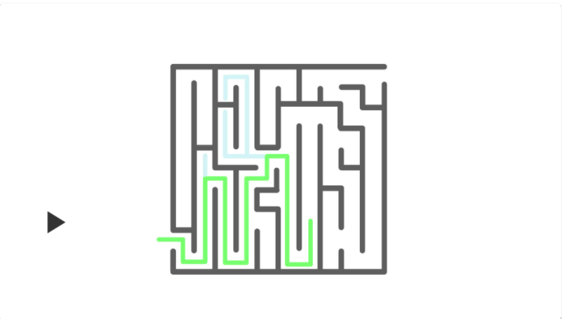
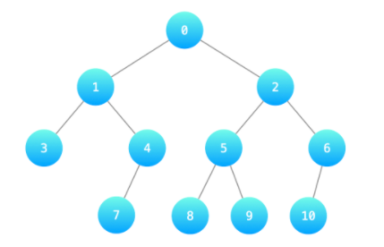
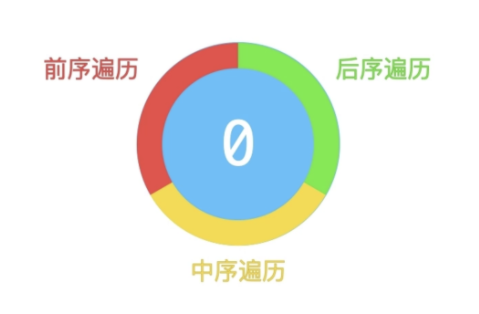
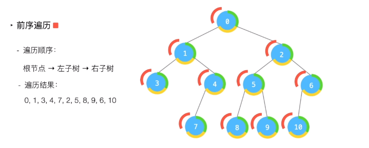
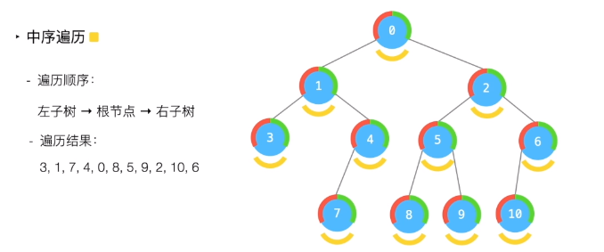
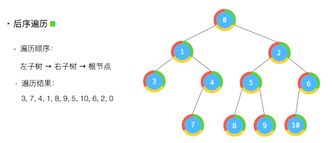

# 1.深度优先遍历形象描述

>「一条路走到底，不撞南墙不回头」是对「深度优先遍历」的最直观描述。下面的视频演示了以「深度优先遍历」的方式「走迷宫找出口」的搜索轨迹。

说明：

> 深度优先遍历 **只要前面有可以走的路**，就会一直向前走，直到无路可走才会回头；

> 「无路可走」有两种情况：① 遇到了墙；② 前面都是已经走过的路；

> 在「无路可走」的时候，**沿着原路返回**，直到回到了还有未走过的路的路口，尝试继续走没有走过的路径

> 有一些路径没有走到，这是因为找到了出口，程序就停止了

> 「深度优先遍历」也叫「深度优先搜索」，遍历是行为的描述，搜索是目的（用途）；

> 遍历不是很深奥的事情，把 所有 可能的情况都看一遍，才能说「找到了目标元素」或者「没找到目标元素」。遍历也称为 穷举，穷举的思想在人类看来虽然很不起眼，但借助 计算机强大的计算能力，穷举可以帮助我们解决很多专业领域知识不能解决的问题。
>

# 2.树的深度优先遍历

## 2.1 前序遍历 (根左右)

对于任意一棵子树，先输出根结点，再递归输出左子树的 所有 结点、最后递归输出右子树的 所有 结点。下图前序遍历的结果就是深度优先遍历的结果：[0、1、3、4、7、2、5、8、9、6、10]

## 2.2 中序遍历 (左根右)

对于任意一棵子树，先递归输出左子树的 所有 结点，然后输出根结点，最后递归输出右子树的 所有 结点。下图中序遍历的结果是：[3、1、7、4、0、8、5、9、2、10、6]。

## 2.3 后序遍历 (左右根)

对于任意一棵子树，总是先递归输出左子树的 所有 结点，然后递归输出右子树的 所有 结点，最后输出根结点。后序遍历体现的思想是：先必需得到左右子树的结果，才能得到当前子树的结果，这一点在解决一些问题的过程中非常有用。上图后序遍历的结果是：[3、7、4、1、8、9、5、10、6、2、0]

## 2.4 为什么前，中，后序遍历都是深度优先遍历

可以把树的深度优先遍历想象成一只蚂蚁，从根结点绕着树的外延走一圈。每一个结点的外延按照下图分成三个部分：前序遍历是第一部分，中序遍历是第二部分，后序遍历是第三部分。

只看结点的第一部分（红色区域），深度优先遍历到的结点顺序就是「前序遍历」的顺序。

### 2.4.1 前序遍历

### 2.4.2 中序遍历

### 2.4.3 后序遍历

# 3.图的深度优先遍历

深度优先遍历有「回头」的过程，在树中由于不存在「环」（回路），对于每一个结点来说，每一个结点只会被递归处理一次。而「图」中由于存在「环」（回路），就需要 记录已经被递归处理的结点（通常使用布尔数组或者哈希表），以免结点被重复遍历到。

