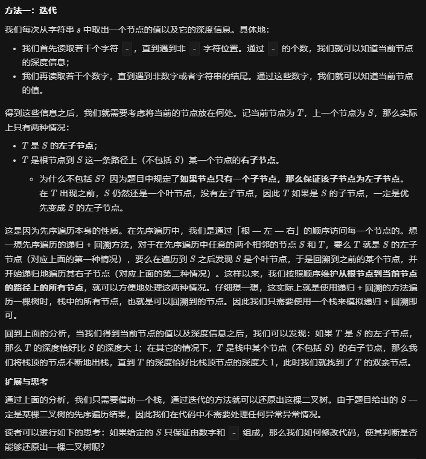

# 1.两种情况

## 1.1 第一种情况

我们将结点放入一个基于深度的单调栈之中，如果本结点的深度==栈的长度则将其赋值给栈顶左子并进行压栈处理。

## 1.2 第二种情况

如果本结点的深度小于栈的长度，则进行弹栈，直到栈的长度==本结点的深度。然后让
栈定元素的右孩子等于这个结点。

## 1.3 完整方法



## 1.4 举例


```
输入："1-2--3--4-5--6--7"
输出：[1,2,5,3,4,6,7]
```

step1：首先将1进行压栈处理。

step2：碰到节点2，层为1，等于栈的大小，所以将栈的栈顶元素的左子赋值为2，并进行压栈。

step3：碰到节点3，层为2，等于栈的大小，所以将栈的栈顶元素的左子赋值为2，并进行压栈

step4：碰到节点4，层位2，小于栈的大小，所以将栈进行弹栈，弹栈后栈顶元素为2，然后让栈顶元素2的右孩子等于这个节点。

step5：碰到节点5，层为1，小于栈的大小，所以将栈进行弹栈，弹栈后栈顶元素为1，然后让栈顶元素1的右孩子等于这个节点。

以此类推。

