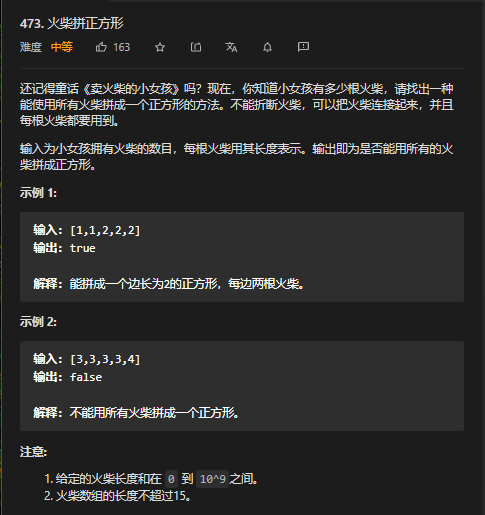

# 1.题目

# 2.深度优先搜索

分析

假设火柴的长度分别为 [1,1,1,1,2,2,2,2,3,3,3,3]，它们的和为 24，因此对应正方形的变成为 6。如下图所示，我们给正方形的每一条边都放上长度为 [1,2,3] 的火柴，这是一种可行的方法。

因此，对于给定的若干根火柴，我们需要：

- 将它们分成四组，每一根火柴恰好属于其中的一组；
- 每一组火柴的长度之和都相同，等于所有火柴长度之和的四分之一。

我们可以使用深度优先搜索枚举出所有的分组情况，并对于每一种情况，判断是否满足上述的两个条件。

我们依次对每一根火柴进行搜索，当搜索到第 i 根火柴时，我们可以把它放到四组中的任意一种。对于每一种放置方法，我们继续对第 i + 1 根火柴进行递归搜索。当我们搜索完全部的 N 根火柴后，再判断每一组火柴的长度之和是否都相同。

在进行搜索之前，我们可以将火柴的长度从大到小进行排序，方便我们先搜索较长的火柴。这样做的目的是对搜索进行剪枝，例如当火柴的长度为 [4,4,4,8] 时，每条边的长度为 5，如果我们先搜索长度为 8 的火柴，就可以发现它无法被放在任意一组中，因此直接退出搜索返回 False。
