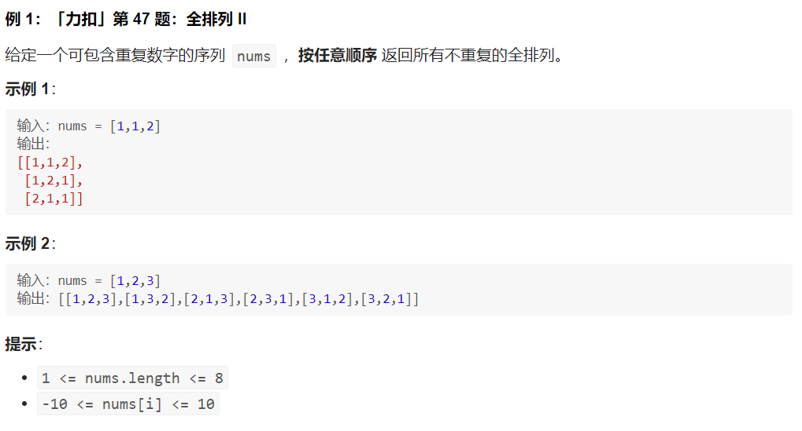
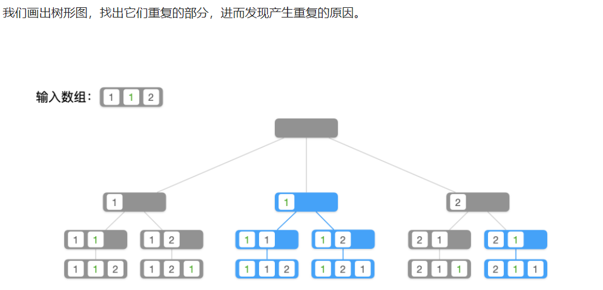
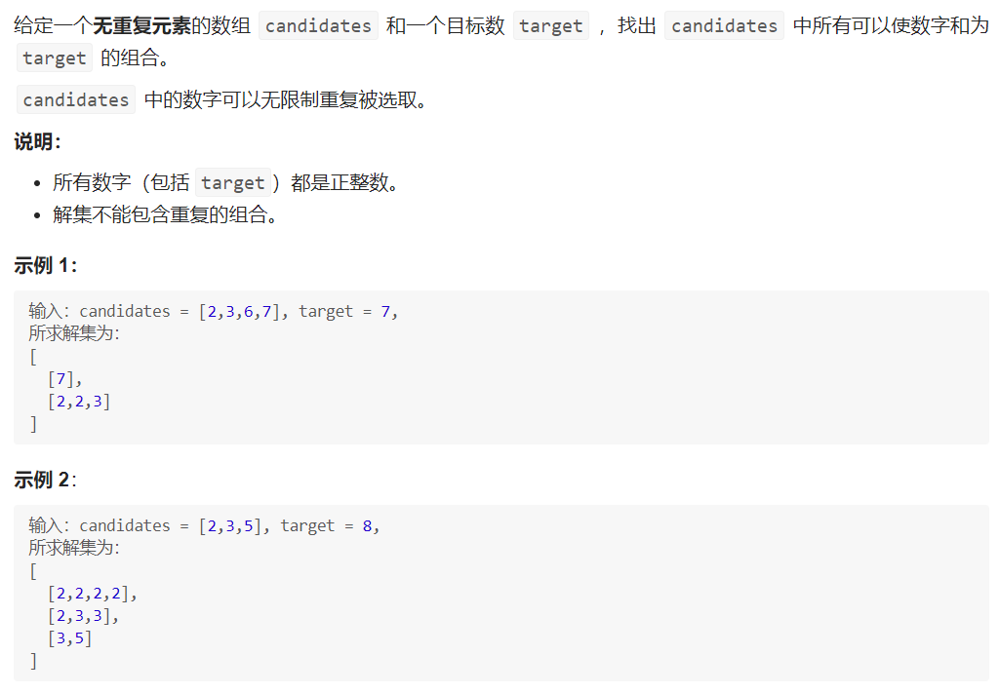
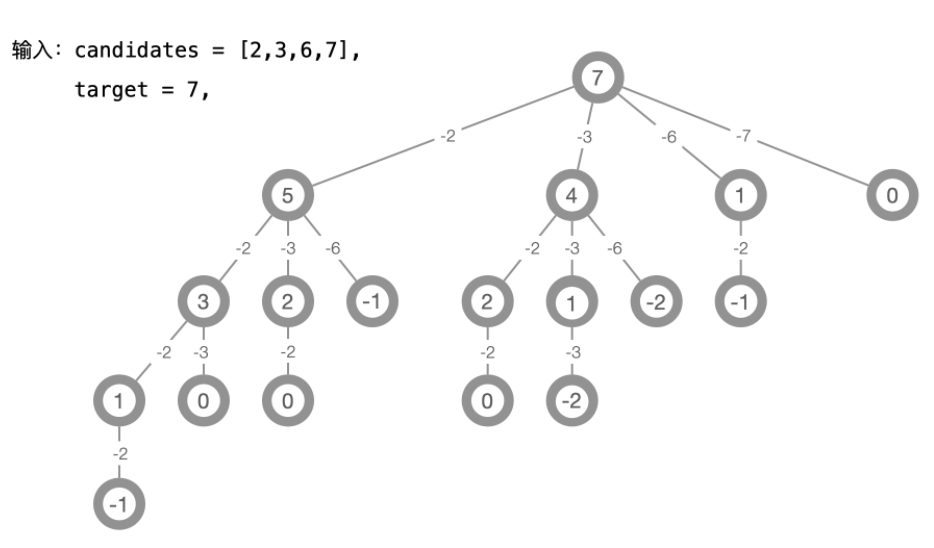
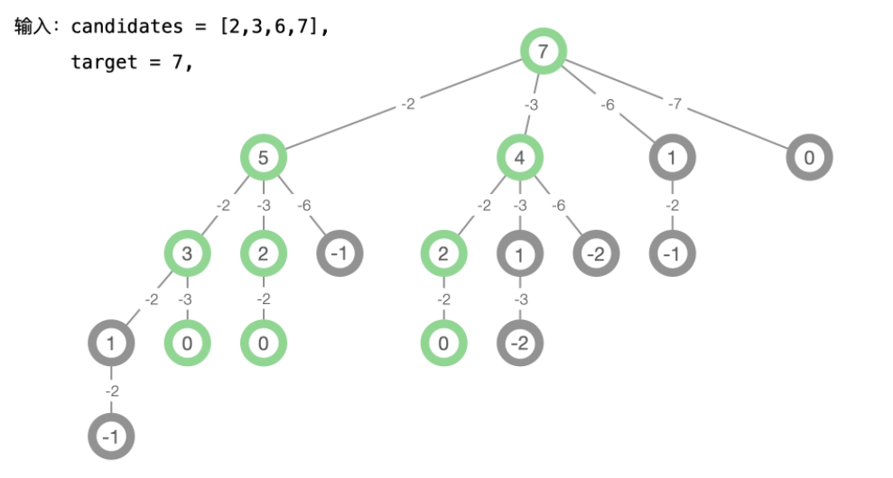

# 1.剪枝的定义

剪枝的想法是很自然的。回溯算法本质上是遍历算法，如果 **在遍历的过程中**，可以分析得到这样一条分支一定不存在需要的结果，就可以跳过这个分支。

发现剪枝条件依然是通过举例的例子，**画图分析**，即：**通过具体例子抽象出一般的剪枝规则**。通常可以选取一些较典型的例子，以便抽象出一般规律。

# 2.按照一定顺序进行搜索 -- 全排列2

按照顺序搜索其实也是去除重复结果的必要条件。

**思路分析**：

这道题基于「力扣」第 46 题（全排列）的思想完成，首先依然是先画出树形结构，然后编写深度优先遍历的代码，在遍历的过程中收集所有的全排列；

与「力扣」第 46 题（全排列）不同的是：输入数组中有重复元素，如果还按照第 46 题的写法做，就会出现重复列表；

如果搜索出来结果列表，再在结果列表里去重，比较相同的列表是一件比较麻烦的事情，我们可以 ①：依次对列表排序，再逐个比较列表中的元素；② 将列表封装成为类，使用哈希表去重的方式去掉重复的列表。这两种方式编码都不容易实现；

既然需要排序，我们可以在一开始的时候，就对输入数组进行排序，在遍历的过程中，通过一定剪枝条件，发现一定会搜索到重复元素的结点，跳过它，这样在遍历完成以后，就能得到不重复的列表。

产生重复列表的原因：

很容易看到，在树的同一层，如果当前考虑的数字相同，就有可能搜索到重复的结果（前提：输入数组按照升序排序），因此剪枝条件为 nums[i] == nums[i - 1] 这里为了保证数组下标不越界，前提是 i > 0；

光有这个条件还不够，我们观察下面两个分支，中间被着重标注的分支，满足 nums[i] == nums[i - 1] 并且 nums[i - 1] 还未被使用--在同一层之中被使用，接下来由于还要使用 1 一定会与前一个分支搜索出的结果重复；

而左边被着重标注的分支，也满足 nums[i] == nums[i - 1] ，但是 nums[i - 1] 在上一层之中被使用了，接下来不会再用到它，因此不会产生重复。

# 3. 组合问题

思路分析：有了之前问题的求解经验，我们 强烈建议 大家使用示例 1 ，以自己熟悉的方式画出树形结构，再尝试编码、通过调试的方式把这个问题做出来。

可以从目标值 target = 7 开始，逐个减去 2 、3 、6 、7 ，把问题转化成使用 [2, 3, 6, 7] 能够得到的组合之和为 5、 4、 1、0 的所有列表，如果能够得到有效的列表，再加上减去的那个数，就是原始问题的一个列表，这是这个问题的递归结构；
减去一个数以后，得到的数为 0 或者负数以后，就可以停止了，请大家想一想这是为什么。画好这棵树以后，我们关注叶子结点的值为 0 的结点，从根结点到叶子结点的一条路径，满足沿途减去的数的和为 target = 7；

由于这个问题得到的结果是组合，[2, 2, 3]、[2, 3, 2] 与 [3, 2, 2] 只能作为一个列表在结果集里输出，我们依然是按照第 47 题的分析，在图中标注出这些重复的分支，发现剪枝的条件；

去除重复的方法通常是按照一定的顺序考虑问题，我们观察重复的三个列表 [2, 2, 3]、[2, 3, 2] 与 [2, 3, 2] ，我们只需要一个，保留自然顺序 [2, 2, 3] 即可，于是我们可以指定如下规则：如果在深度较浅的层减去的数等于 a ，那么更深的层只能减去大于等于 a 的数（根据题意，一个元素可以使用多次，因此可以减去等于 a 的数），这样就可以跳过重复的分支，深度优先遍历得到的结果就不会重复；

容易发现，如果减去一个数的值小于 0 ，就没有必要再减去更大的数，这也是可以剪枝的地方。

# 4.子集

给定两个整数 *n* 和 *k*，返回 1 ... *n* 中所有可能的 *k* 个数的组合。