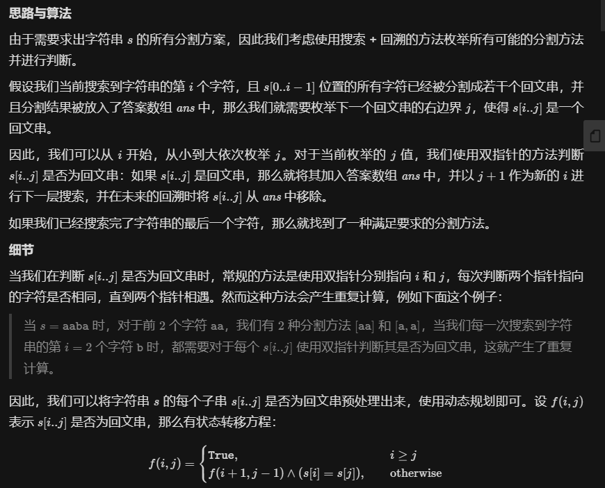
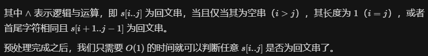

# 1.分割回文串

思路与算法





```java
class Solution {
    boolean[][] f;
    List<List<String>> ret = new ArrayList<List<String>>();
    List<String> ans = new ArrayList<String>();
    int n;

    public List<List<String>> partition(String s) {
        n = s.length();
        f = new boolean[n][n];
        for (int i = 0; i < n; ++i) {
            Arrays.fill(f[i], true);
        }

        for (int i = n - 1; i >= 0; --i) {
            for (int j = i + 1; j < n; ++j) {
                f[i][j] = (s.charAt(i) == s.charAt(j)) && f[i + 1][j - 1];
            }
        }

        dfs(s, 0);
        return ret;
    }

    public void dfs(String s, int i) {
        if (i == n) {
            ret.add(new ArrayList<String>(ans));
            return;
        }
        for (int j = i; j < n; ++j) {
            if (f[i][j]) {
                ans.add(s.substring(i, j + 1));
                dfs(s, j + 1);
                ans.remove(ans.size() - 1);
            }
        }
    }
}
```

