# 1.n皇后问题

*n* 皇后问题研究的是如何将 *n* 个皇后放置在 *n*×*n* 的棋盘上，并且使皇后彼此之间不能相互攻击。

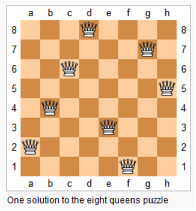

**提示**：

皇后彼此不能相互攻击，也就是说：任何两个皇后都不能处于同一条横行、纵行或斜线上。

思路分析：

解决这个问题的思路是尝试每一种可能，然后逐个判断。只不过回溯算法按照一定的顺序进行尝试，在一定不可能得到解的时候进行剪枝，进而减少了尝试的可能。下面的幻灯片展示了整个搜索的过程。

尝试过程：

1.一开始棋盘是空的。

2.从第一行第一个位置开始进行皇后的摆放。

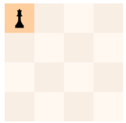

3.从第二行第一个位置开始进行皇后的摆放。

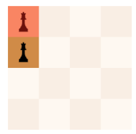

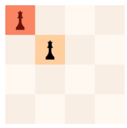

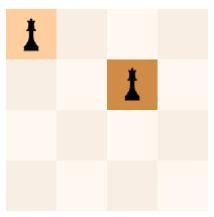

4.只要当前这一行与之前摆放的皇后不冲突，就向下一行摆放皇后。

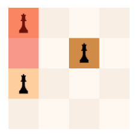

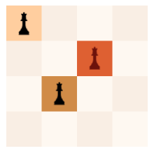

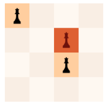

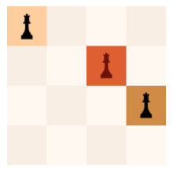

5.发现这一行的位置都不行，回退到上一行，从而尝试下一个位置。

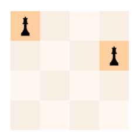

6.以此类推

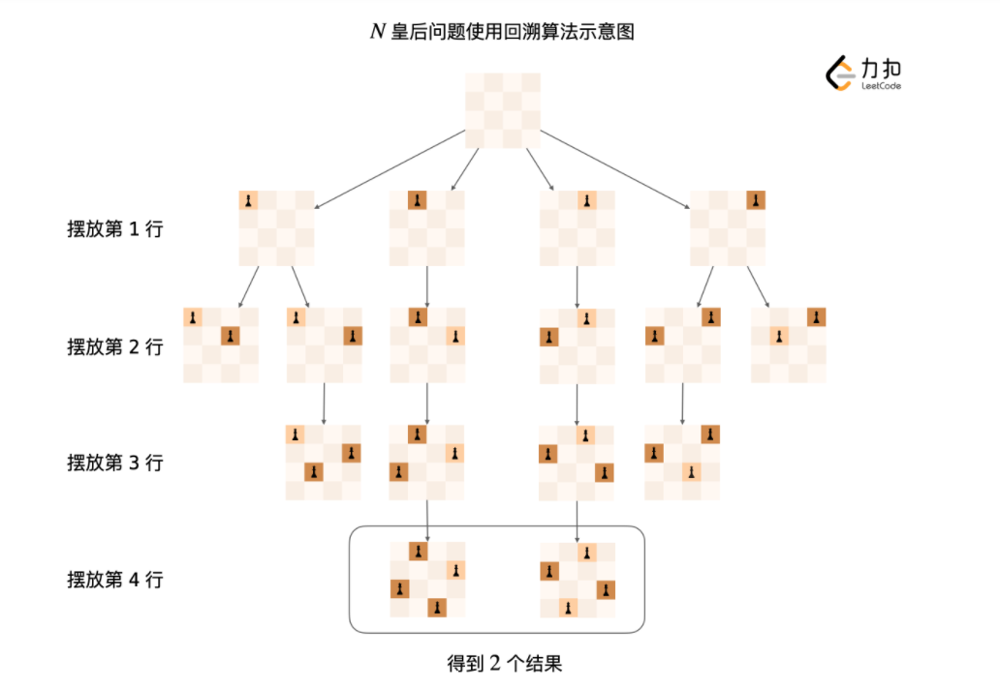

# 2.算法注意细节

由于我们需要根据前面已经放置的皇后的位置，来决定当前位置是否可以放置皇后，因此记住已经放置的皇后的位置就很重要。

> 由于我们一行一行考虑放置皇后，摆放的这些皇后肯定不在同一行；
>
> 为了避免它们在同一列，需要一个长度为 N 的布尔数组 cols，已经放置的皇后占据的列，就需要在对应的列的位置标记为 true；
>
> 还需要考虑「任何两个皇后不能位于同一条斜线上」，下面的图展示了位于一条斜线上的皇后的位置特点。
>
> 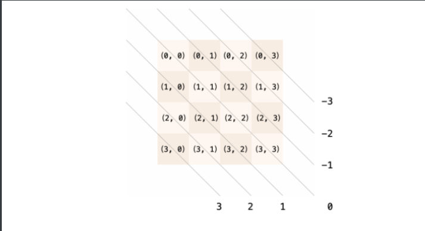
>
> 为此，我们需要一个表示主对角线方向的布尔数组 main（Main diagonal，长度为 2N-1），如果某个单元格放放置了一个皇后，就需要将对应的主对角线标记为 true。注意：由于有 3 个方向的横坐标 - 纵坐标的结果为负值，可以统一地为每一个横坐标 - 纵坐标的结果增加一个偏移，具体请见参考代码 1。
>
> 同理，我们还需要一个表示副对角线方向的布尔数组 sub（Sub diagonal，长度为 2N-1），如果某个单元格放放置了一个皇后，就需要将对应的副对角线标记为 true。
>
> 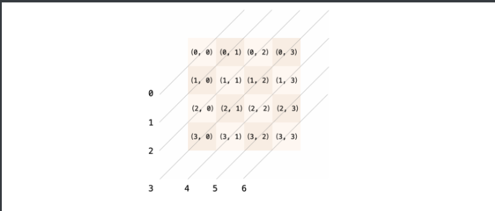

# 3.树形问题

回溯算法其实是在一棵隐式的树或者图上进行了一次深度优先遍历，我们在解决问题的过程中需要把问题抽象成一个树形问题。充分理解树形问题最好的办法就是用一个小的测试用例，在纸上画出树形结构图，然后再针对树形结构图进行编码。

重要的事情我们说三遍：画图分析很重要、画图分析很重要、画图分析很重要。

要理解「回溯算法」的递归前后，变量需要恢复也需要想象代码是在一个树形结构中执行深度优先遍历，回到以前遍历过的结点，变量需要恢复成和第一次来到该结点的时候一样的值。

另一个理解回溯算法执行流程的重要方法是：在递归方法执行的过程中，将涉及到的变量的值打印出来看，观察变量的值的变化。

> 友情提示：画图分析问题是思考算法问题的重要方法，画图这个技巧在解决链表问题、回溯算法、动态规划的问题上都有重要的体现，请大家不要忽视「画图」这个简单的分析问题的方法，很多时候思路就出现在我们在草稿纸上写写画画以后。

# 4.回溯问题的问法

问「一个问题 **所有的** 解」一般考虑使用回溯算法。因此回溯算法也叫「暴力搜索」，但不同于最粗暴的多个 `for` 循环，回溯算法是有方向的遍历。

# 5.再谈搜索

计算机擅长做的事情是「计算」，即「做重复的事情」。能用编程的方法解决的问题通常 结构相同，问题规模不同。因此，我们解决一个问题的时候，通常需要将问题一步一步进行拆解，把一个大问题拆解为结构相同的若干个小问题。

> 友情提示：我们介绍「状态」和「状态空间」这两个概念是为了方便后面的问题描述，其实大家在完成了一定练习以后对这两个概念就会有形象的理解。如果一开始不理解这些概念完全可以跳过。
>

### 「状态」和「状态空间」

为了区分解决问题的不同阶段、不同规模，我们可以通过语言描述进行交流。在算法的世界里，是通过变量进行描述的，不同的变量的值就代表了解决一个实际问题中所处的不同的阶段，这些变量就叫做「状态变量」。所有的状态变量构成的集合称为「状态空间」。

### 不同状态之间的联系形成图（树）结构

我们可以把某种规模的问题描述想象成一个结点。由于规模相近的问题之间存在联系，我们把有联系的结点之间使用一条边连接，因此形成的状态空间就是一张图。

树结构有唯一的起始结点（根结点），且不存在环，树是特殊的图。这一章节绝大多数的问题都从一个基本的问题出发，拆分成多个子问题，并且继续拆分的子问题没有相同的部分，因此这一章节遇到的绝大多数问题的状态空间是一棵树。

我们要了解这个问题的状态空间，就需要通过 遍历 的方式。正是因为通过遍历，我们能够访问到状态空间的所有结点，因此可以获得一个问题的 所有 解。

# 6.为什么叫回溯

而「回溯」就是 深度优先遍历 状态空间的过程中发现的特有的现象，程序会回到以前访问过的结点。而程序在回到以前访问过的结点的时候，就需要将状态变量恢复成为第一次来到该结点的值。

在代码层面上，在递归方法结束以后，执行递归方法之前的操作的 逆向操作 即可。

# 7.回溯算法的实现细节

### 解释递归后面状态重置是怎么回事

> 当回到上一级的时候，所有的状态变量需要重置为第一次来到该结点的状态，这样继续尝试新的选择才有意义；
>
> 在代码层面上，需要在递归结束以后，添加递归之前的操作的逆向操作；

### 基本类型变量和对象类型变量的不同处理

> 基本类型变量每一次向下传递的时候的行为是复制，所以无需重置；
>
> 对象类型变量在遍历的全程只有一份，因此再回退的时候需要重置；
>
> 类比于 Java 中的 方法参数 的传递机制：
>
> 基本类型变量在方法传递的过程中的行为是复制，每一次传递复制了参数的值；
>
> 对象类型变量在方法传递的过程中复制的是对象地址，对象全程在内存中共享地址。

### 字符串问题的特殊性

>  如果使用 + 拼接字符串，每一次拼接产生新的字符串，因此无需重置；
> 如果使用 StringBuilder 拼接字符串，整个搜索的过程 StringBuilder 对象只有一份，需要状态重置。

### 为什么不是广度优先遍历

> 广度优先遍历每一层需要保存所有的「状态」，如果状态空间很大，需要占用很大的内存空间；
> 深度优先遍历只要有路径可以走，就继续尝试走新的路径，不同状态的差距只有一个操作，而广度优先遍历在不同的层之前，状态差异很大，就不能像深度优先遍历一样，可以 使用一份状态变量去遍历所有的状态空间，在合适的时候记录状态的值就能得到一个问题的所有的解。
>