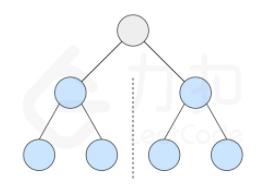
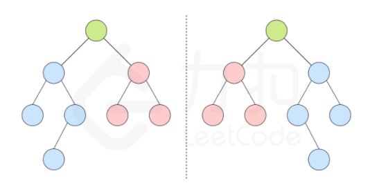

# 1.对称的二叉树

**思路和算法**

如果一个树的左子树与右子树镜像对称，那么这个树是对称的。

因此，该问题可以转化为：两个树在什么情况下互为镜像？

如果同时满足下面的条件，两个树互为镜像：

> 它们的两个根结点具有相同的值
>
> 每个树的右子树都与另一个树的左子树镜像对称

我们可以实现这样一个递归函数，通过「同步移动」两个指针的方法来遍历这棵树，pp 指针和 qq 指针一开始都指向这棵树的根，随后 pp 右移时，qq 左移，pp 左移时，qq 右移。每次检查当前 pp 和 qq 节点的值是否相等，如果相等再判断左右子树是否对称。

算法2

「方法一」中我们用递归的方法实现了对称性的判断，那么如何用迭代的方法实现呢？首先我们引入一个队列，这是把递归程序改写成迭代程序的常用方法。初始化时我们把根节点入队两次。每次提取两个结点并比较它们的值（队列中每两个连续的结点应该是相等的，而且它们的子树互为镜像），然后将两个结点的左右子结点按相反的顺序插入队列中。当队列为空时，或者我们检测到树不对称（即从队列中取出两个不相等的连续结点）时，该算法结束。

