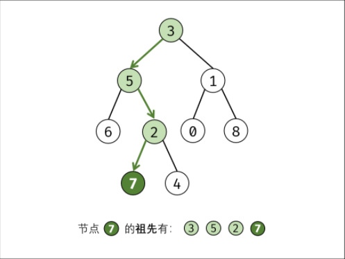

解题思路：

祖先的定义： 若节点 p 在节点 root的左（右）子树中，或 p = root ，则称 root是 p 的祖先。

最近公共祖先的定义： 设节点 root为节点 p, q的某公共祖先，若其左子节点 root.left和右子节点 root.right 都不是 p,q的公共祖先，则称 root 是 “最近的公共祖先” 。

根据以上定义，若 root 是 p, q的 最近公共祖先 ，则只可能为以下情况之一：

1.p 和 q 在 root 的子树中，且分列 root 的 异侧（即分别在左、右子树中）；
2.p = root  ，且 q 在 root 的左或右子树中；
3.q = root ，且 pp在 root 的左或右子树中；

因为若p和q都分布在结点的左子树之中，那么这将不是最近公共祖先，最近公共祖先将是p或者是q.

思路和算法:注意我们需要进行后续遍历，不然可能找到的是祖先，但不是最近公共祖先。

