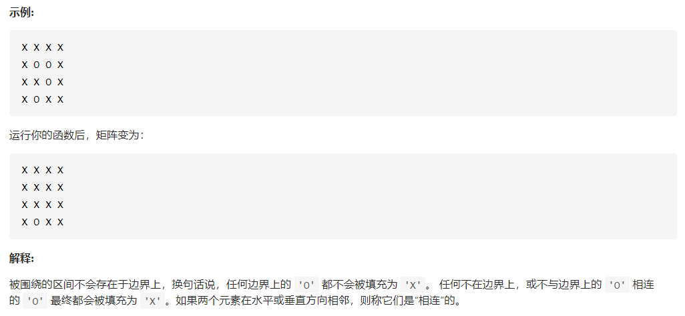

# 1.单词搜索(中等)

给定一个二维网格和一个单词，找出该单词是否存在于网格中。

单词必须按照字母顺序，通过相邻的单元格内的字母构成，其中“相邻”单元格是那些水平相邻或垂直相邻的单元格。同一个单元格内的字母不允许被重复使用。

**思路分析**：

这道题要求我们在一个二维表格上找出给定目标单词 word 的一个路径，题目中说：「相邻」单元格是那些水平相邻或垂直相邻的单元格。也就是说：如果当前单元格恰好与 word 的某个位置的字符匹配，应该从当前单元格的上、下、左、右 44 个方向继续匹配剩下的部分；

下面的幻灯片展示了整个匹配的过程，请大家注意：

对于每一个单元格，在第一个字符匹配的时候，才执行一次深度优先遍历，直到找到符合条件的一条路径结束。如果第一个字符都不匹配，当然没有必要继续遍历下去；

递归终止的条件是：匹配到了 word 的最后一个字符；

在不能匹配的时候，需要 原路返回，尝试新的路径。这一点非常重要，我们修改了题目中的示例，请大家仔细观察下面的幻灯片中的例子，体会「回溯」在什么时候发生？

# 2.岛屿的最大面积

下面我们再展示一个问题，希望大家通过这个问题熟悉二维平面上回溯算法的编码技巧。

给定一个包含了一些 0 和 1 的非空二维数组 grid 。

一个 岛屿 是由一些相邻的 1 (代表土地) 构成的组合，这里的「相邻」要求两个 1 必须在水平或者竖直方向上相邻。你可以假设 grid 的四个边缘都被 0（代表水）包围着。

找到给定的二维数组中最大的岛屿面积。(如果没有岛屿，则返回面积为 0 。)

# 3.被围绕的区域

给定一个二维的矩阵，包含 `'X'` 和 `'O'`（**字母 O**）。

找到所有被 `'X'` 围绕的区域，并将这些区域里所有的 `'O'` 用 `'X'` 填充。

# 4.太平洋大西洋水流问题

给定一个 m x n 的非负整数矩阵来表示一片大陆上各个单元格的高度。“太平洋”处于大陆的左边界和上边界，而“大西洋”处于大陆的右边界和下边界。

规定水流只能按照上、下、左、右四个方向流动，且只能从高到低或者在同等高度上流动。

请找出那些水流既可以流动到“太平洋”，又能流动到“大西洋”的陆地单元的坐标。

