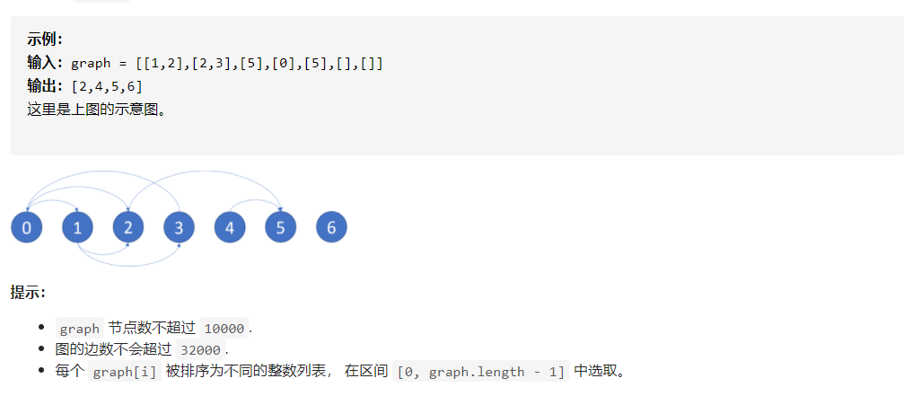

# 1.题目

在有向图中, 我们从某个节点和每个转向处开始, 沿着图的有向边走。 如果我们到达的节点是终点 (即它没有连出的有向边), 我们停止。

现在, 如果我们最后能走到终点，那么我们的起始节点是最终安全的。 更具体地说, 存在一个自然数 K,  无论选择从哪里开始行走, 我们走了不到 K 步后必能停止在一个终点。

哪些节点最终是安全的？ 结果返回一个有序的数组。

该有向图有 N 个节点，标签为 0, 1, ..., N-1, 其中 N 是 graph 的节点数.  图以以下的形式给出: graph[i] 是节点 j 的一个列表，满足 (i, j) 是图的一条有向边。

实际上就是检测环。

# 2.思路

## 2.1 拓扑排序思路

对于一个节点 u，如果我们从 u 开始任意行走能够走到一个环里，那么 u 就不是一个安全的节点。换句话说，u 是一个安全的节点，当且仅当 u 直接相连的节点（u 的出边相连的那些节点）都是安全的节点。

因此我们可以首先考虑没有任何出边的节点，它们一定都是安全的，因为一定不会走到一个环之中，因为它根本就不能走。随后我们再考虑仅与这些节点直接相连的节点，它们也一定是安全的，以此类推。这样我们可以将所有的边全部反向，首先所有没有任何入边的节点都是安全的，我们把这些节点全部移除。随后新的图中没有任何入边的节点都是安全的，以此类推。我们发现这种做法实际上就是对图进行拓扑排序。

算法

注意：这里的反向图是为了更好的找到出发点。

我们将所有的边反向，得到反向图 rgraph，随后将 rgraph 中所有没有入边的节点加入队列中。每一次我们取出队列中的一个节点 u，将它从图中删除，如果此时某个节点 v 存在从 u 到 v 的一条边，并且在删掉了这条边后，v 变成了没有入边的节点，那么就把 v 加入队列。以此类推，直到队列为空。最后所有加入过队列的节点即为安全的节点。