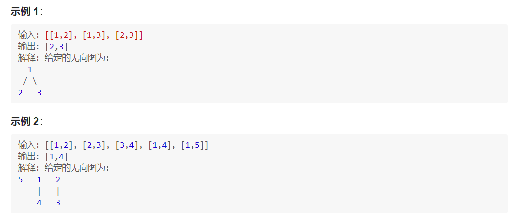

# 1.我们分别通过两个例子讲解「无向图」中环的检测和「有向图」中环的检测 -- 拓扑排序。

例 3：「力扣」第 684 题：冗余连接（中等）
在本问题中, 树指的是一个连通且无环的无向图。

输入一个图，该图由一个有着 N 个节点 (节点值不重复 1, 2, ..., N) 的树及一条附加的边构成。附加的边的两个顶点包含在 1 到 N 中间，这条附加的边不属于树中已存在的边。

结果图是一个以边组成的二维数组。每一个边的元素是一对 [u, v]，满足 u < v，表示连接顶点 u 和 v 的无向图的边。

返回一条可以删去的边，使得结果图是一个有着 N 个节点的树。如果有多个答案，则返回二维数组中最后出现的边。答案边 [u, v] 应满足相同的格式 u < v。

思路分析：

如果两个顶点其中有一个不在这张图上，它当然不是多余的边；

可以在添加一条边的时候，检查从其中一个顶点是否可以通过 遍历 到达另一个顶点，这里所说的遍历可以是「深度优先遍历」，也可以是「广度优先遍历」；

如果遍历不能到达，说明这条表不是多余的边，需要添加到图中（注意：无向图需要添加两条边）；
如果遍历可以到达，说明形成了回路，当前考虑的这条边就是多余的边。