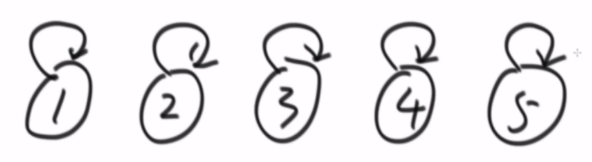
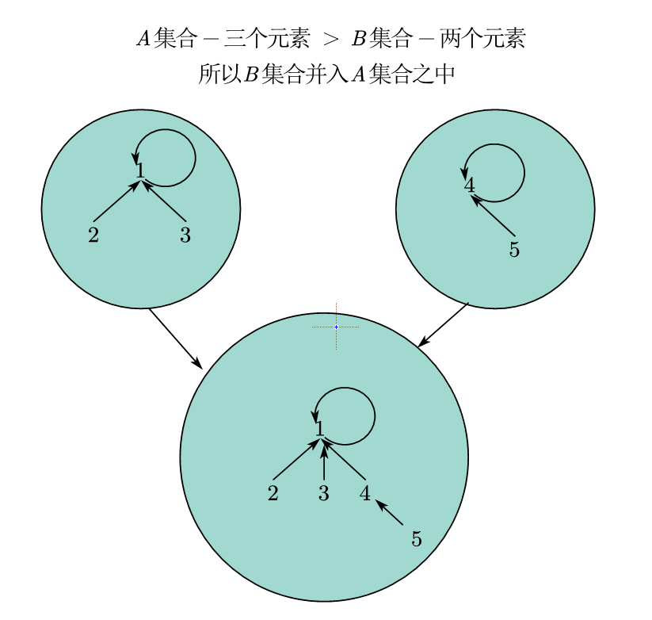
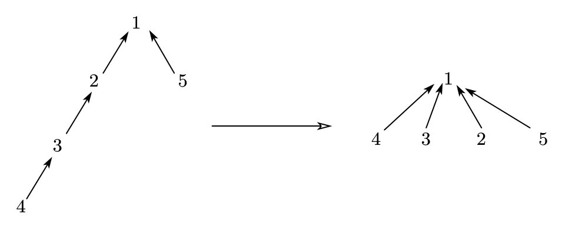

# 1.并查集

## 1.1 概念

并查集需要完成的两个重要的操作

操作1：要非常快的检查两个元素是否在同属于一个集合之中。 isSameSet(A,B)

操作2：两个元素各自所在的集合合并在一起。 union(A,B)将A所在的所有集合和B所在的所有集合合并在一起

## 1.2 具体实现

### 1.2.1 初始化

首先所有的元素先自己指向自己，自己指向自己的就是这个集合的代表元素，入下图所示，1所在的集合只有1自己，并且1是这个集合的代表元素。

### 1.2.2 进行集合的合并

少元素的集合并入多元素的集合当中去。

### 1.2.3 寻找某个结点所处的集合

让每个结点向上进行寻找找到代表结点即可

### 1.2.4 寻找两个结点是否同属于一个集合

让两个结点都向上进行寻找，直到找到各自的代表结点，如果两者所属集合的代表结点都是同一个结点，那么就同属于一个集合之中。

## 1.3 优化思路

每当元素要查找自己所属的集合的时候，它都要进行向上的查找，我们将我们遇到的元素全部直接连到代表结点上。

举例--如下图所示，当4查自己所属集合之后，将从左边的情况变成右边的情况。

