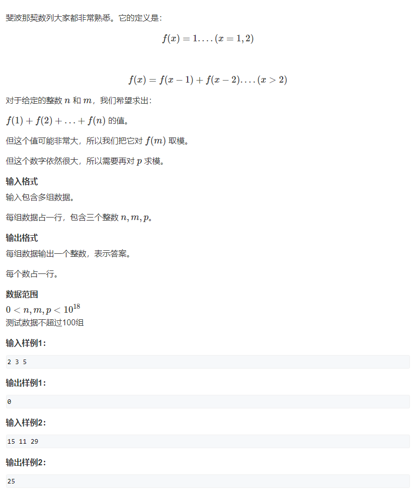

# 1.斐波那契

> 

$$
f\left( x \right) \,\,=\,\,f\left( x-1 \right) \,\,+\,\,f\left( x-2 \right) \,\,->\,\,f\left( x+1 \right) \,\,=\,\,f\left( x \right) \,\,+\,\,f\left( x-1 \right) \,\,->\,\,f\left( x \right) \,\,=\,\,f\left( x+1 \right) \,\,-\,\, f\left( x-1 \right) 
\\
f\left( 2 \right) \,\,=\,\,f\left( 3 \right) \,\,-\,\,f\left( 1 \right) 
\\
f\left( 3 \right) \,\,=\,\,f\left( 4 \right) \,\,-\,\,f\left( 2 \right) 
\\
f\left( 4 \right) \,\,=\,\,f\left( 5 \right) \,\,-\,\,f\left( 3 \right) 
\\
……
\\
f\left( n-1 \right) \,\,=\,\,f\left( n \right) \,\,-\,\,f\left( n-2 \right) 
\\
f\left( n \right) \,\,=\,\,f\left( n+1 \right) \,\,-\,\,f\left( n-1 \right) 
\\
\text{将上述左右累加得到下面的式子}
\\
\sum_{i=1}^n{f\left( i \right) \,\,=\,\,}f\left( n \right) \,\,+\,\,f\left( n+1 \right) \,\,-\,\,f\left( 2 \right) \,\,=\,\,f\left( n+2 \right) \,\,-\,\,f\left( 2 \right) \,\, =\,\,f\left( n+2 \right) \,\,-\,\,1
$$

> 题目等价于
> $$
> \text{原题等价于下式}:
> \\
> \left( \sum_{i=1}^{n+2}{f\left( i \right)}\,\,-\,\,1 \right) \,\,\% \sum_{j=1}^m{f\left( j \right)}\,\,\% mod\,\,
> \\
> \text{如果}m>=\,\,n+2 \text{对}\sum_{j=1}^m{f\left( j \right)}\text{取余数就变得没有意义，上式变为下式}:
> \\
> \left( \sum_{i=1}^{n+2}{f\left( i \right)}\,\,-\,\,1 \right) \,\, \% mod\,\,
> $$

# 2. 转矩阵运算

$$
\left[ f\left[ 2 \right] ,f\left[ 1 \right] \right] \,\,\left[ \begin{matrix}
	1&		1\\
	1&		0\\
\end{matrix} \right] \,\,=\,\,\left[ f\left[ 3 \right] ,f\left[ 2 \right] \right] 
\\
\left[ f\left[ 2 \right] ,f\left[ 1 \right] \right] \,\,\left[ \begin{matrix}
	1&		1\\
	1&		0\\
\end{matrix} \right] ^{n-2}\,\,=\,\,\left[ f\left[ n \right] ,f\left[ n-1 \right] \right]
$$