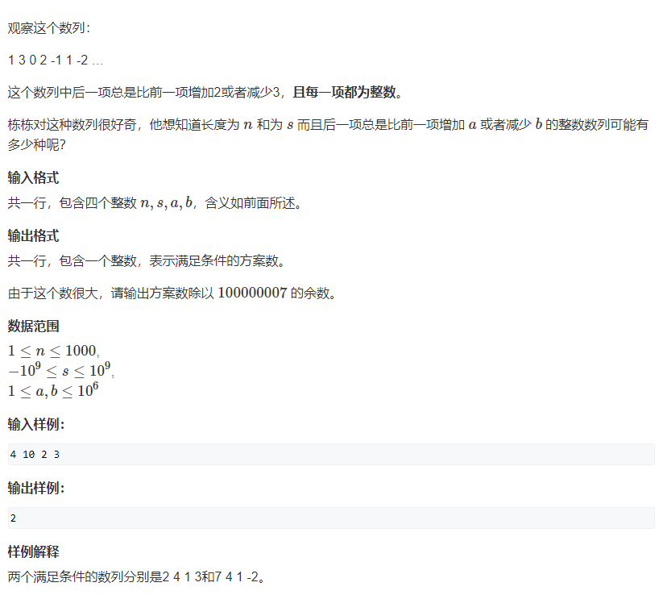

# 1.波动数列

# 2.枚举首项+深度优先搜索

## 2.1 开始的突破口--可能的最小的首项就是一直加最后总和等于s

$$
\text{最小的首项}x\text{推导如下}:
\\
x,x+a,x+2a,x+3a,……,x+\left( n-1 \right) a\,\,->\,\,nx\,\,+\,\,\left( 0+1+2+……+n-1 \right) \,\,a\,\, ==\,\,nx\,\,+\,\,\left( n\left( n-1 \right) /2 \right) a\,\, ==\,\,s\,\,\text{然后可以反推}x
$$

可能的最大的首项就是一直减最后总和等于s
$$
\text{最大的首项}x\text{推导如下}:
\\
x,x-b,x-2b,x-3b,……x-nb\,\,->\,\,nx\,\,-\,\,\left( 0+1+2+……+n-1 \right) \,\,b\,\, ==\,\,nx\,\,-\,\,\left( n\left( n-1 \right) /2 \right) b\,\,==\,\,s\,\,\text{然后可以反推}x
$$
然后进行首项目的枚举，然后每一步可以进行+a每一步也可以进行-b操作。

## 2.2 还可以进行进一步的优化

因为+a和-b的操作总和应该是(n(n-1)/2)，那么我们固定x并枚举a的次数，然后可以得到b的次数，然后计算x + a的次数×a - b的次数×b，看是否会等于s，然后再使用深度优先搜索来进行情况的枚举。

## 2.3 进一步进行优化转换为01背包问题

### 思想突破1：

t1是执行+a操作的次数，t2是执行-b操作的次数

x = (S - t1 * a + t2 * b) / n 所以(S - t1 * a + t2 * b) 是n的倍数，那么我们可以反求出来一个x

### 思想突破2：

问t1是如何被计算出来的？

若为其中有1代表最后一步操作进行的是+a.若其中有2代表倒数第二步进行的是+a

t1是从1，2，3，……(n-1)之中选出若干个求和得到的。

### 思想突破3：

问如果固定t1问有多少种选择方式：

